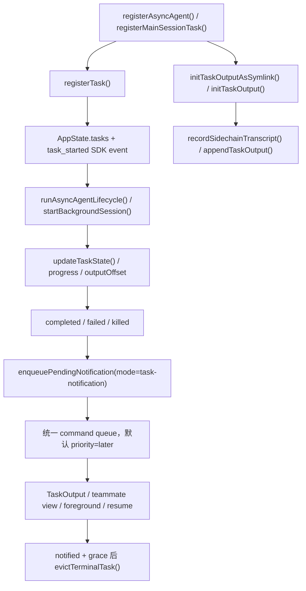

## 一句话结论

异步 Agent 的核心不是“后台起了一个进程”，而是 **一次执行会被建模成任务对象，并贯穿注册、侧链落盘、状态推进、通知回流、查看/恢复和回收整个生命周期**。

## 状态标签总览

| 主题 | 当前状态 | 关键入口 |
|---|---|---|
| 本地异步 agent 任务 | `external build active` | `LocalAgentTask.tsx` |
| 主会话后台化 | `external build active` | `LocalMainSessionTask.ts` |
| 任务注册与轮询回收 | `external build active` | `framework.ts` |
| 输出路径与 transcript 侧链 | `external build active` | `diskOutput.ts` / `sessionStorage.ts` |
| 任务通知队列 | `external build active` | `messageQueueManager.ts` |
| 前台查看 / retain / dismiss | `external build active` | `teammateViewHelpers.ts` |
| 远程 agent 变体 | `external build active` | `RemoteAgentTask.tsx` |

## 为什么存在

如果“后台 agent”只是一次 fire-and-forget 调用，系统很快会失去这些能力：

- 主会话不知道它什么时候结束。
- `TaskOutput` 之类的读取接口没有稳定路径可读。
- `/clear`、前台切换、恢复会话之后，很难继续找到它的输出。
- 用户已经在看这个任务时，系统仍可能重复弹出通知。
- 任务完成后何时释放内存、何时继续在面板里保留几秒，也没有统一语义。

这就是当前实现把异步执行收敛到 `TaskStateBase` 家族里的原因：先把它变成 **可追踪对象**，再谈后台执行。

## 正常链路

这条链路里最容易被低估的点有三个：

- 任务的 `outputFile` 并不是随便拼的字符串，而是稳定路径或 transcript symlink，供读取与恢复复用。
- 终态通知不是直接插队，而是进统一 command queue，并默认放到 `later` 优先级，避免饿死用户输入。
- “结束”与“通知”不是同一个动作；很多地方先推进状态，再补分类、git 信息或 UI 装饰，目的是让阻塞读取能先解开。

## 关键结构 / 状态

| 字段 / 结构 | 作用 | 生命周期里为什么重要 |
|---|---|---|
| `TaskStateBase` | 提供 `id`、`status`、`outputFile`、`outputOffset`、`notified` 等基础字段 | 没有这些字段，就无法统一读取、通知和回收 |
| `LocalAgentTaskState` | 本地异步 agent 的主状态载体 | 额外引入 `retain`、`diskLoaded`、`pendingMessages`、`evictAfter` |
| `LocalMainSessionTaskState` | 主会话后台化后的任务变体 | 仍复用 `local_agent` 家族，只是 `agentType='main-session'` |
| `registerTask()` | 把任务写入 `AppState.tasks` 并发出 `task_started` SDK 事件 | 恢复替换时还会保留 `retain/startTime/messages/diskLoaded/pendingMessages` |
| `updateTaskState()` | 全生命周期唯一的安全推进入口 | 避免直接散写状态，减少并发覆盖 |
| `notified` | 标记是否已经消费过终态 | 防止重复 enqueue，也决定何时允许回收 |
| `retain` / `diskLoaded` | UI 是否“持有”这个任务，以及是否已从磁盘 bootstrap transcript | 影响查看、流式追加与回收阻断 |
| `evictAfter` | 面板保留期限 | 让终态任务还能短暂停留，而不是瞬间消失 |
| `outputOffset` | 已读取到输出文件的哪个位置 | 支撑增量读取与 polling |

## 三条常见子路径

| 路径 | 起点 | 关键差异 |
|---|---|---|
| async-from-start subagent | `registerAsyncAgent()` | 一创建就 `isBackgrounded=true` |
| 前台 agent 后台化 | `registerAgentForeground()` -> `backgroundAgentTask()` | 先在前台运行，后续再切成后台 |
| 主会话后台化 | `startBackgroundSession()` -> `registerMainSessionTask()` | 复用同一任务抽象，但继续跑的是主 `query()` |

## 为什么不是更简单的设计

如果只是起一个子进程，然后等它自己写日志，表面上简单，实际上会立刻失去这些能力：

- 无法在 UI 里稳定区分“还在跑”“跑完未读”“已读可回收”。
- 无法把用户发送给运行中 agent 的新消息排队到正确边界再注入。
- 无法在任务对象被 resume 替换时保住当前查看状态。
- 无法对主会话后台化和子 agent 后台化复用同一套回收与通知语义。

所以这里的复杂度不是炫技，而是在给后台执行补上 **状态、可读性、恢复和 UI 协调语义**。

## 一个实际例子

假设用户让系统在后台起一个长时间研究型 subagent：

1. `AgentTool` 先注册 `LocalAgentTaskState`，同时为 `taskId` 建立输出 symlink。
2. `runAsyncAgentLifecycle()` 驱动 `runAgent()` 流式产出消息，并把新消息一边记到侧链 transcript，一边更新 `progress`。
3. 如果用户在 UI 里点进这个 agent，`enterTeammateView()` 会把 `retain=true`，随后 REPL 会从磁盘 bootstrap transcript，并把新消息继续直接 append 到 `task.messages`。
4. 如果用户给这个运行中的 agent 追加一句话，`queuePendingMessage()` 会把内容先挂进 `pendingMessages`，等到可安全注入的边界由 `drainPendingMessages()` 取走。
5. agent 跑完后，`completeAsyncAgent()` 先把状态推进到 `completed`，随后 `enqueueAgentNotification()` 把终态摘要、输出路径和可选 worktree 信息塞进统一消息队列。
6. 用户晚一点再看也没关系：可以读 `TaskOutput`，也可以重新回到 transcript 视图；只有在 `notified=true` 且宽限期过后，任务才会被回收。

这里“后台运行”“稍后查看”“中途续话”能够同时成立，靠的正是这些状态字段一起工作，而不是某一个单独的 API。

## 一个失败 / 恢复例子

主会话后台化是另一个很典型的恢复场景：

1. 用户把当前 query 背景化后，`registerMainSessionTask()` 不会复用主 transcript，而是给任务单独建一条侧链 transcript symlink。
2. `startBackgroundSession()` 会先把背景化前已有消息整批写入这个侧链，之后每来一条新消息再增量写入。
3. 这样即使中途发生 `/clear` 或 UI 切换，后台 session 的输出仍挂在自己的任务路径下，不会污染清空后的新主会话。
4. 如果用户把它重新前台化，`foregroundMainSessionTask()` 只切换 `isBackgrounded`，并把已有消息交回主视图，而不是重新跑一遍 query。

这类设计修复的不是“能不能跑完”，而是“跑完之前发生界面和会话动作时，状态会不会乱”。

## 失败与恢复

| 场景 | 表现 | 恢复 |
|---|---|---|
| 任务已结束却重复通知 | 多处都想 enqueue 终态 | `notified` 通过原子 check-and-set 防重，先查 `enqueueAgentNotification()` / `enqueueMainSessionNotification()` |
| 任务完成但阻塞读取还没解开 | 分类、git、worktree 附加逻辑太慢 | 当前实现先 `completeAsyncAgent()` / `completeMainSessionTask()`，再做装饰性补充 |
| `/clear` 后背景 session 输出看起来丢了 | 主 transcript 被清空，背景输出路径混乱 | 主会话后台化专门用独立 sidechain transcript，先查 `registerMainSessionTask()` 注释与 symlink 逻辑 |
| resume 后 UI 视图跳回空壳 | 任务被替换时把保留状态丢了 | `registerTask()` 的 replacement merge 会保住 `retain/startTime/messages/diskLoaded/pendingMessages` |
| 面板里任务永远不消失 | 已终态但仍被持有或未标记已读 | 看 `retain`、`notified`、`evictAfter` 与 `evictTerminalTask()` |
| 用户已在前台看主会话，却还收到一条完成通知 | 前后台状态切换不一致 | `foregroundMainSessionTask()` 会把 `isBackgrounded=false`，此后终态走 SDK 书挡而不是 XML 通知 |

## 边界与误读

<Warning>
“异步 Agent”在当前仓库里不只等于 subagent。主会话后台化、远程 agent、甚至某些 UI-only 任务都共享这套 task-state 语义的一部分。
</Warning>

- `outputFile` 并不总是原始 stdout；对本地 agent 来说，它常常是 sidechain transcript 的稳定读取入口。
- `generateTaskAttachments()` 并不会给本地 agent 的 completed 状态统一发通知；注释已经说明，终态通知由各任务类型自己 enqueue，避免双发。
- `TaskOutput` 读取终态任务时会顺手把 `notified=true`，所以“读过即已消费”本身就是生命周期的一环。
- 远程 agent 也属于异步任务，但它的输出与完成条件更多依赖远程 log/polling，不应与本地 `local_agent` 链路混写成完全同一实现。

## 场景变体

| 场景 | 生命周期重点 |
|---|---|
| 长时本地 subagent | transcript 侧链、进度更新、终态通知 |
| 前台跑太久再后台化 | `backgroundSignal`、`isBackgrounded` 和自动转后台 |
| 主会话后台化 | 独立 sidechain transcript，避免污染主会话 |
| 正在查看 transcript | `retain=true` 阻止回收，并允许流式 append |
| 远程 agent | `remote_agent` 任务单独轮询远端 session 与 log |

## 先读什么

- 先读 [任务系统 V2](/docs/agent/task-system-v2)
- 再读 [Mailbox 与任务认领](/docs/agent/mailbox-and-claiming)

## 继续读什么

- [后台任务与 Housekeeping](/docs/runtime/background-tasks-and-housekeeping)
- [运行时控制平面](/docs/runtime/app-state-control-plane)
- [消息队列与 Prompt 调度](/docs/runtime/message-queue-and-prompt-scheduling)
- [恢复与回退](/docs/conversation/recovery-and-fallback)

## 相关源码入口

- `src/Task.ts`
- `src/tasks/LocalAgentTask/LocalAgentTask.tsx`
- `src/tasks/LocalMainSessionTask.ts`
- `src/tasks/RemoteAgentTask/RemoteAgentTask.tsx`
- `src/utils/task/framework.ts`
- `src/utils/task/diskOutput.ts`
- `src/utils/messageQueueManager.ts`
- `src/state/teammateViewHelpers.ts`
- `src/tools/AgentTool/agentToolUtils.ts`
- `src/tools/AgentTool/resumeAgent.ts`
- `src/tools/TaskOutputTool/TaskOutputTool.tsx`

## 本页证据等级

- `external build active`: `src/Task.ts`, `src/tasks/LocalAgentTask/LocalAgentTask.tsx`, `src/tasks/LocalMainSessionTask.ts`, `src/tasks/RemoteAgentTask/RemoteAgentTask.tsx`, `src/utils/task/framework.ts`, `src/utils/task/diskOutput.ts`, `src/utils/messageQueueManager.ts`, `src/state/teammateViewHelpers.ts`, `src/tools/AgentTool/agentToolUtils.ts`, `src/tools/AgentTool/resumeAgent.ts`, `src/tools/TaskOutputTool/TaskOutputTool.tsx`
- `inference`: “生命周期真正关键在于可恢复、可读取、可回收，而不只是后台执行”是对上述实现分工的结构性总结
