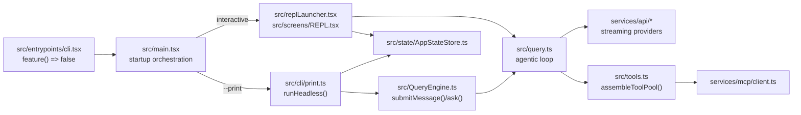
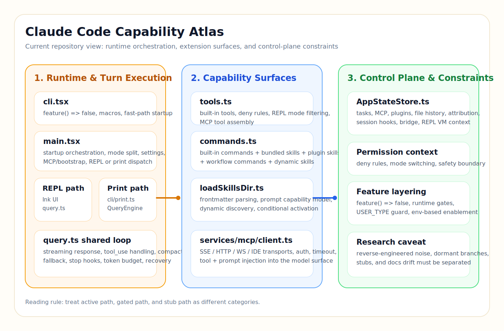
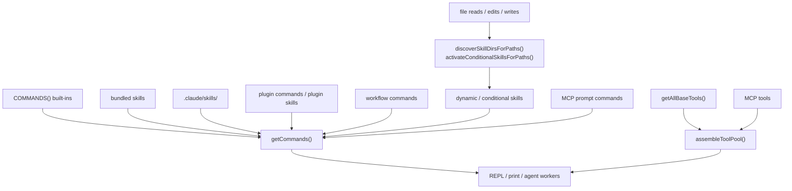
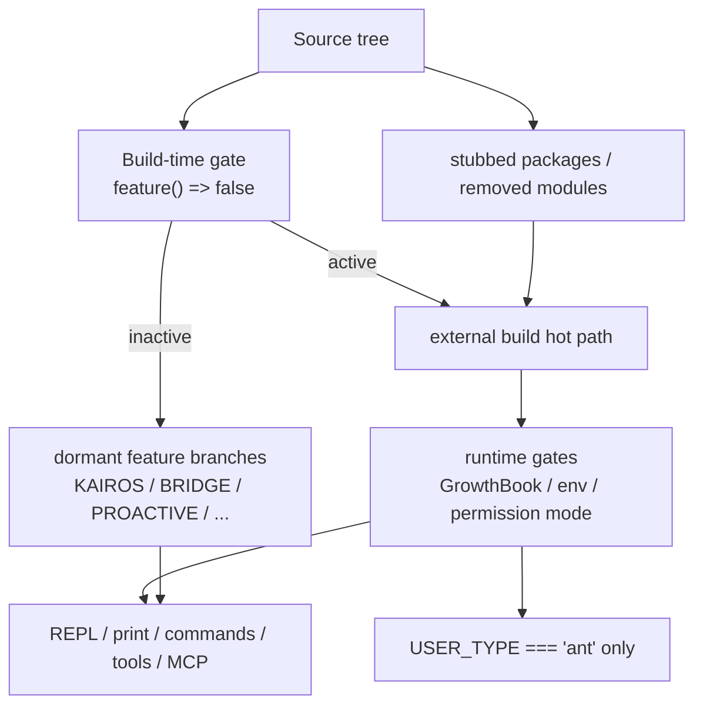
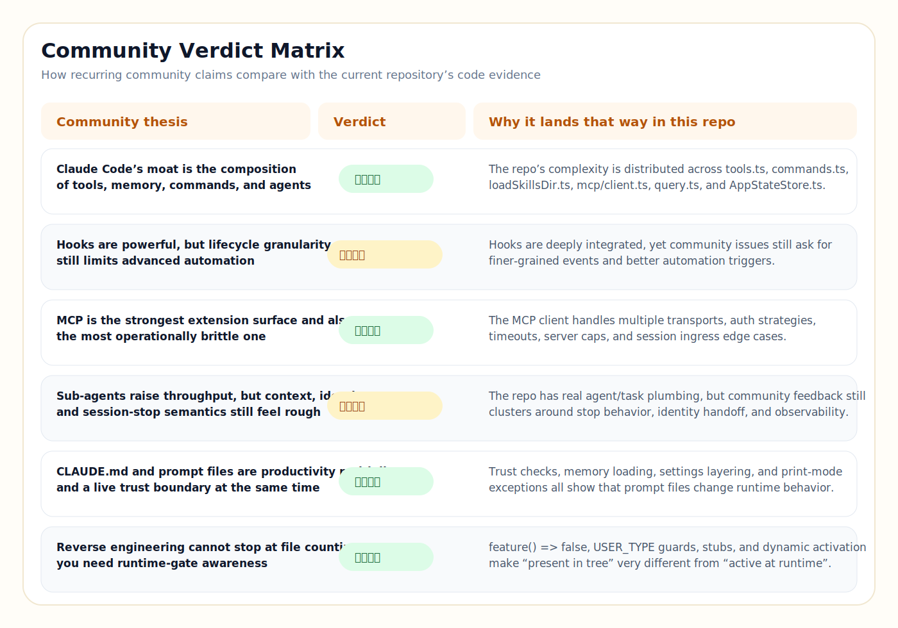

# Claude Code 能力图谱研究报告

> 研究对象：`/Users/admin/work/claude-code`
>
> 报告立场：逆向研究者导向，结论优先以当前仓库源码为准，官方文档用于校准术语与公开能力边界，社区材料用于验证高频共识与偏差。

## 执行摘要

- 这个仓库不是“官方源码镜像”，而是一个 Bun-first、带反编译残留的 Claude Code CLI 重建工程；真正需要关注的是外部构建下的活跃路径，而不是树上所有文件。
- 当前外部构建的热路径清晰可追：`src/entrypoints/cli.tsx` 通过 `feature() => false` 固定外部构建语义，`src/main.tsx` 负责装配，interactive 走 `REPL.tsx -> query.ts`，headless 走 `cli/print.ts -> QueryEngine.ts -> query.ts`。
- 仓库最有价值的不是单一的 agent loop，而是“工具池 + slash commands + skills + MCP + hooks + session/control plane”的组合式平台能力。
- 反编译噪音、feature-gated 分支、`USER_TYPE === 'ant'` 的内部能力和 stub 包共同构成了阅读门槛；如果不先区分 active / gated / stub / noise，很容易得出错误结论。
- 社区对 Claude Code 的高频判断里，关于“组合能力”“MCP 复杂度”“hooks 粒度不足”“CLAUDE.md 既是效率面也是信任边界”这几条，在当前仓库里都能找到明确旁证；但把树上存在的隐藏功能直接等同于当前可用功能，则与源码现实不符。

## 1. 项目身份与分析边界

### 源码证据

- `package.json` 把仓库定义为 `Reverse-engineered Anthropic Claude Code CLI`，并声明运行时为 Bun workspaces，入口产物为 `dist/cli.js`。
- `build.ts:10-16` 使用 `Bun.build({ entrypoints: ["src/entrypoints/cli.tsx"], outdir: "dist", target: "bun", splitting: true })`，说明当前构建是 code splitting 多文件产物，而不是旧说明中常见的单文件 bundle。
- `src/entrypoints/cli.tsx:3-18` 在运行时注入 `feature() => false`、`BUILD_TARGET = "external"`、`BUILD_ENV = "production"`、`INTERFACE_TYPE = "stdio"`，这直接定义了当前分析应以“external build 的活跃语义”为边界。
- `README.md` 把项目描述为“反编译/逆向还原的 Claude Code CLI”，并明确目标是恢复大部分功能与工程化能力，而不是做一个最小 demo。

### 官方对照

Anthropic 官方把 Claude Code 定位为“terminal-native、agentic 的编码助手”，并把 settings、memory、slash commands、hooks、MCP、sub-agents 视为一等能力面，而不是外围插件。[R1][R2][R3][R4][R5][R6]

和官方公开形态相比，这个仓库有两个决定性的差异：

1. 它是重建工程，不是官方实现的直接开源版。
2. 它用 Bun + 反编译代码 + 条件关闭策略去逼近官方行为，而不是复用 Anthropic 的内部构建体系。

### 社区归纳

- `Yuyz0112/claude-code-reverse` 这样的逆向项目，强调的是“从产物、源码残留、运行行为三者交叉还原”，而不是仅靠静态文件名推断能力。[R14]
- DeepWiki 对 `claude-code-best/claude-code` 的整理，也把这个仓库归类为“架构还原 + 文档解释”的工程，而不是官方参考实现。[R17]

### Verdict

**源码证实**：这个仓库应被理解为“以 Bun 为运行底座的 Claude Code 平台重建工程”，分析边界必须锁定在当前 external build 的真实热路径上。

## 2. 真实执行热路径

上图如果在阅读器里不渲染，最短文本版可以记成两条链：

| 模式 | 真实路径 | 说明 |
|---|---|---|
| Interactive | `cli.tsx -> main.tsx -> replLauncher.tsx -> REPL.tsx -> query.ts` | REPL 直接组织主循环，当前并不先经过 `QueryEngine`。 |
| Headless / `--print` | `cli.tsx -> main.tsx -> cli/print.ts -> QueryEngine.ts -> query.ts` | `print.ts` 包装 headless 运行，`QueryEngine` 负责消息与状态生命周期。 |

### 源码证据

- `src/entrypoints/cli.tsx:55-76` 先处理 fast-path 和动态导入，再把剩余启动交给 `main()`。
- `src/main.tsx:2584-2845` 明确处理 `--print` 分支：创建 `headlessStore`、连接 MCP、然后动态导入 `src/cli/print.js` 并调用 `runHeadless(...)`。
- `src/main.tsx:3134-3146` 与 `3176-3191` 展示 interactive 模式最终通过 `launchRepl(...)` 进入 Ink/React 终端界面。
- `src/replLauncher.tsx:12-21` 说明 REPL 路径只是一个薄封装，真正的大量行为都在 `src/screens/REPL.tsx`。
- `src/screens/REPL.tsx:2396-2435` 运行时动态拼装 `tools`、`commands`、`mcpClients` 和权限上下文；`2797-2805` 直接调用 `query(...)`。
- `src/QueryEngine.ts:178-214` 把自己定义为会话级查询生命周期管理器；`1274-1318` 的 `ask()` 是 headless 一次性调用包装器。

### 官方对照

官方文档把 Claude Code 的常见工作流描述成“在终端里持续迭代、执行工具、必要时使用 sub-agents”，这与当前仓库中 `query.ts` 作为共享 agentic loop、interactive/headless 仅在外层编排不同的结构是吻合的。[R1][R6][R7]

### 社区归纳

- `anthropics/claude-code-action` 和围绕 headless 使用方式的生态，普遍把 Claude Code 看成“可嵌进 CI / scripts / automation 的 agent loop”，这与当前仓库把 `--print` 独立成完整 headless 路径的做法一致。[R10]
- 社区工作流集合更强调“同一个模型循环在本地 TUI 与自动化里复用”，而不是把 CLI 看成纯 UI 程序。[R15][R16]

### Verdict

**源码证实**：仓库共享的是 `query.ts` 这颗核心“发动机”，而不是单一的 UI 或单一的 headless wrapper。对热路径的理解应该是“两个入口壳，共用一个 turn loop”。

## 3. 能力图谱总览

### 能力面分层

| 能力面 | 关键文件 | 当前角色 | 结论 |
|---|---|---|---|
| 启动与装配 | `src/entrypoints/cli.tsx`, `src/main.tsx` | 决定模式、模型、权限、MCP、plugins、skills 是否装入会话 | 活跃 |
| 交互层 | `src/screens/REPL.tsx`, `src/components/*` | TUI、输入、权限弹窗、消息显示、队列管理 | 活跃 |
| 会话/循环层 | `src/query.ts`, `src/QueryEngine.ts`, `src/context.ts` | 多轮循环、上下文、恢复、预算、压缩 | 活跃 |
| 工具层 | `src/tools.ts`, `src/Tool.ts` | 内建工具池、权限过滤、MCP 合并 | 活跃 |
| 命令/技能层 | `src/commands.ts`, `src/skills/loadSkillsDir.ts` | slash commands、bundled skills、本地 skills、动态 skills | 活跃 |
| 集成层 | `src/services/mcp/client.ts`, plugins/hooks | 外部 server、plugin、hook 连接点 | 活跃但复杂 |
| 控制平面 | `src/state/AppStateStore.ts`, session storage, file history | 会话级状态、任务、MCP、plugin、权限、resume | 活跃 |

### 源码证据

- `src/tools.ts:191-249` 把 built-in tool 全量拼成一个基准池，之后再按 `isEnabled()`、deny rules、REPL mode 等条件裁切。
- `src/tools.ts:327-364` 的 `assembleToolPool(...)` 把内建工具和 MCP 工具合并，并强调这是 REPL 与 agent worker 共用的单一真相源。
- `src/commands.ts:258-346` 定义 built-in commands；`449-517` 把 bundled skills、plugin skills、workflow commands 与 built-ins 合流；`563-608` 再为 SkillTool 与 slash command skill 生成不同视图。
- `src/skills/loadSkillsDir.ts:185-264` 解析 frontmatter；`270-400` 把 Markdown skill 变成 prompt command；`861-1057` 支持动态目录发现与条件激活。
- `src/state/AppStateStore.ts:159-232`、`254-322`、`468-518` 表明 `AppState` 同时持有 task、MCP、plugin、file history、attribution、session hooks、bridge、computer-use、REPL VM context 等状态。

### 官方对照

官方文档把 Claude Code 的 settings、memory、slash commands、hooks、MCP、sub-agents 拆成多块公开能力面，这与当前仓库的“多平面组合”而不是“单点功能”结构一致。[R2][R3][R4][R5][R6]

### 社区归纳

- 社区最佳实践与工作流集合普遍把“命令 + prompt 文件 + hooks + MCP”视为 Claude Code 的真正差异化表面，而不是某个单独模型参数。[R11][R15][R16]
- 这也解释了为什么反编译项目会优先补文档、skills、命令和可扩展层，而不是只盯着 API client。[R17]

### Verdict

**源码证实**：这个仓库的核心竞争力是“能力编排平台”，不是“一个聊天循环文件”。如果只读 `query.ts`，会低估整个系统。

## 4. 扩展机制图谱

文本版结论：命令与工具是两条并行扩展总线，skills 属于“prompt command”分支，MCP 同时能向命令面和工具面注入能力，文件操作又会反向触发 skill 发现。

### 源码证据

- `src/commands.ts:353-398` 的 `getSkills(...)` 同时读取 skill dir、plugin skills、bundled skills、builtin plugin skills。
- `src/commands.ts:449-468` 通过 `loadAllCommands(...)` 把所有命令源合并成一个序列。
- `src/skills/loadSkillsDir.ts:317-399` 说明 skill 的本质是 `type: "prompt"` 的命令对象，支持参数替换、`${CLAUDE_SKILL_DIR}`、`${CLAUDE_SESSION_ID}`、可选 inline shell expansion，以及 `context: fork`。
- `src/skills/loadSkillsDir.ts:371-375` 专门为 MCP skills 关闭内联 shell 执行，说明 repo 把“远程 prompt 来源”当成独立安全边界。
- `src/screens/REPL.tsx:681-697`、`812-836` 体现 REPL 在本地 commands/tools 基础上继续叠加 plugins 与 MCP。
- `src/services/mcp/client.ts:596-760` 表明 MCP 集成并不是单一 transport，而是 SSE、SSE-IDE、WS-IDE、WS、HTTP、stdio 等多种连接形态的集合。

### 官方对照

- 官方 slash commands、hooks、MCP、sub-agents 文档把这些都定义为 Claude Code 的正式扩展表面。[R3][R4][R5][R6]
- GitHub Actions 的官方 action 则说明 Claude Code 的能力可以被拿来驱动 review、fix、automation，而不是只停留在本地终端。[R8][R10]

### 社区归纳

- `awesome-claude-code-workflows` 和 `claude-code-best-practices` 一类仓库，普遍把 prompt files、hooks、review workflows、automation recipes 视为落地价值最高的部分。[R11][R15]
- 这种看法在当前仓库里有直接旁证：`commands.ts` 与 `loadSkillsDir.ts` 的复杂度并不低于一部分运行时逻辑。

### Verdict

**源码证实**：扩展层不是附属物，而是主产品面。当前仓库已经具备“工具总线 + 命令总线 + skills + MCP”的平台化骨架。

## 5. 死路径、stub 与 feature gate 分层

如果 Mermaid 不渲染，可以直接用下面这张判定表：

| 类别 | 识别方式 | 例子 | 当前结论 |
|---|---|---|---|
| 热路径 | external build 下无额外 gate 即执行 | `cli.tsx`, `main.tsx`, `query.ts`, `tools.ts`, `commands.ts` | 活跃 |
| 运行时条件路径 | 代码存在且可能启用，但依赖 env / state / provider | `ENABLE_LSP_TOOL`, 部分 MCP/IDE 路径 | 条件活跃 |
| feature-gated dormant path | `feature("X")` 在当前 build 恒为 false | `KAIROS`, `BRIDGE_MODE`, `PROACTIVE`, `COORDINATOR_MODE` 等大量分支 | 当前外部构建不活跃 |
| ant-only path | `process.env.USER_TYPE === 'ant'` | `ConfigTool`, `TungstenTool`, 部分 internal commands | 当前外部构建不活跃 |
| stub / partially restored | workspace stub packages、空实现、被移除模块 | `packages/@ant/*`、若干 NAPI / analytics / internal modules | 只能作为上下文，不能直接当能力 |

### 源码证据

- `src/entrypoints/cli.tsx:3` 把 `feature` 定义成恒 `false`，这是所有 dormant feature 的总开关。
- `src/tools.ts:191-249` 与 `src/commands.ts:258-346` 中存在大量 `feature(...)`、`USER_TYPE === 'ant'` 和 `isEnabled()` 条件。
- `src/query.ts:280-281`、`331-335`、`561-568`、`616-647`、`1311-1324` 等位置显示，`query.ts` 本身也在热路径内包含大量实验性分支，但只有部分分支在 external build 下会活跃。
- `src/services/mcp/client.ts:242-249` 把 computer-use wrapper 和 `isComputerUseMCPServer` 直接包在 `feature('CHICAGO_MCP')` 之下。

### 官方对照

官方公开文档只覆盖公开能力面，不会把内部实验功能、dogfooding-only 功能或 ant-only 路径当成对外承诺；因此把树上所有功能都视为“公开可用”本身就违背官方公开边界。[R1][R4][R5][R6]

### 社区归纳

- `Yuyz0112/claude-code-reverse` 这类逆向资料常把“隐藏功能”作为值得研究的线索，但也会强调 feature flags 与运行时条件的存在。[R14]
- 围绕 Claude Code 的社区讨论中，公开 API 与隐藏/实验能力经常被混淆；当前仓库恰好提供了纠偏素材，因为 `feature() => false` 的语义极其明确。

### Verdict

**源码证实**：这不是“功能全开”的源码树，而是“热路径、条件路径、内部路径、stub 并存”的仓库。把 dormant branch 当 current capability，会系统性高估当前构建。

## 6. 文档漂移与工程现实

### 关键漂移

| 主题 | 现有文档说法 | 当前代码现实 | Verdict |
|---|---|---|---|
| 构建形态 | 本地 `AGENTS.md` 将构建描述为 `bun build ... --outdir dist --target bun` 的单文件输出 | `build.ts:10-16` 使用 `splitting: true`，随后还做 Node compatibility patch | `AGENTS.md` 过时 |
| 测试/格式化 | 本地 `AGENTS.md` 写“no test runner / no linter configured” | `package.json` 定义了 `test`, `lint`, `lint:fix`, `format`, `health`, `docs:dev` | `AGENTS.md` 过时 |
| README 与代码 | README 已提到 `build.ts`、code splitting、Node/Bun 兼容 | 与 `build.ts`、`package.json` 更接近 | README 较新 |
| print mode 信任边界 | 帮助文本提醒 `--print` 会跳过 trust dialog | `src/main.tsx:2590-2593` 直接在 print mode 应用完整环境变量 | 文档与代码一致，但安全假设更强 |

### 源码证据

- `build.ts:26-46` 还会对产物执行 `import.meta.require` 的 Node 兼容补丁，进一步说明构建不止是“打个 bun bundle”。
- `src/main.tsx:3875-3889` 在 `--print` 模式下跳过 52 个 subcommand 注册，这是一个只有看代码才能确认的性能优化现实。
- `src/main.tsx:2599-2607` 与 `2687-2738` 说明 headless mode 对 hooks 与 MCP 的处理顺序与 interactive 不完全相同。

### 官方对照

官方 settings / memory / hooks / slash commands 文档里强调配置层级、信任边界和 automation surface；当前仓库保留了这些概念，但因为是重建工程，局部实现细节和文档更新速度并不总能同步。[R2][R3][R5]

### 社区归纳

- 社区最佳实践往往默认“文档、prompt files、settings、hooks 必须跟着 repo 演进”，否则 AI 行为会和工程现实脱节。[R11][R15]
- 这个仓库里最典型的漂移对象就是本地 `AGENTS.md`：它仍有 onboarding 价值，但不能再被当作构建与验证的唯一权威。

### Verdict

**源码证实**：当前仓库的首要事实源已经从 `AGENTS.md` 转移到了 `build.ts + package.json + docs/ + 热路径源码`。研究和维护时应该按这个优先级取证。

## 7. 社区共识对照

### 逐条核验

| 社区高频判断 | Verdict | 当前仓库里的证据 |
|---|---|---|
| Claude Code 的护城河是“组合能力”，不是单一聊天循环 | **源码证实** | `tools.ts`、`commands.ts`、`loadSkillsDir.ts`、`mcp/client.ts`、`AppStateStore.ts` 共同构成平台面；官方文档也把 settings/memory/hooks/MCP/sub-agents 并列为主能力。[R1][R2][R4][R5][R6][R11][R15] |
| hooks 很有价值，但生命周期粒度仍然让高级自动化吃力 | **部分成立 / 依赖上下文** | 仓库内 hooks 已深入 query 与 REPL；同时官方 issue 里确实持续有人要求更多 hook 事件与更细粒度控制。[R5][R12] |
| MCP 是最强扩展面，也是运维与调试最脆弱的一面 | **源码证实** | `mcp/client.ts` 同时处理多 transport、auth、timeout、session ingress、cap truncation；官方与社区 issue 都显示 MCP 真实复杂度很高。[R4][R18][R19] |
| sub-agents 能放大吞吐，但上下文、identity、session/stop 行为仍有边缘粗糙 | **部分成立 / 依赖上下文** | 官方把 sub-agents 当正式能力；社区 issue 仍集中讨论 subagent session/stop 行为与可观测性细节。[R6][R13] |
| CLAUDE.md / memory / prompt files 既是效率面，也是信任边界 | **源码证实** | 当前仓库在 trust dialog、print mode、memory loading、settings 层级上都把这类文件当强行为输入；社区安全 issue 也聚焦这里。[R2][R9][R11] |
| 逆向不能只数文件，必须看运行语义和门禁 | **源码证实** | `feature() => false`、`USER_TYPE === 'ant'`、stubs、conditional skills、MCP 条件 transport 共同说明“代码存在 != 能力活跃”。[R14][R17] |

### 社区材料的使用方式

本报告对社区材料采取了保守用法：

- 只把它们当作“高频观点样本”，不直接把社区表述提升为事实。
- 每个社区观点都必须回到当前仓库源码做核验。
- 无法在当前仓库里落到证据的观点，一律不升级为结论。

## 8. 最终结论与研究建议

### 五条总判断

1. **当前仓库的真正中心是 orchestration，而不是某个单文件。**
   `main.tsx`、`query.ts`、`QueryEngine.ts`、`tools.ts`、`commands.ts`、`AppStateStore.ts` 共同组成控制与执行平面。

2. **Interactive 与 headless 共享引擎，但不是同一条壳。**
   当前代码里 REPL 直接调用 `query()`，而 headless 通过 `print.ts -> QueryEngine` 包装；这意味着调试与扩展两个模式时，切入点不同。

3. **扩展层是这个仓库最值得投资的部分。**
   commands、skills、MCP、hooks、plugins 不只是外围接口，而是产品化能力的主要载体。

4. **反编译噪音和 dormant feature 必须被当作“研究上下文”，不能当作“立即可用功能”。**
   当前 external build 的阅读方法必须是 active-first，而不是 tree-first。

5. **如果要继续做深入研究，优先顺序应是：**
   `query.ts` 的状态机与恢复路径 -> `REPL.tsx` 的运行时聚合 -> `commands.ts + loadSkillsDir.ts` 的 prompt capability model -> `mcp/client.ts` 的连接和 auth 复杂度 -> `AppStateStore.ts` 的控制平面。

### 建议的后续阅读顺序

1. `src/entrypoints/cli.tsx`
2. `src/main.tsx`
3. `src/query.ts`
4. `src/QueryEngine.ts`
5. `src/tools.ts`
6. `src/commands.ts`
7. `src/skills/loadSkillsDir.ts`
8. `src/services/mcp/client.ts`
9. `src/state/AppStateStore.ts`
10. `src/screens/REPL.tsx`

## 结论摘要

- **项目定义**：Bun-first、反编译重建的 Claude Code CLI 平台工程。
- **热路径定义**：`cli.tsx -> main.tsx -> (REPL | print) -> query.ts`，其中 headless 额外经由 `QueryEngine.ts`。
- **核心价值定义**：工具、命令、skills、MCP、hooks、control plane 的组合能力。
- **主要阅读风险**：把 dormant feature、ant-only、stub、反编译残留误判成当前活跃能力。
- **社区核验结果**：关于组合能力、MCP 复杂度、hooks 粒度不足、CLAUDE.md 信任边界的高频判断在当前仓库中都有明确旁证。

## 可信度与未覆盖边界

### 高可信部分

- 启动链路、interactive/headless 分叉、query loop 的真实入口关系
- 工具池、命令池、skills 动态发现、MCP 合并机制
- `feature() => false`、`USER_TYPE === 'ant'` 与 external build 的活跃/休眠边界
- `AGENTS.md` 与当前构建/脚本现实之间的文档漂移

### 中等可信部分

- 社区观点的趋势强弱排序
- 某些实验能力在官方内部构建里的原始地位与未来走向

### 未覆盖边界

- 本报告没有执行真实的联网 Claude 会话，因此 provider-specific runtime 差异、远端 entitlement、企业策略下的门禁行为仍以静态证据为主。
- `REPL.tsx` 体量极大，本报告对它的结论更偏“运行时聚合角色”，而不是逐 hook、逐对话框、逐快捷键的 UI 深描。
- 对 plugin marketplace、desktop integration、IDE bridge 的深度分析只做到结构触达，未做单独专题。

## 参考来源

### 官方与一手资料

- [R1] Anthropic, “Claude Code overview” ([link](https://docs.anthropic.com/en/docs/claude-code/overview))
- [R2] Anthropic, “Manage memory with Claude” ([link](https://docs.anthropic.com/en/docs/claude-code/memory))
- [R3] Anthropic, “Slash commands” ([link](https://docs.anthropic.com/en/docs/claude-code/slash-commands))
- [R4] Anthropic, “Model Context Protocol (MCP)” ([link](https://docs.anthropic.com/en/docs/claude-code/mcp))
- [R5] Anthropic, “Hooks reference” ([link](https://docs.anthropic.com/en/docs/claude-code/hooks))
- [R6] Anthropic, “Sub-agents” ([link](https://docs.anthropic.com/en/docs/claude-code/sub-agents))
- [R7] Anthropic, “Common workflows” ([link](https://docs.anthropic.com/en/docs/claude-code/common-workflows))
- [R8] Anthropic, “GitHub Actions” ([link](https://docs.anthropic.com/en/docs/claude-code/github-actions))
- [R9] Anthropic, “Settings” ([link](https://docs.anthropic.com/en/docs/claude-code/settings))

### 社区与生态材料

- [R10] Anthropic, `claude-code-action` ([link](https://github.com/anthropics/claude-code-action))
- [R11] awattar, `claude-code-best-practices` ([link](https://github.com/awattar/claude-code-best-practices))
- [R12] Anthropic issue #3447, hook events / lifecycle granularity discussion ([link](https://github.com/anthropics/claude-code/issues/3447))
- [R13] Anthropic issue #7881, subagent session / stop behavior discussion ([link](https://github.com/anthropics/claude-code/issues/7881))
- [R14] Yuyz0112, `claude-code-reverse` ([link](https://github.com/Yuyz0112/claude-code-reverse))
- [R15] luandro, `awesome-claude-code-workflows` ([link](https://github.com/luandro/awesome-claude-code-workflows))
- [R16] ykdojo, `awesome-claude-code` ([link](https://github.com/ykdojo/awesome-claude-code))
- [R17] DeepWiki, `claude-code-best/claude-code` ([link](https://deepwiki.com/claude-code-best/claude-code))
- [R18] Anthropic issue #5465, task subagents failing to inherit permissions in MCP server mode ([link](https://github.com/anthropics/claude-code/issues/5465))
- [R19] Anthropic issue #6699, deny permissions in `settings.json` not enforced ([link](https://github.com/anthropics/claude-code/issues/6699))
- [R20] Anthropic issue #2142, CLAUDE.md / prompt-file security discussion ([link](https://github.com/anthropics/claude-code/issues/2142))
