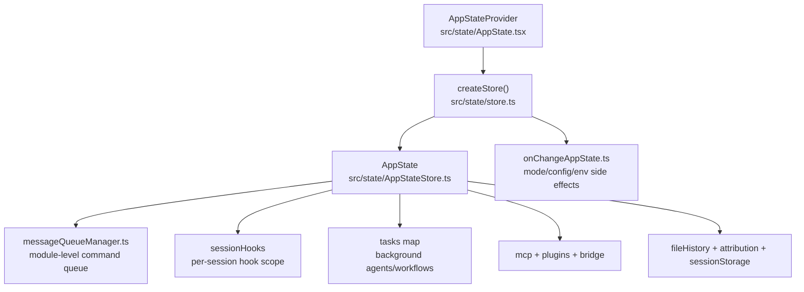
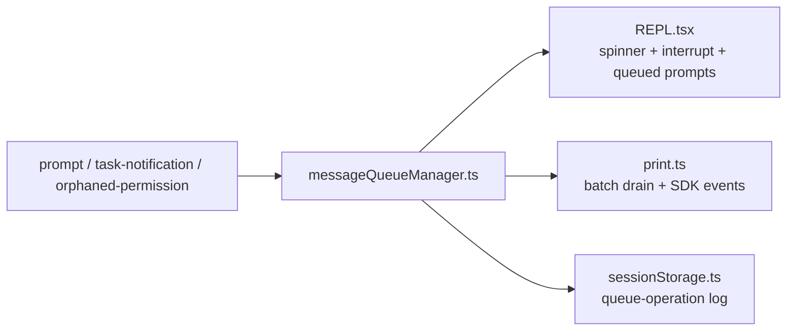

# Claude Code Architecture Handoff

## Why This Exists

`final-analysis.md` 解释了“这是什么、主链路怎么跑”。这份 handoff 专门补足另一半：哪些横切机制在真正决定维护难度，以及出现问题时应该先怀疑哪一层。

## Control Plane Overview

这张图想表达的重点不是“状态从哪里来”，而是：这个仓库并没有把 REPL、headless、task、resume、hook 各自封闭。它们通过同一批状态和平面机制彼此耦合。

## 1. AppState Is The Session Control Plane

`src/state/AppStateStore.ts` 的 `AppState` 更像一个 session control plane，而不是普通前端 store。

高价值字段可以按功能块理解：

- 交互与权限：`toolPermissionContext`、`mainLoopModel`、`thinkingEnabled`、`promptSuggestionEnabled`
- 后台并发：`tasks`、`agentNameRegistry`、`foregroundedTaskId`、`viewingAgentTaskId`
- 扩展与外联：`mcp.clients/tools/commands/resources`、`plugins.*`
- 持久化辅助：`fileHistory`、`attribution`
- 会话级自定义：`sessionHooks`
- 远端/桥接：`remoteConnectionStatus`、`remoteBackgroundTaskCount`、`replBridge*`

维护含义：

- 改某个命令时，如果它还涉及 permission mode、bridge、resume、remote metadata，就不再是“只改命令”。
- 很多 bug 看起来像 UI 问题，根因其实是 `AppState` 某个共享子结构没有同步。

## 2. The Store Is Thin; Side Effects Live Elsewhere

`src/state/store.ts` 的 store 很薄，只负责：

- 保存当前 state
- `setState(updater)`
- 通知 listeners

复杂度主要在两处：

- `AppStateProvider` 把 store 接进 React，并在 mount 时处理 settings/permission 兼容逻辑
- `onChangeAppState.ts` 统一处理状态变更后的副作用

这意味着：

- 如果是纯渲染抖动，优先看 selector 和订阅
- 如果是“状态变了但外部世界没变”，优先看 `onChangeAppState.ts`

## 3. `onChangeAppState.ts` Is The Side-Effect Choke Point

这个文件现在承担几类关键同步：

- permission mode -> CCR / SDK external metadata
- model override -> user settings + bootstrap override
- expandedView / verbose / ant-only panel visibility -> global config
- settings 变化 -> 清 auth cache + 重应用 `settings.env`

它的重要性在于：很多 mutation path 分布在 REPL、print、命令处理器、权限对话框里，但 mode/config/env 的落地被集中在这里。

## 4. Command Queue Is Shared Infrastructure, Not A UI Helper

`src/utils/messageQueueManager.ts` 统一维护模块级队列，并支持：

- 优先级：`now > next > later`
- React 订阅：`subscribeToCommandQueue()` + snapshot
- 非 React 读取：`dequeue()` / `peek()` / `dequeueAllMatching()`
- 审计：`recordQueueOperation()`

这个模块的价值在于把几类原本可能分散处理的输入合成一个统一入口：

- 用户 prompt
- 背景任务完成通知
- orphaned permission
- 某些 hook/notification 回流

在 `src/cli/print.ts` 里，这个队列会被 drain，并对 prompt 做批处理；在 `src/screens/REPL.tsx` 里，队列长度会直接影响 spinner、中断、loop mode tick 等行为。

## 5. Session Storage Is A Full Subsystem

`src/utils/sessionStorage.ts` 的职责远超“把消息写磁盘”。它更像 transcript / resume / sidechain 的子系统。

关键能力包括：

- 主 transcript 路径与 session project dir 解析
- subagent transcript 独立目录与 sidechain metadata
- JSONL entry 分类与 append
- `--resume` / `--continue` 的 transcript 装载与 metadata 恢复
- 大 transcript 的 pre-compact skip / lite read 优化
- 会话级附属数据：
  - `queue-operation`
  - `file-history-snapshot`
  - `attribution-snapshot`
  - `content-replacement`
  - `mode`
  - `worktree-state`
  - context collapse records

几个必须牢记的语义边界：

- `progress` 不是 transcript message，不参与 parentUuid chain
- sidechain agent transcript 走独立文件，不能直接按主 session UUID 去重
- `loadAllSubagentTranscriptsFromDisk()` 直接扫磁盘，所以任务从 `AppState.tasks` 淘汰后依然可恢复

## 6. Backgrounding Uses A Unified Task Framework

任务相关的最小骨架分布在这些文件：

- `src/Task.ts`
- `src/utils/task/framework.ts`
- `src/tasks/LocalAgentTask/LocalAgentTask.tsx`
- `src/tasks/LocalMainSessionTask.ts`
- `src/utils/task/diskOutput.ts`

统一模型是：

- task 有共享 `TaskStateBase`
- 通过 `registerTask()` 进入 `AppState.tasks`
- 通过 `updateTaskState()` 变更
- 通过 `enqueuePendingNotification()` 把终态重新送回主会话
- 输出落盘，支持附件/增量读取/淘汰

这里最重要的认知变化是：主会话 backgrounding 不是特殊硬编码，而是被建模成一种 `local_agent` 变体。`LocalMainSessionTask.ts` 复用了 task 基建，把主会话后台执行和普通 agent 背景执行放进同一抽象家族里。

## 7. Session Hooks Are Scoped And Merged

`src/utils/hooks.ts` 里真正高价值的不是“如何 exec 一个 shell hook”，而是“哪些 hook 会在当前 session 生效”。

它会合并：

- snapshot/config hooks
- registered hooks
- `AppState.sessionHooks` 中的 session hooks
- session function hooks

这使得 agent/skill frontmatter hook 能做到 session 级隔离，不把一个 agent 的 hook 泄漏给另一个 agent 或主线程。

另一个值得注意的细节是 async hook / asyncRewake：

- 它们可以后台执行
- 阻塞错误可以转成 `task-notification`
- 再通过统一消息队列回流到模型

## 8. Practical Triage Map

遇到问题时，可以先按下面的怀疑顺序排：

- “权限模式、model、verbose、bridge 状态变了但外部不同步”
  - 先查 `src/state/onChangeAppState.ts`
- “prompt、task-notification、orphaned permission 顺序异常”
  - 先查 `src/utils/messageQueueManager.ts`
  - 再查 `src/cli/print.ts` 或 `src/screens/REPL.tsx` 的消费点
- “resume、continue、subagent transcript、fork 后上下文不完整”
  - 先查 `src/utils/sessionStorage.ts`
- “后台 agent / 主会话 backgrounding 的通知、淘汰、输出文件异常”
  - 先查 `src/utils/task/framework.ts`
  - 再查 `src/tasks/LocalAgentTask/LocalAgentTask.tsx` 与 `src/tasks/LocalMainSessionTask.ts`
- “某个 agent/skill 的 hook 似乎串到别的 session”
  - 先查 `src/utils/hooks.ts` 与 `AppState.sessionHooks`

## Suggested Read Order For New Maintainers

1. `src/state/AppStateStore.ts`
2. `src/state/onChangeAppState.ts`
3. `src/utils/messageQueueManager.ts`
4. `src/utils/sessionStorage.ts`
5. `src/Task.ts`
6. `src/utils/task/framework.ts`
7. `src/tasks/LocalAgentTask/LocalAgentTask.tsx`
8. `src/tasks/LocalMainSessionTask.ts`
9. `src/utils/hooks.ts`
10. `src/cli/print.ts`
11. `src/screens/REPL.tsx`
