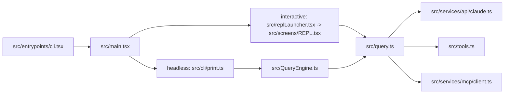

# Claude Code 完整项目分析报告

## 报告定位

这份报告面向两类读者：

- 第一次接手 `/Users/admin/work/claude-code` 的维护者
- 已经看过源码局部，但需要一份“当前仓库到底怎么工作”的全局交接文档的人

它不是逐目录说明书，也不是代码审查报告，而是一份以“当前构建真实会跑什么”为核心的架构分析。结论优先以代码为准，文档仅作为辅助参考。

## 一句话结论

这个仓库是一个基于 Bun 的、反编译还原版 Claude Code 终端智能体 CLI。它的核心不是某个单独的聊天循环，而是一套围绕终端会话组织起来的系统：入口与初始化、interactive/headless 双路径、`query()` 多轮 loop、工具与 MCP 扩展、session 级状态控制平面、transcript/resume 持久化、后台任务、skills/hooks/plugins 等共同协作。

## 一、项目身份与“当前真相”

### 1. 仓库是什么

从仓库形态看，这不是普通“AI app”，也不是一个单 SDK 包，而是一个中大型 Bun workspaces CLI monorepo：

- 主程序在 `src/`
- 工作区依赖在 `packages/*` 与 `packages/@ant/*`
- 终端 UI 使用 Ink / React
- 存在 headless `-p/--print` 模式
- 保留了 tools、MCP、skills、hooks、plugins、agents、background tasks、resume/transcript 等基础设施

它的目标并不是做一个精简 demo，而是尽量恢复官方 Claude Code CLI 的主运行形态，同时通过 feature gate 和 stub 让未恢复部分暂时不进入当前构建热路径。

### 2. 分析这个仓库最重要的原则

这个项目不能按“树上有哪些文件”来理解，而要按“当前默认构建到底会执行哪些路径”来理解。几个决定性事实如下：

- 真入口是 `src/entrypoints/cli.tsx`
- 当前 build 事实以 `build.ts` 为准，而不是根级文档说明
- `feature()` 在 `cli.tsx` 里被 polyfill 为恒 `false`
- interactive 与 headless 是两条不同主路径，不应该混成一条

### 3. 当前构建的三条关键现实

#### 事实 A：这是 Bun 运行时，不是 Node-first 工程

- `package.json` 使用 Bun 脚本
- `build.ts` 使用 `Bun.build(...)`
- 代码里大量默认前提都建立在 Bun 环境上

#### 事实 B：当前 build 是多文件 split build，不是单文件 bundle

根级 `AGENTS.md` / `CLAUDE.md` 仍把构建描述成单文件输出，但源码里的 `build.ts` 实际使用：

- `target: "bun"`
- `splitting: true`

也就是说，dist 产物形态、调试方式、运行时依赖关系，都应该按 split build 理解。

#### 事实 C：当前外部构建中，feature-gated 分支默认不活跃

`src/entrypoints/cli.tsx` 把 `feature()` 设为恒 `false`，这意味着很多 Anthropic 内部能力虽然还在代码里，但在当前构建下并不会进入主热路径。维护时必须把“代码存在”与“当前构建活跃”分开看。

## 二、真实执行路径

### 1. 顶层链路

当前最值得记住的主链路如下：

这个图里最重要的不是文件名，而是分叉位置：

- interactive 不先经过 `QueryEngine`
- headless 才是 `print.ts -> QueryEngine -> query()`

### 2. 入口与初始化

#### `src/entrypoints/cli.tsx`

职责：

- 注入 runtime polyfill
- 提供 `feature() === false` 的构建前提
- 写入 `MACRO`、`BUILD_TARGET`、`BUILD_ENV`、`INTERFACE_TYPE`
- 处理少数 fast-path
- 默认 dynamic import `../main.jsx`

这个文件决定了一个分析上的大前提：很多 feature-gated 代码在当前外部构建下默认是死路径。

#### `src/main.tsx`

职责：

- Commander 参数解析
- `init()` / `setup()` 链路
- settings、权限、skills、plugins、commands、MCP、LSP 等初始化
- interactive/headless 分支调度

这里是仓库最重要的编排层之一。不是因为它包含所有业务逻辑，而是因为它定义了启动时哪些能力会被装配进会话。

#### `src/entrypoints/init.ts`

职责：

- 一次性初始化
- 环境与配置预热
- telemetry / trust / remote settings 等准备性工作

### 3. 交互路径与 headless 路径

#### Interactive 路径

路径是：

`cli.tsx -> main.tsx -> replLauncher.tsx -> REPL.tsx -> query.ts`

关键点：

- `REPL.tsx` 是 interactive 模式的真正主控屏
- 工具和命令会在这里做最终合并
- 用户输入、spinner、队列、权限弹窗、背景任务反馈都在这里落到 UI
- 真正采样与工具循环时，`REPL.tsx` 会直接调用 `query()`

#### Headless 路径

路径是：

`cli.tsx -> main.tsx -> print.ts -> QueryEngine.ts -> query.ts`

关键点：

- `print.ts` 负责面向 SDK / headless 的运行包装
- `QueryEngine.ts` 负责消息状态、transcript、file cache、permission 包装、输出整形等
- 最终仍会落到 `query()`

### 4. `query.ts` 才是多轮智能体循环核心

无论 interactive 还是 headless，真正的多轮 loop 核心都在 `src/query.ts`。

它负责的事情包括：

- 调模型
- 收集 streaming 响应
- 抓取 `tool_use`
- 执行工具
- 插入 follow-up 消息
- 处理 compaction / reactive recovery / stop hooks
- 决定终止还是继续下一轮

所以如果你要改“模型如何思考并多轮行动”，首选阅读点不是 REPL，也不是 QueryEngine，而是 `query.ts`。

## 三、核心架构分层

### 1. 启动与编排层

主要文件：

- `src/entrypoints/cli.tsx`
- `src/main.tsx`
- `src/entrypoints/init.ts`
- `src/setup.ts`

这一层决定：

- 启动时装配什么
- 当前 session 有哪些能力
- 哪些系统在会话开始前已进入后台准备状态

### 2. 会话与循环层

主要文件：

- `src/QueryEngine.ts`
- `src/query.ts`
- `src/context.ts`
- `src/utils/claudemd.ts`

这一层决定：

- 会话上下文如何构造
- system prompt 如何拼装
- 多轮 tool loop 如何继续
- transcript 如何进入会话逻辑

### 3. API 与 provider 层

主要文件：

- `src/services/api/claude.ts`
- `src/services/api/client.ts`
- `src/services/api/withRetry.ts`

这一层决定：

- 如何组织模型请求
- 如何处理 streaming 与 fallback
- provider 适配如何切换

### 4. 工具与扩展层

主要文件：

- `src/tools.ts`
- `src/Tool.ts`
- `src/services/mcp/client.ts`
- `src/commands.ts`
- `src/skills/loadSkillsDir.ts`
- `src/utils/plugins/loadPluginCommands.ts`
- `src/utils/hooks.ts`

这一层决定：

- AI 有哪些可调用能力
- slash commands 如何装载
- MCP 如何进入工具池
- skills / plugins / hooks 如何扩展行为

### 5. 控制平面与持久化层

主要文件：

- `src/state/AppStateStore.ts`
- `src/state/onChangeAppState.ts`
- `src/utils/messageQueueManager.ts`
- `src/utils/sessionStorage.ts`
- `src/utils/task/framework.ts`
- `src/tasks/LocalMainSessionTask.ts`

这一层是第一版分析里最容易被低估、但实际最影响维护成本的部分。

## 四、真正的“控制平面”

### 1. `AppState` 是整个 session 的控制平面

`src/state/AppStateStore.ts` 里的 `AppState` 不是狭义前端状态，而是 session control plane。它集中承载：

- 权限与模型：`toolPermissionContext`、`mainLoopModel`
- 后台任务：`tasks`、`foregroundedTaskId`、`viewingAgentTaskId`
- MCP 与 plugins：`mcp.*`、`plugins.*`
- 持久化辅助：`fileHistory`、`attribution`
- session-scoped hooks：`sessionHooks`
- remote / bridge 状态：`remoteConnectionStatus`、`replBridge*`

这意味着很多问题看起来像“某个组件坏了”，但根因其实在共享状态平面没有同步好。

### 2. `onChangeAppState.ts` 是副作用闸门

这个文件至少统一处理了：

- permission mode -> 外部 session metadata / SDK 通知
- model override -> settings
- UI 配置项 -> global config
- settings/env 更新 -> auth cache 清理与环境变量重应用

它的重要性在于：变更来源很多，但副作用落地被集中在一个地方。如果 mode/config/env 相关行为不一致，优先怀疑这里。

### 3. `messageQueueManager.ts` 是 interactive 与 headless 的共用调度器

队列里统一流动的不是单一 prompt，而是多类命令：

- 用户 prompt
- 背景任务通知
- orphaned permission

它支持：

- 优先级：`now > next > later`
- React 订阅
- 非 React drain
- queue operation 持久化

这个设计很关键，因为它说明：

- REPL 与 print 不是完全独立的两套输入处理系统
- 队列行为会影响中断、spinner、批处理 prompt、task-notification 注入等多个层面

### 4. `sessionStorage.ts` 是 transcript / resume / sidechain 的基础设施层

它不只是“把消息 append 到 JSONL”。它负责：

- transcript 路径与项目目录计算
- main session 与 subagent sidechain transcript 分离
- `queue-operation`、`file-history-snapshot`、`attribution-snapshot`、`worktree-state` 等附属记录
- `--resume` / `--continue` 的载入与恢复
- 大 transcript 的优化读法

几个维护上必须牢记的语义边界：

- `progress` 不属于 transcript message，不参与 parent chain
- sidechain transcript 有独立文件，不应按主 session 逻辑简单去重
- 从 `AppState.tasks` 淘汰不代表 transcript 丢失，因为磁盘上的 `subagents/` 仍可被恢复读取

换句话说，resume 稳不稳，核心不在 REPL，而在 `sessionStorage.ts` 的链路一致性。

### 5. 后台任务不是旁路能力，而是一等机制

任务相关的统一骨架在：

- `src/Task.ts`
- `src/utils/task/framework.ts`
- `src/tasks/LocalAgentTask/LocalAgentTask.tsx`
- `src/tasks/LocalMainSessionTask.ts`
- `src/utils/task/diskOutput.ts`

统一模型是：

- 用共享 `TaskStateBase`
- 进入 `AppState.tasks`
- 输出走 disk output
- 完成后回流到统一消息队列

尤其值得强调：主会话 backgrounding 也不是特例 hack，而是被建模成 `main-session` 类型的 local task。这个结论对理解 `/clear`、resume、通知与 transcript 隔离非常重要。

### 6. Hooks 是 session-scoped 的

`src/utils/hooks.ts` 合并的不是单一配置来源，而是：

- snapshot/config hooks
- registered hooks
- `AppState.sessionHooks`

这意味着 agent 或 skill 的 frontmatter hook 可以按 session 隔离，而不是全局泄漏。并且 async hook 还可以通过任务通知重新进入队列，对模型继续产生影响。

## 五、扩展点地图

维护这个仓库时，比“目录树”更重要的是“某类能力从哪里改”。

### 1. 工具系统

优先阅读：

1. `src/tools.ts`
2. `src/Tool.ts`
3. `src/tools/<ToolName>/...`

适合处理：

- 默认工具池
- deny/allow 过滤
- 单个工具的输入、权限、调用逻辑

### 2. Slash commands

优先阅读：

1. `src/commands.ts`
2. `src/commands/<name>/`
3. `src/utils/processUserInput/processUserInput.ts`

适合处理：

- 命令注册
- 命令排序
- prompt 提交前的 command 分流

### 3. Skills

优先阅读：

1. `src/skills/bundled/index.ts`
2. `src/skills/loadSkillsDir.ts`
3. `src/commands.ts`

适合处理：

- bundled skills
- 用户/项目 skill 的 `SKILL.md` 加载
- frontmatter 驱动的行为注入

### 4. Plugins

优先阅读：

1. `src/commands/plugin/index.tsx`
2. `src/utils/plugins/loadPluginCommands.ts`
3. `initializeVersionedPlugins()` 的主流程调用点

注意：这个仓库的 plugin 系统并没有真正“被删除”，而是当前内建 registry 很薄，但基础设施仍在。

### 5. MCP

优先阅读：

1. `src/services/mcp/client.ts`
2. `src/services/mcp/config.ts`
3. `src/tools.ts`

适合处理：

- transport
- tool/resource 转换
- elicitation / OAuth
- MCP 工具进入权限链与工具池

### 6. Hooks

优先阅读：

1. `src/utils/hooks.ts`
2. `src/utils/processUserInput/processUserInput.ts`
3. `src/query.ts`

适合处理：

- prompt 前后 hook
- tool 前后 hook
- session hooks
- stop failure / async hook 行为

## 六、文档漂移与可信度

### 1. 根级文档存在明显漂移

根级 `AGENTS.md` / `CLAUDE.md` 当前至少在这些方面与代码不一致：

- build 不是单文件，而是 split build
- 并非没有 test/lint，仓库已经有 Bun test 和 Biome
- plugin / marketplace 基础设施仍在
- LSP 没有彻底移除
- voice 代码没有消失，只是默认 gate off

### 2. docs 站点整体比根级文档更可信，但也不是完全无偏差

抽样结论：

- `docs/conversation/the-loop.mdx` 基本贴近 `query.ts`
- `docs/extensibility/mcp-protocol.mdx` 基本贴近 `client.ts`
- `docs/extensibility/hooks.mdx` 与 `hooks.ts` 较一致
- `docs/extensibility/skills.mdx` 与 skills 加载路径较一致
- `docs/introduction/architecture-overview.mdx` 有一个关键误导：把 `QueryEngine` 写成 REPL 与 `query()` 的统一中间层

### 3. 建议的“信任顺序”

对于后续维护者，更实用的信任顺序是：

1. 入口文件、registry、主 loop、持久化代码
2. docs 站里的 conversation / extensibility 章节
3. docs 站里的总览页
4. 根级 AGENTS / CLAUDE

## 七、仓库噪音与维护风险

### 1. 反编译噪音很高

当前代码库包含：

- decompiled React Compiler 产物
- 大量不可靠类型
- 镜像目录与占位目录，例如 `src/src/*`、`*/src/*`

维护建议：

- 优先相信真实入口与 registry
- 不要从镜像目录倒推主实现

### 2. “有代码”不等于“有活跃能力”

很多模块必须同时看三层条件：

- `feature()` 是否已在当前构建下被关闭
- `process.env.USER_TYPE === "ant"` 等运行条件
- settings / env 是否真的启用它

### 3. `src/main.tsx` 与 `REPL.tsx` 都偏大，局部阅读很容易失焦

这两个文件都承载了过多责任。维护时不要一上来就从头读到尾，而应该带着具体问题，从调用点反向追踪。

### 4. 本报告的边界

本次结论主要来自静态代码分析，没有完整跑一遍所有 CLI 场景。因此：

- provider-specific 差异
- 企业策略路径
- 某些 feature-gated 能力的恢复情况

仍然应该视为“基于代码高度可信的推断”，而不是运行时实测结论。

## 八、建议阅读顺序

如果你要在最短时间内建立正确心智模型，建议按下面顺序读：

1. `src/entrypoints/cli.tsx`
2. `src/main.tsx`
3. `src/entrypoints/init.ts`
4. `src/state/AppStateStore.ts`
5. `src/state/onChangeAppState.ts`
6. `src/utils/messageQueueManager.ts`
7. `src/utils/sessionStorage.ts`
8. `src/tools.ts`
9. `src/commands.ts`
10. `src/QueryEngine.ts`
11. `src/query.ts`
12. `src/services/api/claude.ts`
13. `src/services/mcp/client.ts`
14. `src/utils/hooks.ts`
15. `src/skills/loadSkillsDir.ts`
16. `src/utils/plugins/loadPluginCommands.ts`
17. `src/tasks/LocalMainSessionTask.ts`
18. `src/screens/REPL.tsx`

## 九、最值得立即做的后续动作

如果接下来要继续推进仓库维护，我建议优先做这三件事：

### 1. 先修文档漂移

优先修：

- 根级 `AGENTS.md`
- 根级 `CLAUDE.md`
- `docs/introduction/architecture-overview.mdx`

原因很简单：这些文档现在会直接误导新维护者。

### 2. 给状态/持久化层补一页正式文档

目前大家最容易高估 `query.ts` 的中心性，而低估 `AppState`、queue、sessionStorage、tasks 的复杂度。建议把本报告中“四、真正的控制平面”这一部分拆成正式项目文档。

### 3. 对超大编排文件做“按边界拆分”的维护性重构

优先对象：

- `src/main.tsx`
- `src/screens/REPL.tsx`

不是为了“代码好看”，而是为了让 interactive/headless、queue、task、bridge、hook 等横切逻辑不再难以定位。

## 十、最终判断

当前 `/Users/admin/work/claude-code` 的可维护性问题，不在于“功能太少”，而在于：

- 真实热路径与文档认知不一致
- 控制平面分散在多层共享机制里
- 反编译噪音会让读者误把非活跃代码当活跃系统

但反过来说，这个仓库也并不是完全不可接手。只要先抓住下面几个锚点，维护工作就会迅速清晰：

- `cli.tsx` 决定当前构建前提
- `main.tsx` 决定启动装配
- `REPL.tsx` 与 `print.ts` 决定 interactive/headless 分叉
- `query.ts` 决定多轮 agentic loop
- `AppState + queue + sessionStorage + tasks + hooks` 决定 session 的真实控制平面

如果把这几个锚点先建立起来，这个仓库就不再像一团“反编译残骸”，而会更像一个复杂但仍然可以系统化维护的 CLI 智能体平台。
