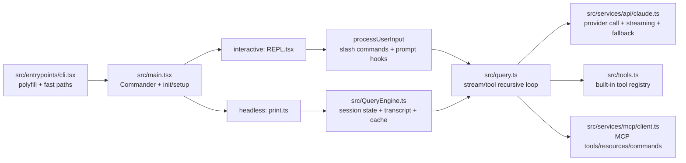
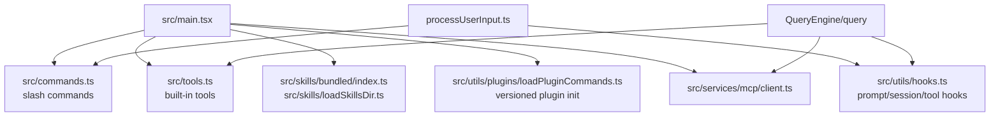

# Claude Code Analysis

## Project Summary

这个仓库是一个基于 Bun 的、反编译还原版 Claude Code 终端 CLI，不是普通“聊天 app”也不是单一 SDK 包。它的核心目标是把官方 Claude Code 的 CLI 运行链路、终端 UI、工具系统、MCP、skills、hooks 和多轮 agentic query loop 尽量复刻出来，同时通过 feature gate 和 stub 保留大量未启用或未完全恢复的分支。

从仓库形态上看，它是一个 Bun workspaces monorepo：主程序在 `src/`，本地包在 `packages/*` 与 `packages/@ant/*`，文档站由 `mint.json` 驱动。当前维护这个项目时，最重要的原则不是“树上有什么”，而是“当前构建到底会执行什么”。

## What Actually Runs

当前构建的真实热路径以 `src/entrypoints/cli.tsx` 为起点。这个文件在最顶部注入 runtime polyfill，把 `feature()` 固定为 `false`，并写入 `MACRO`、`BUILD_TARGET`、`BUILD_ENV`、`INTERFACE_TYPE` 等全局常量。这个细节决定了一个非常重要的事实：大量 Anthropic 内部分支虽然在代码树里存在，但在当前仓库的默认 dev/build 路径下不会被激活。

默认 CLI 路径会从 `src/entrypoints/cli.tsx` dynamic import `src/main.tsx`。`src/main.tsx` 使用 Commander 解析参数，在 `preAction` 中先跑 `init()`，然后进入 `setup()`、权限初始化、bundled skills/plugins 注册、commands 和 agent definitions 预加载、MCP 配置读取、LSP manager 初始化，以及 interactive/headless 两条分支。interactive 模式通过 `src/replLauncher.tsx` 加载 `src/screens/REPL.tsx`；headless `-p/--print` 则转入 `src/cli/print.ts`。

真正驱动一轮对话的是 `src/query.ts`。`src/QueryEngine.ts` 是 headless/SDK 路径外包的一层 orchestrator，负责消息列表、session transcript、file state cache、slash command 预处理、tool permission 包装、SDK 输出转换；interactive REPL 分支则在 `src/screens/REPL.tsx` 里直接构造上下文并调用 `query()`。`query.ts` 负责多轮 `while (true)` 递归循环：请求模型流式输出、收集 `tool_use`、执行工具、插入 attachment/memory/skill prefetch、在需要时继续下一轮。模型调用本身在 `src/services/api/claude.ts`，里面处理 provider 选择、tool schema 构造、streaming、watchdog、fallback 到 non-streaming、usage/cost 记录等。

## Runtime And Build

- Runtime: Bun，`package.json` 通过 `bun run dev` 直接执行 `src/entrypoints/cli.tsx`。
- Module system: ESM，`"type": "module"`，TSX 使用 `react-jsx`。
- Workspaces: `packages/*` 与 `packages/@ant/*` 通过 `workspace:*` 引用。
- Build: 以 `build.ts` 为准，而不是旧文档描述。当前是 `Bun.build({ entrypoints: ["src/entrypoints/cli.tsx"], outdir: "dist", target: "bun", splitting: true })`，随后把输出里的 `import.meta.require` 替换成兼容 Node 的 `createRequire` 方案。
- Output shape: 这是多文件 code-splitting 构建，不是单文件 bundle。
- Test/Lint reality: 仓库并非“完全没有测试和 lint”。`package.json` 已经配置了 `bun test`、Biome `lint` / `format`，并且 `src/utils/__tests__` 下已有少量测试；只是测试覆盖面还很薄，不足以把文档里列出的复杂功能都兜住。

## Execution Flow

下面这张图是当前构建最值得记住的主路径：

按步骤拆开：

1. `src/entrypoints/cli.tsx`
   - 处理极少数 fast-path，例如 `--version`。
   - 默认情况下启动 early input capture，然后 import `../main.jsx`。
   - 这里的 `feature = () => false` 是“当前构建的第一开关”。
2. `src/main.tsx`
   - 负责 CLI 参数、权限模式、settings 加载、`init()`、`setup()`。
   - 在 `setup()` 前就注册 bundled skills / builtin plugins，避免 commands 预加载时拿到空技能列表。
   - 并发拉起 commands、agent definitions、MCP 配置、部分上下文预取。
3. `src/entrypoints/init.ts`
   - 做配置启用、safe env、graceful shutdown、telemetry 初始化准备、OAuth 信息补齐、remote settings/policy limits 预热等。
4. `src/utils/processUserInput/processUserInput.ts`
   - 统一处理 prompt、slash commands、attachments、UserPromptSubmit hooks。
   - 这是“命令系统”和“正式 query loop”之间的第一层桥。
5. `src/QueryEngine.ts`
   - 主要服务于 headless/SDK 路径。
   - 构造 system prompt parts、写 transcript、更新 app state、封装 `canUseTool`、处理 orphaned permissions，然后把控制权交给 `query()`。
6. `src/query.ts`
   - 真正的 agentic 多轮循环核心。
   - 管理 compaction、streaming tool execution、prompt-too-long/max-output-tokens 恢复、stop hooks、queued commands、memory/skill prefetch。
7. `src/services/api/claude.ts`
   - 构造 API 请求、工具 schema、tool search、provider/beta header、stream watchdog。
   - 负责 streaming 与 non-streaming fallback 切换，并为 Bedrock / Vertex / Foundry / first-party 做适配。

## Core Module Map

### 1. Entrypoint / Bootstrap

- `src/entrypoints/cli.tsx`: 真正入口，决定哪些 fast-path 可以在不加载全 CLI 的情况下运行。
- `src/main.tsx`: 最大的编排层，负责把配置、权限、commands、agents、MCP、interactive/headless 模式组织起来。
- `src/entrypoints/init.ts`: 一次性初始化与环境准备。

### 2. Conversation Engine

- `src/QueryEngine.ts`: 会话级 orchestrator。
- `src/query.ts`: turn loop。
- `src/context.ts`: system/user context 注入，含 git 状态与 CLAUDE/AGENTS memory 收集。
- `src/utils/claudemd.ts`: 发现并组合 memory/CLAUDE.md 文件。

### 3. API Layer

- `src/services/api/claude.ts`: 主模型调用层。
- `src/services/api/client.ts`: provider client 构造，覆盖 first-party、Bedrock、Foundry、Vertex。
- `src/services/api/withRetry.ts`: retry / fallback 策略。

### 4. Tooling Layer

- `src/Tool.ts`: `Tool` 接口与匹配工具函数。
- `src/tools.ts`: built-in 工具注册与过滤中心。
- `src/tools/<ToolName>/...`: 各工具独立实现。

### 5. Command / Skill / Plugin Layer

- `src/commands.ts`: slash commands registry，同时合并 built-in、bundled skills、本地 skills、plugins、workflow commands。
- `src/skills/bundled/index.ts`: 内置技能注册。
- `src/skills/loadSkillsDir.ts`: 读取 `.claude/skills`、用户目录或 managed 目录的技能 markdown。
- `src/utils/plugins/loadPluginCommands.ts`: 读取插件提供的 commands/skills。

### 6. MCP / Hook / Optional Services

- `src/services/mcp/client.ts`: MCP transport、client、tool/resource 包装、OAuth / elicitation。
- `src/utils/hooks.ts`: hook 执行核心。
- `src/services/lsp/manager.ts`: LSP manager 启动与重初始化。

### 7. UI Layer

- `src/replLauncher.tsx`: 轻量加载器。
- `src/screens/REPL.tsx`: 超大体量的 Ink 交互主屏，也是 interactive 分支直接调用 `query()` 的地方。
- `src/components/*`: 消息、输入、权限、任务等 UI 组件。

## Extension Points

这个仓库最实用的维护地图不是“目录树”，而是“我想改一类能力时从哪里下手”。可以这样记：

按改动目标分类：

- 改工具可用集合或权限前可见性：先看 `src/tools.ts`。
- 改单个工具行为：去 `src/tools/<ToolName>/`。
- 改 slash command 注册顺序或可见性：看 `src/commands.ts`。
- 改本地/项目 skill 发现逻辑：看 `src/skills/loadSkillsDir.ts`。
- 改 bundled skills：看 `src/skills/bundled/index.ts` 与各 `src/skills/bundled/*.ts`。
- 改插件命令/技能装载：看 `src/utils/plugins/loadPluginCommands.ts`、`initializeVersionedPlugins()` 所在的主流程。
- 改 MCP server/tool/resource 行为：看 `src/services/mcp/client.ts` 与 `src/services/mcp/config.ts`。
- 改 hook 生命周期：看 `src/utils/hooks.ts`，以及 `processUserInput` / `query.ts` 里触发 hooks 的位置。
- 改一轮 query loop：优先读 `src/QueryEngine.ts` 和 `src/query.ts`，不要先陷进 `REPL.tsx`。

## State, Persistence, And Backgrounding

第一版分析把主执行流讲清了，但维护这个仓库时，真正容易把人拖进细节泥潭的，是几条横切全局的“控制平面”：AppState、消息队列、transcript 持久化、任务框架，以及 session-scoped hooks。

### 1. `AppState` 不是普通 UI state，而是整个 session 的控制平面

`src/state/AppStateStore.ts` 里的 `AppState` 远不止 messages / loading 这类前端字段。它实际上把几类关键状态都集中在一起：

- session 与权限：`toolPermissionContext`、`mainLoopModel`、`thinkingEnabled`
- 后台任务：`tasks`、`foregroundedTaskId`、`viewingAgentTaskId`
- 扩展系统：`mcp.clients/tools/commands/resources`、`plugins.enabled/disabled/errors`
- 持久化与恢复：`fileHistory`、`attribution`
- 会话范围自定义：`sessionHooks`
- remote/bridge 连接：`remoteConnectionStatus`、`replBridge*`

`src/state/store.ts` 的实现本身非常薄，只做 `getState()`、`setState()`、`subscribe()`。复杂度不在 store 机制，而在 `AppState` 这个结构聚合了多少系统横切状态。

### 2. `onChangeAppState.ts` 是副作用总闸门

`src/state/onChangeAppState.ts` 不是一个普通的“状态监听器”，而是当前仓库里最重要的统一副作用出口之一。它至少负责：

- 权限模式变化时，把 mode 同步到外部 session metadata / SDK 通知
- 持久化 model override 到 settings
- 把 `expandedView` / `verbose` / ant-only tmux panel 开关写回全局配置
- settings 变化时清空 auth cache，并重新应用 `settings.env`

这意味着：如果出现“UI 上 mode 已经变了，但外部会话、SDK、配置文件没跟上”的问题，第一排查点通常不是某个命令，而是 `onChangeAppState.ts` 有没有覆盖到这条 mutation 路径。

### 3. `messageQueueManager.ts` 是 REPL 和 headless 共用的统一调度器

`src/utils/messageQueueManager.ts` 明确把三类东西放进同一个 module-level queue：

- 用户 prompt
- 任务完成通知
- orphaned permission

这个队列支持 `now > next > later` 三档优先级，同时给两种消费方式：

- React 路径通过 `useSyncExternalStore` 风格接口订阅
- 非 React 路径直接 `dequeue()` / `peek()` 读取

这不是一个可有可无的小工具，而是 interactive 和 headless 分支之间的重要共用层：

- `src/cli/print.ts` 会订阅队列，并在 `run()` 中 drain queue，批量合并 prompt、单独处理 `task-notification` 和 `orphaned-permission`
- `src/screens/REPL.tsx` 会用队列长度控制 spinner 与中断行为，也会把 loop mode 的 tick 直接 `enqueue({ mode: "prompt" ... })`

更关键的是，队列操作会通过 `recordQueueOperation()` 持久化到 `sessionStorage`。也就是说，这个队列不只是临时 UI 行为，它还是 session 审计轨迹的一部分。

### 4. `sessionStorage.ts` 是 transcript / resume / sidechain 的基础设施层

如果说 `query.ts` 是“当下这一轮怎么跑”，那 `src/utils/sessionStorage.ts` 就是“这次会话如何被记住、恢复、裁剪、分叉、继续”。

这个模块承担的事情至少包括：

- 主 session transcript 路径与 JSONL append
- subagent / sidechain transcript 路径管理
- queue-operation、file-history snapshot、attribution snapshot、content replacement、worktree state 等非普通消息的持久化
- `--resume` / `--continue` 的 transcript 读取与 metadata 恢复
- 大 transcript 的 pre-compact skip / partial read 优化，避免恢复时 OOM

几个维护上必须记住的判断：

- 只有 `user` / `assistant` / `attachment` / `system` 被视为 transcript message；progress 不参与 parentUuid chain
- sidechain agent transcript 会写到独立文件，不能简单按主 session UUID 去重
- `loadAllSubagentTranscriptsFromDisk()` 是直接扫磁盘 `subagents/` 目录，而不是只信 `AppState.tasks`，所以任务从 state 中淘汰后 transcript 仍可恢复

换句话说，这个项目的“resume 能不能稳”主要不取决于 REPL，而取决于 `sessionStorage.ts` 的链路是否自洽。

### 5. 后台化不是附属功能，而是任务框架的一等能力

`src/Task.ts`、`src/utils/task/framework.ts`、`src/tasks/LocalAgentTask/LocalAgentTask.tsx`、`src/tasks/LocalMainSessionTask.ts` 共同说明：后台 agent / workflow / 主会话 backgrounding 不是零散补丁，而是同一套 task 基建上的不同变体。

统一点包括：

- task 有统一的 `TaskStateBase`
- `registerTask()` / `updateTaskState()` 负责进 `AppState.tasks`
- task 完成后通过 `enqueuePendingNotification()` 回流到统一消息队列
- task 输出走 `diskOutput`，不是只存在内存里

尤其值得注意的是 `LocalMainSessionTask.ts`：主线程 query 被 background 后，不是“偷偷继续跑”，而是被显式建模成 `agentType: "main-session"` 的 local task，并把输出链接到独立 transcript 文件，避免 `/clear` 之后污染主 session transcript。

### 6. Hooks 是 session-scoped 的，不只是全局配置

`src/utils/hooks.ts` 不是只读一个 settings 文件那么简单。它会合并三层来源：

- snapshot/config hooks
- registered hooks
- `AppState.sessionHooks` 里的 session-scoped hooks

这让 agent/skill frontmatter hook 可以按 session 或 agent 隔离，不互相泄漏。并且 async hook 还能通过 `enqueuePendingNotification()` 把阻塞错误重新送回模型，形成真正参与 loop 的反馈路径。

## Known Noise And Constraints

### 1. Feature gate 是当前构建最强的裁剪器

`src/entrypoints/cli.tsx` 把 `feature()` 固定为 `false`，这意味着很多 Anthropic 内部分支虽然仍在代码里，但在当前 dev/build 默认路径下不会执行。分析这个仓库时，不能把 `feature('X')` 包裹的代码直接视为“系统现有能力”。

### 2. 反编译噪音高

这个仓库包含大量 decompiled React Compiler 产物、宽松类型、镜像目录与历史残留。比如 `src/screens/REPL.tsx` 体积巨大，很多辅助目录也有 `src/src/*` 这样的镜像结构。对维护者来说，registry 和入口远比遍历目录树更重要。

### 3. “存在代码”不等于“活跃能力”

Voice、bridge、buddy、coordinator、workflow 等模块很多仍在，但是否活跃要看三层：

- `feature()` 是否被当前构建编译掉
- `process.env.USER_TYPE === "ant"` 之类的运行条件
- runtime setting / env gate 是否实际开启

### 4. Runtime 约束偏 CLI-first

这不是以 HTTP server 为中心的系统，而是围绕 terminal session、TTY、hook、tool permission、transcript 和 background tasks 设计的 CLI。很多抽象是围绕“一次终端会话中的多轮 prompt/turn”构建的。

## Documentation Drift

这里是最值得明确拆开的部分。

### Docs say / code says

- Build 产物
  - 文档说：`AGENTS.md` / `CLAUDE.md` 写的是单文件 `bun build ... --outdir dist --target bun`。
  - 代码说：`build.ts` 已明确使用 `splitting: true` 的多文件构建，并在构建后修补 Node 兼容 require。

- Test / lint 状态
  - 文档说：没有 test runner，没有 linter。
  - 代码说：`package.json` 已有 `bun test`、Biome lint/format，且 `src/utils/__tests__` 下已有实际测试文件。

- Plugins / Marketplace
  - 文档说：Plugins / Marketplace removed。
  - 代码说：`src/commands/plugin/index.tsx` 仍注册 `/plugin` / `/plugins` / `/marketplace`，`src/utils/plugins/loadPluginCommands.ts` 仍负责插件 commands/skills 装载，`src/main.tsx` 仍会运行 `initializeVersionedPlugins()`。
  - 更准确的描述应是：插件系统仍存在，built-in plugin registry 目前为空，但 marketplace/plugin 相关基础设施没有被删除。

- LSP
  - 文档说：LSP Server removed。
  - 代码说：`src/main.tsx` 仍调用 `initializeLspServerManager()`，`src/services/lsp/manager.ts` 仍维护完整的 singleton lifecycle，`src/tools.ts` 仍可在 `ENABLE_LSP_TOOL` 为真时暴露 `LSPTool`。
  - 更准确的描述应是：LSP 不是主热路径默认能力，但并未从代码库移除。

- Voice
  - 文档说：Voice Mode removed。
  - 代码说：`src/screens/REPL.tsx`、`src/commands/voice/*`、`src/voice/*` 依然保留，只是被 `feature('VOICE_MODE')` 包住，当前构建默认不激活。
  - 更准确的描述应是：Voice 是“编译期关闭的保留分支”，不是“仓库里已不存在”。

## Docs Site Vs Root Docs

根级 `AGENTS.md` / `CLAUDE.md` 的漂移最明显，但 `docs/` 站点并不是完全同一程度地失真。抽样结果更像是：

- `docs/conversation/the-loop.mdx`
  - 与 `src/query.ts` 的主循环结构基本一致，可作为辅助阅读材料。
- `docs/extensibility/mcp-protocol.mdx`
  - 对 `src/services/mcp/client.ts` 的工具发现、连接、权限链路描述整体可信。
- `docs/extensibility/hooks.mdx`
  - 对 hook 类型、session hooks、async hook 行为的描述与代码较贴近。
- `docs/extensibility/skills.mdx`
  - 对 skills 来源、frontmatter、inline/fork 双路径的讲解基本是代码导向的。
- `docs/introduction/architecture-overview.mdx`
  - 有一处关键误导：它把 `QueryEngine` 写成 REPL 与 `query()` 之间的统一编排层，但当前代码实际是：
    - interactive: `REPL.tsx` 直接调用 `query()`
    - headless/print: `print.ts` 通过 `QueryEngine` 落到 `query()`

因此更准确的信任排序应是：

1. 入口文件、registry、主 loop、持久化代码
2. docs 站的 conversation/extensibility 章节
3. 根级 AGENTS/CLAUDE 这类项目说明

## Confidence And Remaining Gaps

这份分析的高置信部分来自真实入口、构建脚本、registry、query loop 与 API 层代码，而不是 README 的能力表。为了避免把冲突描述写成想当然的结论，我额外做了一轮有边界的复查，专门核验 plugin / LSP / voice 三个最容易被文档误导的点，结论都能在实际代码入口里找到直接证据。

剩余的保留项主要有三类：

- 我没有实际运行完整 CLI 流程，只做了静态代码路径分析，所以某些运行期设置、远端 provider、企业 policy 路径的细节仍属于“高概率推断”。
- feature-gated 分支很多，我刻意只把当前构建的活跃路径当作主结论，没有把所有 dormant 分支一一深挖。
- docs 站 `docs/` 本身没有逐页审计，因此这里只指出根级指导文档与代码的关键漂移，不声称站点文档全部准确或全部失效。

## Suggested Reading Order

1. `src/entrypoints/cli.tsx`
2. `src/main.tsx`
3. `src/entrypoints/init.ts`
4. `src/state/AppStateStore.ts`
5. `src/state/onChangeAppState.ts`
6. `src/utils/messageQueueManager.ts`
7. `src/utils/sessionStorage.ts`
8. `src/tools.ts`
9. `src/commands.ts`
10. `src/QueryEngine.ts`
11. `src/query.ts`
12. `src/services/api/claude.ts`
13. `src/services/mcp/client.ts`
14. `src/utils/hooks.ts`
15. `src/skills/loadSkillsDir.ts`
16. `src/utils/plugins/loadPluginCommands.ts`
17. `src/tasks/LocalMainSessionTask.ts`
18. `src/screens/REPL.tsx`

## Follow-up Questions

- 当前项目希望保留多少“官方代码形状”，又愿意多大程度上清理反编译噪音和死分支？
- `AGENTS.md` / `CLAUDE.md` 是否应该更新成“当前真实构建说明”，避免新人按旧文档误判？
- plugins / LSP / voice 这些“代码存在但默认不活跃”的能力，未来目标是恢复、冻结还是删除？
- 是否需要把 `src/main.tsx` / `src/screens/REPL.tsx` 做进一步拆分，以降低维护成本？

## Visual Suggestions

- 已包含 2 张高价值 Mermaid 图：主执行流、扩展点地图。
- 如果后续要继续做分享版文档，下一张最值得补的是“interactive REPL 与 headless print 分支对照图”。
