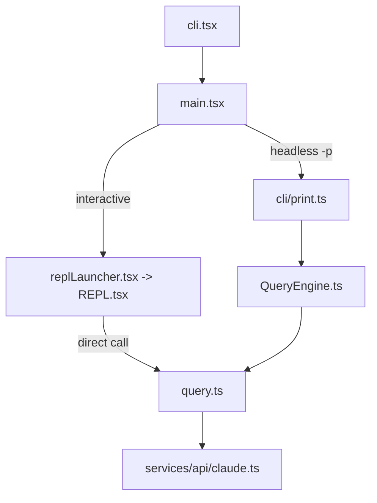

# Claude Code Maintainer Deep Dive

## Why This Follow-up Exists

第一份分析已经回答了“这个仓库是什么、主链路怎么走”。这一份更偏维护视角，回答的是：

- interactive REPL 和 headless `-p` 到底在哪分叉
- 改工具、命令、skills、plugins、MCP、hooks 时，真正会穿过哪些代码
- 哪些目录大概率是噪音、stub 或类型占位，维护时应该降低优先级

## Interactive vs Headless

这是当前最容易误判的一条边界：

### Interactive path

- `src/main.tsx` 在 interactive 模式下挂载 [REPL.tsx](/Users/admin/work/claude-code/src/screens/REPL.tsx)。
- `REPL.tsx` 内部先通过 `useMergedTools()` 和 `useMergedCommands()` 把本地、插件、MCP 侧的工具与命令拼起来。
- 真正执行一轮模型请求时，`REPL.tsx` 在 `onQuery` 里直接调用 `query({...})`。
- 这意味着：
  - 如果你在改 interactive 的消息生命周期、spinner、turn metrics、prompt queue、UI 可见事件，优先看 `REPL.tsx`。
  - 如果你在改“所有模式共用”的 tool loop / prompt-too-long / compaction / tool execution，优先看 `query.ts`。

### Headless path

- `src/main.tsx` 的 `-p/--print` 分支进入 [print.ts](/Users/admin/work/claude-code/src/cli/print.ts)。
- `print.ts` 用 `ask()` / `QueryEngine` 包住会话状态和 SDK 输出，再落到 `query()`。
- 这意味着：
  - 如果你在改 SDK/stream-json 行为、structured IO、permission prompt tool、headless session 恢复，优先看 `print.ts` 与 `QueryEngine.ts`。
  - 如果改动只涉及纯 query 行为，通常 `query.ts` 一处即可同时影响 REPL 和 headless。

## Contributor Change Map

### 1. 改工具系统

入口顺序：

1. [tools.ts](/Users/admin/work/claude-code/src/tools.ts)
2. [Tool.ts](/Users/admin/work/claude-code/src/Tool.ts)
3. `src/tools/<ToolName>/`

实战判断：

- 想改“默认有哪些工具可见”：先改 `getAllBaseTools()` / `getTools()`。
- 想改“权限 deny rules 如何过滤工具”：看 `filterToolsByDenyRules()` 和 `assembleToolPool()`。
- 想改 interactive 里合并后的工具池：看 [useMergedTools.ts](/Users/admin/work/claude-code/src/hooks/useMergedTools.ts)。

### 2. 改 slash commands

入口顺序：

1. [commands.ts](/Users/admin/work/claude-code/src/commands.ts)
2. `src/commands/<name>/`
3. [processUserInput.ts](/Users/admin/work/claude-code/src/utils/processUserInput/processUserInput.ts)

实战判断：

- 改命令是否被加载、排序、按 source 合并：看 `getCommands()` / `loadAllCommands()`。
- 改 REPL 中立即执行的 local-jsx command：看 `REPL.tsx` 的 `onSubmit` immediate command 分支。

### 3. 改 skills

入口顺序：

1. [skills/bundled/index.ts](/Users/admin/work/claude-code/src/skills/bundled/index.ts)
2. [loadSkillsDir.ts](/Users/admin/work/claude-code/src/skills/loadSkillsDir.ts)
3. [commands.ts](/Users/admin/work/claude-code/src/commands.ts)

实战判断：

- 想加内置 skill：先看 `initBundledSkills()`。
- 想理解项目/用户 skill markdown 怎么进系统：看 `loadSkillsDir.ts` 的 frontmatter 解析和 command 生成。

### 4. 改 plugins

入口顺序：

1. [commands/plugin/index.tsx](/Users/admin/work/claude-code/src/commands/plugin/index.tsx)
2. [loadPluginCommands.ts](/Users/admin/work/claude-code/src/utils/plugins/loadPluginCommands.ts)
3. `initializeVersionedPlugins()` 在 [main.tsx](/Users/admin/work/claude-code/src/main.tsx) 的调用点

实战判断：

- 这个仓库的 plugin 系统不是“已删除”，而是“仍在，且启动时会初始化版本化插件体系”。
- 真正空的是 built-in plugin registry，不是整个插件基础设施。

### 5. 改 MCP

入口顺序：

1. [services/mcp/client.ts](/Users/admin/work/claude-code/src/services/mcp/client.ts)
2. `src/services/mcp/config.ts`
3. [tools.ts](/Users/admin/work/claude-code/src/tools.ts)
4. REPL / print 分支各自的 MCP merge 点

实战判断：

- tool/resource 包装、transport、elicitation、OAuth，都在 `client.ts`。
- REPL 和 headless 都会额外做 MCP tools/commands merge，不要只改 registry。

### 6. 改 hooks

入口顺序：

1. [hooks.ts](/Users/admin/work/claude-code/src/utils/hooks.ts)
2. [processUserInput.ts](/Users/admin/work/claude-code/src/utils/processUserInput/processUserInput.ts)
3. `query.ts`
4. `sessionStart` / `setup` 触发点在 [main.tsx](/Users/admin/work/claude-code/src/main.tsx) 和 [print.ts](/Users/admin/work/claude-code/src/cli/print.ts)

实战判断：

- prompt 提交前的 hook 是 `processUserInput` 关心。
- tool 后、stop hook、notification hook 属于 `query.ts` / `hooks.ts` 的协作区。
- startup/setup hook 的触发时机，需要区分 interactive 与 headless。

## What `setup()` Actually Does

[setup.ts](/Users/admin/work/claude-code/src/setup.ts) 不是主 query 逻辑，但它决定了“会话开始前哪些背景能力会被铺好”。可以粗分成两类。

### Runtime-critical

- 设置 cwd / project root
- 捕获 hooks config snapshot
- 初始化 FileChanged watcher
- 处理 `--worktree` 与 tmux
- 在非 bare 模式下注册 session memory / context collapse 等关键后台能力

### Mostly prefetch / housekeeping

- plugin hooks preload
- attribution hooks
- session file access hooks
- team memory watcher
- release notes / logo 数据预热
- API key helper prefetch

维护建议：

- 如果你在改首屏速度或 CLI 启动成本，优先看 `setup.ts` 里哪些事情只是 prefetch。
- 如果你在改 query correctness，不要先钻进这些 housekeeping 分支。

## Noise Zones

### 1. `src/src/*` 和 `*/src/*` 类型占位目录

这些不是主实现，很多文件就是自动生成的 type stub，例如：

- [src/src/bootstrap/state.ts](/Users/admin/work/claude-code/src/src/bootstrap/state.ts)
- [src/src/utils/cwd.ts](/Users/admin/work/claude-code/src/src/utils/cwd.ts)
- [src/context/src/state/AppState.ts](/Users/admin/work/claude-code/src/context/src/state/AppState.ts)

它们更像反编译后的占位兼容层，不应该优先当成真实实现入口。

### 2. `feature()` 恒 false 的分支

任何 `feature('X')` 包住的逻辑，都要先默认它在当前构建不活跃，再去确认是否有别的运行路径绕开了它。

### 3. `process.env.USER_TYPE === "ant"` 分支

这类分支通常是内部构建或 dogfooding 代码。当前仓库分析时应默认不是主热路径，除非你明确在恢复那类能力。

### 4. Workspace packages

`packages/*` 里既有接近可用的替代实现，也有明显 stub。

- `color-diff-napi` 更像真实 TypeScript port
- `audio-capture-napi` 是 shell-command 替代实现
- 很多 `@ant/*` 包与其他 `*-napi` 包则更接近占位或裁剪版兼容层

## Practical Reading Order By Task

### 想改一次用户提交到模型响应的全过程

1. [REPL.tsx](/Users/admin/work/claude-code/src/screens/REPL.tsx) 或 [print.ts](/Users/admin/work/claude-code/src/cli/print.ts)
2. [processUserInput.ts](/Users/admin/work/claude-code/src/utils/processUserInput/processUserInput.ts)
3. [query.ts](/Users/admin/work/claude-code/src/query.ts)
4. [services/api/claude.ts](/Users/admin/work/claude-code/src/services/api/claude.ts)

### 想改工具注册与执行

1. [tools.ts](/Users/admin/work/claude-code/src/tools.ts)
2. [Tool.ts](/Users/admin/work/claude-code/src/Tool.ts)
3. 具体工具目录
4. [query.ts](/Users/admin/work/claude-code/src/query.ts) 的 tool execution 段

### 想改 startup / session bootstrap

1. [entrypoints/cli.tsx](/Users/admin/work/claude-code/src/entrypoints/cli.tsx)
2. [main.tsx](/Users/admin/work/claude-code/src/main.tsx)
3. [entrypoints/init.ts](/Users/admin/work/claude-code/src/entrypoints/init.ts)
4. [setup.ts](/Users/admin/work/claude-code/src/setup.ts)

## Recommended Next Step

如果你还要继续往下分析，最值得做的不是再扩目录介绍，而是二选一：

- 做一份 “interactive vs headless 行为差异清单”
- 做一份 “文档漂移修复清单”，把 AGENTS/CLAUDE/README 里过时的描述逐项改掉
