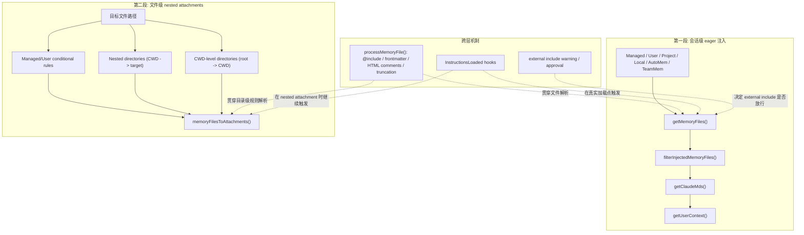

## 一句话结论

Claude Code 的“项目知识进入模型”不是读一份 `CLAUDE.md`，而是两段式装载：第一段由 `getMemoryFiles() -> filterInjectedMemoryFiles() -> getClaudeMds() -> getUserContext()` 生成会话级上下文，第二段由附件系统按具体文件路径再补一轮 nested memory attachments，所以同一份规则可能既有 eager 注入，也有按路径延迟命中的局部注入。

## 状态标签总览

| 组成层 | 当前状态 | 关键入口 | 这层负责什么 | 不要误读成什么 |
|---|---|---|---|---|
| Managed / User / Project / Local memory 发现 | `external build active` | `src/utils/claudemd.ts` | 发现 `CLAUDE.md`、`.claude/CLAUDE.md`、`.claude/rules/*.md`、`CLAUDE.local.md` | “只有仓库根的一个文件会被读” |
| 会话级 eager 注入 | `external build active` | `getMemoryFiles()`, `filterInjectedMemoryFiles()`, `getClaudeMds()`, `getUserContext()` | 把基础 instructions 拼成长期前缀 | “所有规则都只在启动时一次性拼进 prompt” |
| 文件级 nested memory attachments | `external build active` | `src/utils/attachments.ts`, `getMemoryFilesForNestedDirectory()` | 针对具体文件按目录和 glob 再补局部规则 | “打开文件后不会再影响上下文” |
| `@include` 递归与 HTML comment/frontmatter 处理 | `external build active` | `processMemoryFile()`, `parseMemoryFileContent()` | 支持 include、剥离 frontmatter、注释、truncation | “include 只是文本替换，没有边界与深度控制” |
| `.claude/rules` 条件规则 (`paths:`) | `external build active` | `processConditionedMdRules()` | 只在目标路径命中时注入 | “规则目录里的每个 md 都无条件进上下文” |
| 外部 include 审批与 warning | `external build active` | `shouldShowClaudeMdExternalIncludesWarning()` | 控制 Project/Local external include 的安全提示与批准状态 | “所有外部 include 都默认开放” |
| `--bare` / `CLAUDE_CODE_DISABLE_CLAUDE_MDS` / `--add-dir` | `external build active` | `src/context.ts`, `src/main.tsx` | 控制自动发现是否关闭，额外目录是否显式纳入 | “bare 模式会清空所有上下文，包括显式提供的目录” |
| AutoMem / memory index 过滤 | `external build active` + `feature-gated` | `isAutoMemoryEnabled()`, `filterInjectedMemoryFiles()` | AutoMem 入口可注入，但部分 index 注入受 GrowthBook gate 控制 | “AutoMem 就等于 CLAUDE.md 机制本身” |
| TeamMem | `feature-gated` | `TEAMMEM`, `teamMemPaths` | 团队共享 memory 入口 | “团队记忆与基础 `CLAUDE.md` 装载没有边界” |

## 为什么不是“把项目说明读进系统提示词”

如果上下文系统只需要“项目说明”，读一个根目录文件就够了。之所以会长成现在这样，是因为它要同时回答四类不同问题：

- 会话级长期规则是什么？
- 当前打开或操作的具体文件，会不会命中额外局部规则？
- 哪些规则来自 checked-in project instructions，哪些来自用户私有 local instructions？
- 哪些 include / memory 入口应该被审批、过滤、去重或延迟注入？

这四类问题天然不可能用一个“读取根目录文档”的动作解决，所以才有 eager context 和 nested attachments 两段链路。

## 正常链路

这张图最重要的结论是：**上下文装载不是一条链，而是“会话级基础注入 + 文件级局部补充”两条链。**

## 关键结构 / 状态

### 1. 基础发现与解析

| 结构 / 函数 | 负责什么 | 这页应该怎么理解 |
|---|---|---|
| `processMemoryFile()` | 递归读取单个 memory file 与其 `@include` | 这里处理去重、最大深度、external include、排除规则与 parent 关系 |
| `parseMemoryFileContent()` | 解析 frontmatter、HTML comments、include 路径、AutoMem truncation | 不是简单 `readFile()`，文件内容在这里就可能被结构化改写 |
| `processMdRules()` | 遍历 `.claude/rules/**/*.md` | 同一个 rules 目录里既能有 unconditional rules，也能有 conditional rules |
| `processConditionedMdRules()` | 只保留 `paths:` 命中的 rule files | `paths:` 规则要结合目标文件路径解释，不能当普通 eager rule |
| `TEXT_FILE_EXTENSIONS` | include 扩展名白名单 | `@include` 不会把 PDF / 图片之类的二进制东西灌进 prompt |
| `MAX_INCLUDE_DEPTH = 5` | include 深度上限 | include 不是无限递归展开 |

### 2. 会话级 eager 注入

| 结构 / 函数 | 负责什么 | 这页应该怎么理解 |
|---|---|---|
| `getMemoryFiles()` | 按类型与目录层级发现 memory files | 加载顺序是 Managed -> User -> Project -> Local，再叠加 AutoMem / TeamMem |
| `filterInjectedMemoryFiles()` | 过滤“真正要进上下文”的 memory files | 不是所有发现到的 memory 都会被 system/user context 注入 |
| `getClaudeMds()` | 把 memory files 拼成单段 instructions 文本 | 会给不同 memory type 添加不同描述语义 |
| `getUserContext()` | 决定是否禁用自动发现，并注入 `claudeMd` 与 `currentDate` | `--bare` 与 disable env 在这里真正生效 |
| `getSystemContext()` | 注入 git status 等系统上下文 | CLAUDE.md 装载只是整体 context builder 的一部分，不是全部 |

### 3. 文件级 nested 注入

| 结构 / 函数 | 负责什么 | 这页应该怎么理解 |
|---|---|---|
| `getManagedAndUserConditionalRules()` | 先处理 managed/user 级 conditional rules | 这是 nested 链的第一相，不依赖目录 walk |
| `getMemoryFilesForNestedDirectory()` | 对目标路径的嵌套目录加载 `CLAUDE.md`、unconditional rules、conditional rules | 当前文件越近的目录越可能补充更局部的 instructions |
| `getConditionalRulesForCwdLevelDirectory()` | 对 root -> CWD 路径上的目录只加载 conditional rules | 因为 unconditional rules 已经在 eager 阶段装过，不应重复注入 |
| `memoryFilesToAttachments()` | 把 memory files 转成 attachment，并登记 read state | 这是 nested memory 真正进入本轮上下文的入口 |
| `getNestedMemoryAttachmentsForFile()` | 组织 nested 链的处理顺序 | 明确分三相：managed/user conditional -> nested dirs -> cwd-level conditional |

## 装载顺序不是美学问题，而是优先级编码

`claudemd.ts` 顶部注释已经把 eager 阶段的全局顺序写得很清楚：

1. Managed memory
2. User memory
3. Project memory
4. Local memory

同时目录遍历是从当前目录一路向上，再在处理时 **从 root 向 CWD 反向遍历**。这意味着：

- 越靠近当前工作目录的项目规则，越晚进入结果数组，优先级更高。
- `CLAUDE.local.md` 虽然是 local memory，但它是在每个目录层级上单独插入的，不是全局只读一个。
- nested attachment 阶段又会在“具体文件路径”维度再叠一层局部优先级。

所以这里的“顺序”其实就是一套可解释的覆盖模型，而不是实现巧合。

## 一个实际例子：在 monorepo 子包里打开一个文件会触发哪两轮上下文

假设用户当前 CWD 是 `repo/packages/web`，随后打开文件 `repo/packages/web/src/pages/Home.tsx`。系统会至少经历两轮不同粒度的上下文装载：

### 第一轮：会话启动时的 eager 注入

`getMemoryFiles()` 会按顺序尝试加载：

- managed `CLAUDE.md` 与 managed `.claude/rules/*.md`
- 用户 `~/.claude/CLAUDE.md` 与 `~/.claude/rules/*.md`
- `repo/CLAUDE.md`、`repo/.claude/CLAUDE.md`、`repo/.claude/rules/*.md`
- `repo/packages/web/CLAUDE.md`、`repo/packages/web/.claude/CLAUDE.md`、对应 rules
- 各层目录上的 `CLAUDE.local.md`

这些内容经过 `filterInjectedMemoryFiles()` 后，由 `getClaudeMds()` 合并成会话级 `claudeMd` 文本，再由 `getUserContext()` 注入本轮 query 的长期前缀。

### 第二轮：具体打开 `Home.tsx` 时的 nested 注入

当附件系统处理这个文件时，`getNestedMemoryAttachmentsForFile()` 会再跑三相：

1. 先拿 Managed/User 级别里带 `paths:` 且命中 `src/pages/Home.tsx` 的 conditional rules。
2. 再从 CWD 到目标文件目录这条路径，逐级加载每层的 `CLAUDE.md`、unconditional rules、conditional rules。
3. 最后再对 root -> CWD 的目录，只补 conditional rules，避免把 eager 已经装过的 unconditional rules 重复塞进上下文。

也就是说，同一个 `repo/packages/web/.claude/rules/react.md`，是否出现在本轮上下文里，取决于它属于 eager unconditional rule、还是 nested conditional rule、还是两者都不是。这正是“上下文不是只读一个文件”的最直观证据。

## 再看 `@include`：它不是文本替换，而是结构化递归

`@include` 这一层也很容易被轻描淡写，但源码实际上给了它一整套安全边界：

- include 路径会在 lexer 层提取，而不是靠正则对整文件粗暴替换。
- code block 与 codespan 里的 `@path` 不会被当成 include。
- include 目标会先过文本扩展名白名单，防止二进制内容进入 memory。
- `processedPaths` 与 `MAX_INCLUDE_DEPTH` 一起防止循环与爆炸式递归。
- Project/Local include 是否允许跨出工作目录，要看 `includeExternal` 与审批状态；User memory 则允许 external include。
- 被 include 的文件会保留 `parent` 关系，后续 hooks 与 warning 都能知道是谁包含了它。

因此，文档里最准确的说法应该是：**`@include` 让 instruction files 形成一棵受控的解析树，而不是一串盲目拼接文本。**

## 失败与恢复

| 失败场景 | 表现 | 恢复 / 止损方式 |
|---|---|---|
| `CLAUDE_CODE_DISABLE_CLAUDE_MDS=1` 或 bare 模式无 `--add-dir` | 会话像没加载任何项目规则 | 这是 `getUserContext()` 的显式分支，不是 loader 失灵 |
| Project/Local 文件用了 external include | 首次进入项目时会出现 warning / approval | `shouldShowClaudeMdExternalIncludesWarning()` 和项目配置位点决定是否放行 |
| nested worktree 中规则被重复装载 | 相同 checked-in rules 像是出现两遍 | `getMemoryFiles()` 有 nested worktree 专门去重逻辑，跳过 worktree 外的 Project files |
| `paths:` 规则明明存在却不生效 | 某个 rule 从不命中目标文件 | `processConditionedMdRules()` 是按 baseDir 相对路径匹配的，先核对 relativePath 与 glob |
| include 指向图片/PDF/不存在文件 | 某些 include 无声跳过 | 这是设计结果：非文本扩展名和 ENOENT 都会被安全忽略 |
| memory file 很大 | 内容只注入一部分 | `truncateEntrypointContent()` 与 `MAX_MEMORY_CHARACTER_COUNT` / attachment partial-view 机制会裁剪并留痕 |
| 中途清缓存后 hooks 行为看起来不对 | `InstructionsLoaded` 触发理由与预期不一致 | `clearMemoryFileCaches()` 与 `resetGetMemoryFilesCache(reason)` 的语义不同，别混用 |

## 边界与误读

<Warning>
不要把这页里的 `CLAUDE.md` 机制和本仓库给 Codex/Claude 用的 `AGENTS.md` 说明混成同一个概念。这里分析的是被逆向目标 Claude Code 自己的上下文系统。
</Warning>

- 发现到的 memory files 不等于最终注入的 memory files；`filterInjectedMemoryFiles()` 明确会裁掉一部分入口。
- eager context 与 nested attachments 不是“谁替代谁”的关系，而是不同粒度的两轮注入。
- `CLAUDE.local.md` 与 checked-in `CLAUDE.md` 语义不同，前者是用户私有 project instructions。
- conditional rules 不是只在启动时算一次；打开具体文件时还会按目标路径再跑。
- AutoMem / TeamMem 不是基础 `CLAUDE.md` 机制的同义词，它们只是复用了同一套 memory 文件基础设施。

## 场景变体

| 场景 | 上下文装载最重要的部分 |
|---|---|
| 单仓库日常开发 | eager 阶段的 Project + Local memory 足以定义大部分长期规则 |
| monorepo 子模块开发 | 目录越近的 `CLAUDE.md` 与 `.claude/rules` 会在顺序上获得更高优先级 |
| 打开深层文件后继续工作 | nested memory attachments 会把文件级局部规则补进来 |
| 受控 headless / bare 场景 | 自动发现关闭，显式 `--add-dir` 与 system prompt 成为主要来源 |
| 共享知识较多的组织 | TeamMem 会变成额外入口，但仍需和基础 instruction loader 分开理解 |

## 先读什么

- 先读 [记忆分层](/docs/context/memory-layers)
- 再读 [System Prompt 动态组装](/docs/context/system-prompt)

## 继续读什么

- [压缩边界与 PTL](/docs/context/compaction-boundaries-and-ptl)
- [Token Budget](/docs/context/token-budget)
- [Permission Model](/docs/safety/permission-model)
- [Prompt Injection 防御](/docs/safety/prompt-injection-defense)

## 相关源码入口

- `src/context.ts`
- `src/utils/claudemd.ts`
- `src/utils/attachments.ts`
- `src/utils/config.ts`
- `src/utils/hooks/hooksConfigManager.ts`

## 本页证据等级

- `external build active`: Managed/User/Project/Local memory loader、`@include` 解析、rules 目录遍历、nested memory attachments、external include warning、bare/disable/add-dir 控制
- `feature-gated`: TeamMem、部分 memory index / project-level 注入过滤 gate
- `inference`: “上下文装载是 eager 会话前缀 + 文件级 nested attachments 的两段式系统”是对 loader 与 attachment 两条链路的结构归纳
