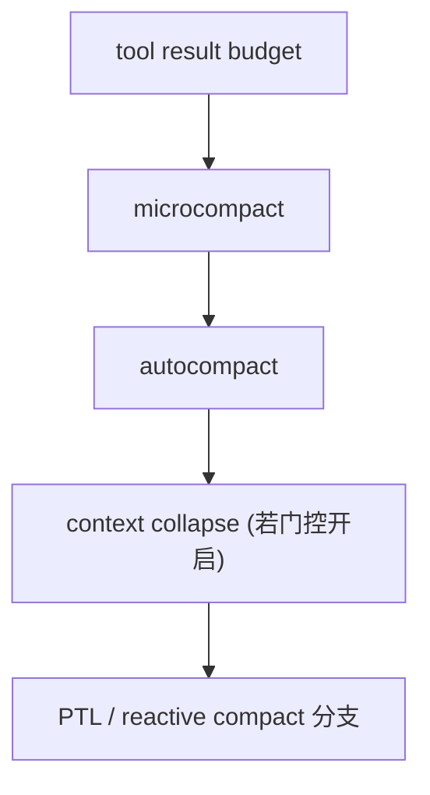

## 一句话结论

Claude Code 的上下文治理不是一个“到点就全量 compact”的单动作，而是一条分层边界链；在这个 reverse-engineered 仓库里，活跃层主要是工具结果预算、microcompact 和 autocompact，而不是 live reactive compact。

## 实现状态

| 层级 | 状态标签 | 当前含义 |
|---|---|---|
| 工具结果预算、preview 替换 | `external build active` | 当前 query 每轮都会先经过 |
| `microcompact` | `external build active` | 当前 `query.ts` 真实调用 |
| `autocompact` | `external build active` | 当前 `autoCompact.ts` 真实实现 |
| `context collapse` | `feature-gated` | 代码路径存在，但当前默认构建不活跃 |
| `reactiveCompact` | `stubbed/removed` | `src/services/compact/reactiveCompact.ts` 当前为 stub |

## 为什么存在

长会话里最贵的不是“消息很多”，而是消息、工具结果和附件一起持续增长。如果没有渐进式边界控制，系统很快会遇到：

- 下一轮 prompt 被历史结果挤爆
- 输出槽被旧内容吃掉，回答一再截断
- resume 后上下文越来越难治理

因此 Claude Code 设计成“尽量先动便宜的层，最后才动昂贵的层”：

- 先缩工具结果
- 再缩工具结果内部的细节
- 再决定是否需要整轮 summary
- 真正的 overflow 恢复再交给更重的机制

## 正常链路

这张图的重点不是绝对时间顺序，而是“谁先尝试、谁更便宜”。在当前仓库里，可以把前三层当作当前 external build 的主治理链；后两层则必须带门控和 stub 标记阅读。

## 关键结构 / 状态

| 结构 | 作用 | 典型位置 |
|---|---|---|
| `applyToolResultBudget()` | 对大 `tool_result` 做 preview 替换与稳定重放 | `src/utils/toolResultStorage.ts`, `src/query.ts` |
| `microcompact()` | 对工具输出做更细粒度压缩 | `src/services/compact/microCompact.ts`, `src/query.ts` |
| `autoCompactIfNeeded()` | 基于 token 阈值决定是否触发全量 compact | `src/services/compact/autoCompact.ts` |
| `AutoCompactTrackingState` | 跟踪本轮是否 compact 过、连续失败次数 | `src/services/compact/autoCompact.ts`, `src/query.ts` |
| `hasAttemptedReactiveCompact` | 防止进入 reactive compact 死循环 | `src/query.ts` |

这里最重要的纠偏点是：`hasAttemptedReactiveCompact` 出现在 active 的 `State` 里，不代表 `reactiveCompact` 在当前仓库真有 live 实现。它只是说明 query 状态机保留了这条分支的形状。

## 一个端到端例子

一个长调试会话在当前仓库里，更常见的演化是：

1. Bash 输出过长，先被工具结果预算替换成 preview + 文件路径。
2. 工具结果仍很多，`microcompact()` 再对可压缩块做细化处理。
3. 整体 token 使用继续攀升，`autoCompactIfNeeded()` 在阈值以上时尝试 summary compaction。
4. 如果用户关闭 auto-compact，或上下文仍然逼近阻塞上限，系统更可能走“提前阻塞”而不是 live reactive compact 恢复。

这与很多“官方或内部世界里会先 drain collapse 再 reactive compact”的描述不同。当前 reverse-engineered 仓库必须按真实实现写，而不是按设计意图写。

## 失败与恢复

| 场景 | 当前仓库里更真实的处理 |
|---|---|
| 单个工具结果过大 | 结果预算先落盘替换 |
| 工具结果很多但单条都不算极端 | `microcompact` 和 `autocompact` 继续治理 |
| token 接近上限 | `autoCompactIfNeeded()` 根据阈值决定是否 compact |
| prompt-too-long 后想靠 reactive compact 兜底 | 当前仓库里这条实现是 stub，不应写成稳定恢复路径 |

`autoCompact.ts` 还有一个很重要的“电路熔断器”语义：连续 compact 失败达到阈值后，会停止继续 hammer API。也就是说，压缩层不仅是“怎么缩”，还是“何时停止无谓重试”。

## 边界与误读

<Warning>
最需要纠正的误读，是把 query.ts 里保留的 `reactiveCompact` 分支直接写成当前 external build 的已验证能力。
</Warning>

- 当前仓库里 `reactiveCompact.ts` 是 stub，默认返回 false / null。
- `context collapse` 在源码中有完整思路，但属于 feature-gated 世界。
- `autocompact` 是当前 external build 真实存在的“重压缩层”。
- “PTL” 在这个仓库里更应该被理解成 overflow 边界概念，而不是当前一定能自动恢复成功的功能承诺。

## 场景变体

| 场景 | 最先起作用的边界 |
|---|---|
| 长 Bash 输出 | 工具结果预算 |
| 多轮搜索与读取 | `microcompact` |
| 总 token 接近阈值 | `autocompact` |
| 研究 feature-gated 世界 | `context collapse` |
| 试图理解 overflow 兜底设计 | `reactiveCompact` 分支形状，但要标成 stub |

## 继续读什么

- [工具结果预算](/docs/tools/tool-result-budgeting)
- [单轮状态机](/docs/conversation/single-turn-state-machine)
- [恢复与 fallback](/docs/conversation/recovery-and-fallback)

## 相关源码入口

- `src/query.ts`
- `src/utils/toolResultStorage.ts`
- `src/services/compact/microCompact.ts`
- `src/services/compact/autoCompact.ts`
- `src/services/compact/reactiveCompact.ts`

## 本页证据等级

- `external build active`: 结果预算、microcompact、autocompact
- `feature-gated`: `context collapse`
- `stubbed/removed`: `reactiveCompact`
