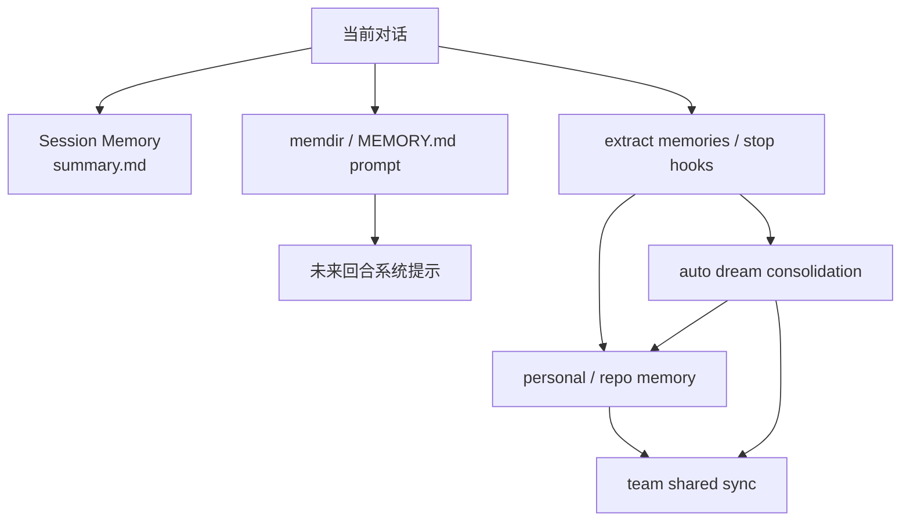

## 一句话结论

Claude Code 的“记忆”不是一个统一的大 memory blob，而是按 **时效、共享范围、写入方式和安全边界** 分成多层：当前会话记忆、跨会话个人记忆、团队共享记忆，以及后台 consolidation。

## 状态标签总览

| 层级 | 当前状态 | 说明 |
|---|---|---|
| Session Memory 基建 | `external build active` | `setup.ts` 会初始化，会话内摘要文件与权限白名单真实存在 |
| Session Memory 自动提炼 | `feature-gated` / 动态门控 | 是否真正抽取受 GrowthBook 与阈值控制 |
| memdir / auto memory prompt | `external build active` | `QueryEngine.ts` 会加载 memory prompt 相关内容 |
| Team shared memory sync | `feature-gated` | 需要 `TEAMMEM`、OAuth、repo slug 等条件 |
| Auto Dream / consolidation | `feature-gated` | 后台任务，受时间门、会话门和锁控制 |

## 为什么必须分层

“记住刚才这轮对话发生了什么”和“把这个项目长期有效的知识保存给将来的你”不是同一个问题；再进一步，“把团队都该知道的知识同步出去”又是第三个问题。

如果把它们全塞进一个统一存储里，会同时失去四种治理能力：

1. 无法区分短期连续性与长期知识。
2. 无法区分私人偏好与团队共享事实。
3. 无法区分当前回合立即要用的信息和后台慢慢蒸馏的信息。
4. 无法给不同层施加不同的安全与陈旧性策略。

所以当前仓库不是做“一个 memory store”，而是在做 **几层职责不同的 memory pipeline**。

## 正常链路

## 四层分工

| 层级 | 核心入口 | 主要目标 | 最大风险 |
|---|---|---|---|
| Session Memory | `src/services/SessionMemory/sessionMemory.ts` | 维持当前会话连续性 | 抽取过频、会话噪音过多 |
| Personal / Repo Memory | `src/memdir/memdir.ts` | 为未来回合提供跨会话上下文 | 陈旧知识污染新回合 |
| Team Shared Memory | `src/services/teamMemorySync/*` | 把团队级有用知识同步出去 | 鉴权、repo 归属、敏感信息治理 |
| Dream / Consolidation | `src/services/autoDream/autoDream.ts` | 用后台低频方式整理多次会话 | 误摘要、锁竞争、门控未开 |

## 关键结构 / 状态

### 1. Session Memory

Session Memory 不是虚构概念，它有非常具体的落点：

- `setup.ts` 会在非 bare 模式下调用 `initSessionMemory()`。
- 文件路径在权限层被显式放进 session memory 白名单。
- `sessionMemory.ts` 会创建 `summary.md`，并依据 token/tool-call 阈值决定是否抽取。

这意味着“当前会话记忆”不是普通消息历史的别名，而是 **单独的摘要文件与更新逻辑**。

### 2. Personal / Repo Memory

`QueryEngine.ts` 会加载 `memdir` 相关 prompt，把 memory directory 中的内容转成未来回合可消费的系统提示部分。`memdir/memoryTypes.ts` 还明确提醒：

- memory 记录的是“写下当时的事实”，不是永久真理；
- 与代码、路径、函数相关的 memory 需要在当前状态上重新验证。

这层更像“跨会话知识入口”，不是本轮对话缓存。

### 3. Team Shared Memory

team memory sync 之所以是单独一层，是因为它比 personal memory 多了三类约束：

- 必须知道当前 repo slug。
- 必须满足 OAuth / API 条件。
- 必须承担 entry checksum、body size、冲突重试等同步语义。

因此它不能被粗暴写成“memdir 的团队版”。

### 4. Dream / Consolidation

auto dream 不是“第四个更聪明的记忆库”，而是 **后台整理器**：

- 受 `minHours` 与 `minSessions` 双门限制。
- 还要过 lock，防止多个进程同时 consolidation。
- 最终以 forked agent 方式跑整理任务，并登记成 dream task。

这更接近低频维护任务，而不是每轮对话都在实时参与的记忆层。

## 一个端到端例子

假设用户在三次不同会话里逐步摸清了一个项目的构建陷阱：

1. 第一次会话里，Session Memory 可能把本轮关键修复步骤写进 `summary.md`，方便后续几轮继续接着干。
2. 同一时期，memdir 相关 prompt 会把更稳定的项目知识带到未来会话，但它仍然应该被当作“待验证记忆”。
3. 如果这些经验对整个团队都长期有用，且同步条件满足，team memory sync 才有资格把它推进共享层。
4. 若过了足够时间、积累了足够多会话，auto dream 才可能把这些碎片做一次后台 consolidation。

这四步没有哪一步是另一步的简单别名。它们处理的是不同时间尺度上的“记住”。

## 为什么不是更简单的设计

把所有记忆都做成一个全局知识库，表面上最省事，实际上会把下面这些东西混在一起：

- 当前回合刚发生的细节
- 用户长期偏好
- 项目级跨会话知识
- 团队共享信息
- 后台低频蒸馏结果

混在一起之后，系统就会很难回答两个关键问题：

1. 这条记忆是谁可见的？
2. 这条记忆现在还可信么？

当前分层设计，本质上是在把“可见性”和“新鲜度”拆开治理。

## 失败与恢复

| 失败场景 | 当前表现 | 恢复方式 |
|---|---|---|
| Session Memory 过早或过频抽取 | 会话被背景提炼打扰，或摘要质量差 | 依赖 token/tool-call 阈值与自然断点控制 |
| memdir 记忆陈旧 | 旧知识被当成当前事实使用 | `memoryTypes.ts` 明确要求先验证再引用 |
| team memory sync 无 OAuth / repo 条件 | 团队共享层不工作 | 这是预期止损，不应强写成“同步失败 bug” |
| auto dream 时间门未到 | 长期整理不触发 | 受 `minHours` / `minSessions` / lock 保护 |
| 多进程并发做 dream | 资源争抢或重复整理 | consolidation lock 会阻止并发进入 |

当前仓库在这块最重要的恢复哲学不是“尽量都跑”，而是 **门没开就不跑，避免把后台记忆流程做成前台干扰源**。

## 边界与误读

<Warning>
memory 不是事实数据库，而是“在某个时刻写下的高价值上下文”。尤其涉及代码、文件、函数名时，必须回到当前状态验证。
</Warning>

- 不要把 Session Memory 与历史 transcript 混为一谈；它有独立文件和独立更新逻辑。
- 不要把 memdir 写成“永久可信知识库”；源码明确提醒 memory 会陈旧。
- 不要把 Team Memory 写成默认 always-on；当前同步路径是 feature-gated 且受鉴权约束。
- 不要把 Dream 写成实时参与每轮推理的第四脑；它更像后台 consolidation worker。

## 场景变体

| 场景 | 最相关的层 |
|---|---|
| 一次超长调试会话 | Session Memory |
| 隔天回来继续同一项目 | Personal / Repo Memory |
| 团队共享约定与参考入口 | Team Shared Memory |
| 多次会话后的低频整理 | Dream / Consolidation |

## 先读什么

- 先读 [Claude.md 与上下文加载](/docs/context/claude-md-and-context-loading)
- 再读 [项目记忆系统](/docs/context/project-memory)

## 继续读什么

- [压缩边界与 PTL](/docs/context/compaction-boundaries-and-ptl)
- [恢复与 fallback](/docs/conversation/recovery-and-fallback)
- [后台任务与 housekeeping](/docs/runtime/background-tasks-and-housekeeping)

## 相关源码入口

- `src/setup.ts`
- `src/services/SessionMemory/sessionMemory.ts`
- `src/memdir/memdir.ts`
- `src/memdir/memoryTypes.ts`
- `src/services/teamMemorySync/index.ts`
- `src/services/autoDream/autoDream.ts`
- `src/query/stopHooks.ts`

## 本页证据等级

- `external build active`: [src/setup.ts](/Users/admin/work/claude-code-docs-sweep/src/setup.ts), [src/services/SessionMemory/sessionMemory.ts](/Users/admin/work/claude-code-docs-sweep/src/services/SessionMemory/sessionMemory.ts), [src/memdir/memdir.ts](/Users/admin/work/claude-code-docs-sweep/src/memdir/memdir.ts), [src/memdir/memoryTypes.ts](/Users/admin/work/claude-code-docs-sweep/src/memdir/memoryTypes.ts)
- `feature-gated`: [src/services/teamMemorySync/index.ts](/Users/admin/work/claude-code-docs-sweep/src/services/teamMemorySync/index.ts), [src/services/autoDream/autoDream.ts](/Users/admin/work/claude-code-docs-sweep/src/services/autoDream/autoDream.ts), [src/query/stopHooks.ts](/Users/admin/work/claude-code-docs-sweep/src/query/stopHooks.ts)
- `inference`: “为什么要分成四层而不是一个 store”是对当前实现约束的系统总结
