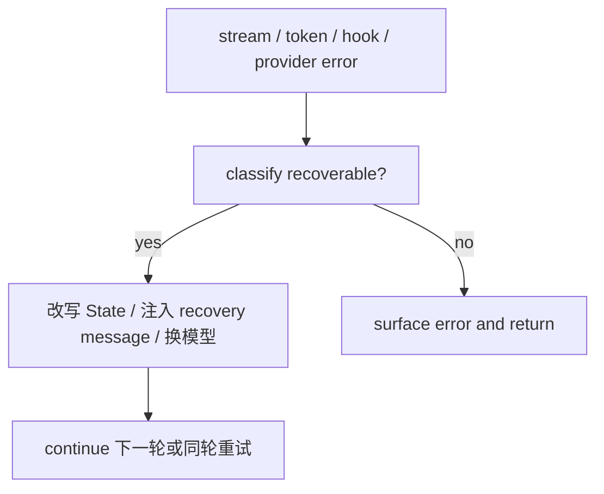

## 一句话结论

Claude Code 的恢复体系不是统一 retry 包装，而是把“本轮失败”改写成“下一轮可处理状态”的多条专门分支；但在当前 reverse-engineered 仓库里，并不是所有设计中的恢复分支都真的活着。

## 实现状态

| 恢复路径 | 状态标签 | 当前含义 |
|---|---|---|
| `max_output_tokens` 升级与续写恢复 | `external build active` | 当前 `query.ts` 明确实现 |
| streaming -> non-streaming fallback | `external build active` | 当前 `claude.ts` 真实实现 |
| repeated 529 -> model fallback | `external build active` | 需要配置 fallback model，但路径真实存在 |
| stop hook 阻塞后继续 | `external build active` | 当前 external build 真实路径 |
| `collapse_drain_retry` | `feature-gated` | 依赖 `contextCollapse` 开启 |
| `reactive_compact_retry` | `stubbed/removed` | 当前仓库实现文件是 stub |

## 为什么存在

只要系统允许多轮工具调用，就迟早会遇到：

- 输出被截断
- stream 中途挂掉
- provider 持续 529 或 404 streaming endpoint
- stop hook 要求模型换一种策略

如果这些情况都只能“报错结束”，Claude Code 就很难稳定支撑长任务。恢复体系的本质，是把“本轮失败”转成“下一轮仍能理解并继续的输入形态”。

## 正常链路

关键不是“会不会 retry”，而是 recoverable error 会先改变 `State`，再继续循环。恢复发生在 query loop 内部，而不是外面再包一层通用重试器。

## 关键结构 / 状态

| 结构 | 作用 | 典型位置 |
|---|---|---|
| `maxOutputTokensRecoveryCount` | 限制续写恢复次数 | `src/query.ts` |
| `maxOutputTokensOverride` | 允许先从默认 8k 升到 64k | `src/query.ts` |
| `transition.reason` | 记录本轮为什么继续 | `src/query.ts` |
| `FallbackTriggeredError` | repeated 529 后触发模型 fallback | `src/services/api/withRetry.ts` |
| `onStreamingFallback()` | stream 失败后切非流式，并通知 query 清理 | `src/services/api/claude.ts`, `src/query.ts` |

恢复体系里最关键的不是某一个 helper，而是这些字段和异常一起决定“继续前要不要改写消息面”。

## 一个端到端例子

最典型、也最稳定活跃的一条恢复链是 `max_output_tokens`：

1. streaming 过程中出现被 withheld 的 `max_output_tokens` 错误。
2. 如果当前还没有 override，先把 `maxOutputTokensOverride` 升到更大的槽位，同一请求再跑一次。
3. 如果更大槽位仍不够，就在消息尾部注入一条 meta message，要求模型直接继续刚才被截断的回答。
4. 计数超过上限后，才真正把 withheld 的错误放出来。

这条链之所以重要，是因为它把“输出被截断”识别成一种可恢复的资源问题，而不是逻辑失败。

## 失败与恢复

| 问题 | 当前仓库的恢复方式 |
|---|---|
| `max_output_tokens` | 先升级输出槽，再注入续写消息 |
| streaming 中途挂掉、无事件、半事件 | 切到 non-streaming fallback，并让 query 清理半成品消息 |
| repeated 529 | `withRetry.ts` 抛 `FallbackTriggeredError`，由 query 换 fallback model |
| stop hook 阻塞 | 把 blocking error message 拼回消息面，继续下一轮 |
| prompt-too-long 想靠 reactive compact 兜底 | 当前仓库不应文档化为 live 路径，因为 `reactiveCompact.ts` 是 stub |

这里最需要保守描述的就是 prompt-too-long：

- `query.ts` 里保留了 collapse drain 和 reactive compact 的设计分支
- 但当前仓库里 `contextCollapse` 依赖 feature gate，`reactiveCompact` 实现本身又是 stub
- 所以公开文档不应再写成“当前 external build 会自动 drain collapse 再 reactive compact”

## 边界与误读

- “重试”不等于“盲目重放原请求”；很多恢复会先改写 `State`。
- `FallbackTriggeredError` 不是最终用户错误，而是切模型的控制信号。
- streaming fallback 后如果不 tombstone 旧消息，会留下无效 thinking block 和旧 `tool_use_id`。
- stop hook 不是所有错误都该跑；源码里明确避免对 API error 继续跑 hook，防止死循环。
- prompt-too-long 的理想恢复设计和当前仓库的真实可用恢复，不是同一件事。

## 场景变体

| 场景 | 恢复重点 |
|---|---|
| 长回答被截断 | 先扩槽，再续写 |
| 流式代理不稳定 | stream fallback 与消息清理 |
| 主模型容量不足或持续过载 | repeated 529 -> fallback model |
| 输出策略违规 | stop hook 阻塞后再思考 |
| 研究内部或未来设计 | collapse / reactive compact 分支，但要明确不是当前 live 能力 |

## 继续读什么

- [单轮状态机](/docs/conversation/single-turn-state-machine)
- [流事件与 watchdog](/docs/conversation/stream-events-and-watchdog)
- [压缩边界与 PTL](/docs/context/compaction-boundaries-and-ptl)

## 相关源码入口

- `src/query.ts`
- `src/services/api/claude.ts`
- `src/services/api/withRetry.ts`
- `src/services/compact/reactiveCompact.ts`

## 本页证据等级

- `external build active`: max output 恢复、stream fallback、model fallback、stop hook 阻塞
- `feature-gated`: `collapse_drain_retry`
- `stubbed/removed`: `reactive_compact_retry`
