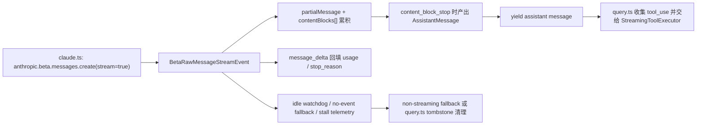

## 一句话结论

Streaming 在 Claude Code 里不是“边打字边显示”的视觉糖衣，而是 `claude.ts`、`query.ts` 和 `StreamingToolExecutor` 共享的结构化执行协议。

## 实现状态

| 组成 | 状态标签 | 当前含义 |
|---|---|---|
| 原始流事件解析、`content_block_*` 累积、`usage` 回填 | `external build active` | 当前 external build 真实执行路径 |
| 流失败后切非流式 fallback | `external build active` | 当前 `claude.ts` 与 `query.ts` 都显式处理 |
| idle watchdog 实现 | `external build active` | 代码真实存在，但是否启用取决于运行环境变量 |
| 中途 fallback 后的 tombstone 清理 | `external build active` | 当前 `query.ts` 明确做 orphan message 清理 |

## 为什么存在

如果 streaming 只是“不断拼接文本”，Claude Code 会同时失去四个关键能力：

- 无法在 `tool_use` 还没完全结束整个响应前就启动工具执行
- 无法把 `usage`、`stop_reason` 这种后到达元数据正确写回已生成消息
- 无法区分“流干净结束”与“代理/网关偷偷断流”
- 无法在中途 fallback 时清理半成品 assistant 消息，避免脏状态污染下一轮

这里最关键的一点，是 Anthropic 的原始事件流本来就不是“完整 assistant message 一次性到达”，而是：

- `message_start`
- `content_block_start`
- `content_block_delta`
- `content_block_stop`
- `message_delta`

Claude Code 必须自己把这些低层事件重新装配成“可显示、可持久化、可继续决策”的消息对象。

## 正常链路

这条链路有两个容易漏写的事实：

1. `claude.ts` 是按 `content_block_stop` 产出 assistant message，而不是等整条响应结束后再一次性 yield。
2. 最终的 `usage` 和 `stop_reason` 常常在 `message_delta` 才到，所以代码会直接回写最后一条已 yield 的 assistant message，而不是重新造一条新消息。

## 关键结构 / 状态

| 结构 | 作用 | 典型位置 |
|---|---|---|
| `partialMessage` | 保存 `message_start` 带来的响应外壳 | `src/services/api/claude.ts` |
| `contentBlocks[]` | 按 `index` 累积 text / thinking / tool_use / server_tool_use | `src/services/api/claude.ts` |
| `usage` / `stopReason` | 从 `message_start` 与 `message_delta` 逐步更新 | `src/services/api/claude.ts` |
| `needsFollowUp` | 在 `query.ts` 中把“流里出现过 tool_use”变成下一轮继续信号 | `src/query.ts` |
| `streamingToolExecutor` | 流还没结束时就能启动并并发执行工具 | `src/query.ts`, `src/services/tools/StreamingToolExecutor.ts` |
| `streamIdleTimer` / `streamIdleWarningTimer` | 处理“请求没报错，但长时间没有 chunk”这种静默挂死 | `src/services/api/claude.ts` |

这也解释了为什么 `stop_reason === 'tool_use'` 在 `query.ts` 里被明确标注为“不可靠”：真正可靠的继续条件不是 stop reason，而是流里是否真的收到了 `tool_use` block。

## 一个端到端例子

一次典型响应可能是这样的：

1. `message_start` 到达，`partialMessage` 建好外壳，`usage` 初始化。
2. 模型开始输出 thinking 和 text，`content_block_delta` 不断往 `contentBlocks[]` 追加。
3. 某个 `tool_use` block 在 `content_block_stop` 时闭合，`claude.ts` 立刻 yield 一条 assistant message。
4. `query.ts` 看到里面有 `tool_use`，把它丢给 `StreamingToolExecutor`，工具已经可以开始跑。
5. 更晚到达的 `message_delta` 才把真正的 `stop_reason` 和最终 `usage` 写回刚才那条 assistant message。
6. 如果工具已经完成，`query.ts` 甚至会在流结束前先收到部分 `tool_result`。

也就是说，Claude Code 的单条模型响应，实际上是在“边装配 assistant 消息、边执行工具、边补全计费元数据”。

## 失败与恢复

| 场景 | 症状 | 处理 |
|---|---|---|
| stream 返回 200 但没有任何 `message_start` | 看起来像“模型没回复” | `claude.ts` 认定为坏流，切到非流式 fallback |
| 只有 `message_start`，但没有闭合任何 content block | assistant 半成品 | 同样切到非流式 fallback |
| 中途长时间没有 chunk | 会话像卡死一样挂着 | watchdog 触发中断，并记录 watchdog telemetry |
| 流中途 fallback | 已经 yield 过半条 assistant message | `query.ts` 给 orphan assistant messages 发 tombstone，丢弃旧 `tool_result` |
| fallback 前工具已开始执行 | 新旧 `tool_use_id` 混杂 | `StreamingToolExecutor.discard()`，防止旧结果泄漏到新响应 |

这里最有价值的恢复动作不是“再试一次”，而是先把已经暴露给 UI 和 transcript 的半成品清干净，再换路继续。否则用户会看到失真的 thinking block，API 也可能因为签名块失配而在下一轮报错。

## 边界与误读

- “streaming = 打字机效果”是最表层误读。真实复杂度在事件装配与恢复。
- `usage` 不是生成 assistant message 时就完全可得，很多时候要靠 `message_delta` 回填。
- assistant message 的切分粒度接近 `content_block_stop`，不等于“一次 API 请求只产生一条 assistant message”。
- watchdog 不是唯一 fallback 条件；“无事件”“半事件”“流错误”“404 stream creation”都可能触发 fallback。
- 中途 fallback 后产生 tombstone，并不表示消息“没出现过”，而是显式告诉 UI 和 transcript 把旧半成品移除。

## 场景变体

| 场景 | streaming 的重点 |
|---|---|
| 普通文本回答 | 主要是低延迟文本显示与 usage 统计 |
| 多工具 agent 轮次 | `tool_use` 一闭合就能启动 StreamingToolExecutor |
| 长时间 Bash / AgentTool | 允许进度消息和工具结果在响应尚未完全结束时回流 |
| 网关或代理不稳定 | watchdog、无事件检测、非流式 fallback 变成核心稳定性能力 |

## 继续读什么

- [单轮状态机](/docs/conversation/single-turn-state-machine)
- [恢复与 fallback](/docs/conversation/recovery-and-fallback)
- [工具渲染与进度](/docs/tools/tool-rendering-and-progress)

## 相关源码入口

- `src/services/api/claude.ts`
- `src/query.ts`
- `src/services/api/withRetry.ts`
- `src/services/tools/StreamingToolExecutor.ts`

## 本页证据等级

- `external build active`: 原始 stream 解析、usage 回填、非流式 fallback、tombstone 清理
- `inference`: “streaming 是执行协议而非 UI 特效”是基于这些调用关系做出的架构归纳
