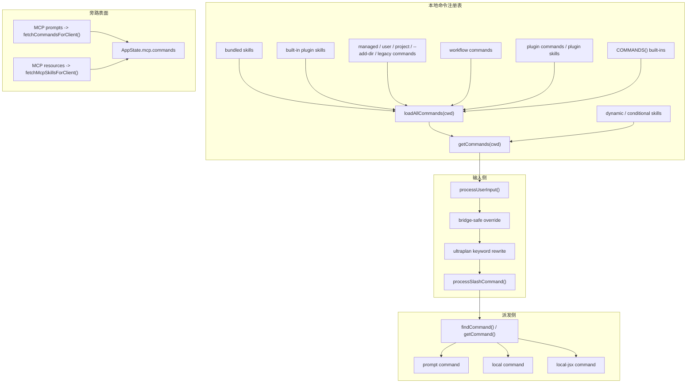

## 一句话结论

Claude Code 的命令系统不是“几个 slash command 的列表”，而是一个把 TypeScript 内置命令、Markdown 技能、插件命令、动态发现技能和少量 feature-gated 工作流统一成同一种 `Command` 抽象的汇合层；但这个汇合层并不真正覆盖全部命令表面，因为 MCP prompt commands 与 MCP skills 仍走旁路注入。

## 状态标签总览

| 来源 / 子系统 | 当前状态 | 是否进入 `getCommands()` 主注册表 | 关键入口 | 这页最重要的边界 |
|---|---|---|---|---|
| `COMMANDS()` 内置 TypeScript 命令 | `external build active` | 是 | `src/commands.ts` | 这是硬编码 slash commands，不等于全部命令能力 |
| bundled skills | `external build active` | 是 | `src/skills/bundledSkills.ts`, `src/commands.ts` | 对用户看起来像 `/xxx`，但本质是 `prompt` command |
| built-in plugin skills | `external build active` | 是 | `src/plugins/builtinPlugins.ts`, `src/commands.ts` | 它们在 `Command.source` 上故意标成 `bundled`，不是 `builtin` |
| managed / user / project / `--add-dir` skills | `external build active` | 是 | `src/skills/loadSkillsDir.ts` | 这些是本地 Markdown 技能，不是运行时远端命令 |
| legacy `/commands` Markdown | `external build active` | 是 | `src/skills/loadSkillsDir.ts` | 仍被当作 prompt commands 兼容加载 |
| 动态发现技能 / 条件技能 | `external build active` | 是 | `discoverSkillDirsForPaths()`, `activateConditionalSkillsForPaths()` | 不是启动时全量加载，而是“文件触达后激活” |
| plugin commands / plugin skills | `external build active` | 是 | `src/utils/plugins/loadPluginCommands.ts` | 表面还活着，但生态供应面与文档存在漂移 |
| workflow commands | `feature-gated` | 是 | `getWorkflowCommands()` | 只有 `WORKFLOW_SCRIPTS` 打开时才并入注册表 |
| MCP prompt commands | `external build active` | 否 | `src/services/mcp/client.ts` | 会被转成 `Command`，但不属于本地核心 registry |
| MCP skills | `feature-gated` | 否 | `getMcpSkillCommands()`, `fetchMcpSkillsForClient()` | 需要 `MCP_SKILLS`，而且走 MCP 资源发现旁路 |

## 为什么存在

如果系统只有十几个硬编码 slash commands，完全没必要做这一层。之所以会长成现在的样子，是因为它要同时满足四件事：

- 用户输入层希望统一。无论 `/review` 指向 TypeScript 命令、bundled skill 还是项目里的 Markdown 技能，入口都应该长得一样。
- 模型调用层也希望统一。SkillTool、slash command、prompt command 都要共享一套 `Command` 抽象，而不是各有各的元数据结构。
- 本地扩展要能热插拔。项目 `.claude/skills`、`--add-dir`、plugin markdown、条件技能都不能强迫用户重启整个会话。
- 输入治理要前置。bridge 场景、availability、feature gate、`userInvocable`、dynamic skills 都不是执行器自己的事，而是命令表面就该处理的事。

所以命令系统真正承担的是“统一抽象 + 统一发现 + 统一过滤 + 分类型派发”，而不是“统一执行”。这一点是读这页时最不能丢的前提。

## 正常链路

这张图要强调两层“统一”与“两层不统一”：

- 统一的是 `Command` 抽象、slash 入口、过滤规则、部分 UI 展示。
- 不统一的是构建来源与执行后端。
- 本地 registry 的中心是 `getCommands()`。
- MCP prompt / MCP skills 虽然也会变成 `Command`，但并不在 `getCommands()` 里装配。

## 装配顺序不是细节，它决定覆盖优先级

`loadAllCommands(cwd)` 的拼装顺序是固定的：

| 顺序 | 来源 | 为什么重要 |
|---|---|---|
| 1 | `bundledSkills` | 最早进入基础 prompt surface |
| 2 | `builtinPluginSkills` | 仍然是技能形态，但来自启用中的 built-in plugins |
| 3 | `skillDirCommands` | 本地 skills 与 legacy commands 比 built-ins 更早 |
| 4 | `workflowCommands` | feature-gated 工作流命令插在 built-ins 之前 |
| 5 | `pluginCommands` | 插件命令进入本地主 registry |
| 6 | `pluginSkills` | 插件技能继续复用 prompt command 结构 |
| 7 | `COMMANDS()` | 最后的硬编码 TypeScript commands |

之后 `getCommands()` 再做两件额外的事：

1. 对全部命令重新执行 `meetsAvailabilityRequirement()` 和 `isCommandEnabled()`，所以 provider / auth 状态变化不会卡在 memoized 旧结果上。
2. 把 `dynamicSkills` 插入到 **plugin skills 之后、built-ins 之前**，并按名称去重，避免动态技能与已存在命令重复堆叠。

这里的顺序不是装饰。因为 `findCommand()` 与 `getCommand()` 都是顺序查找，所以**越早进入数组的命令，越可能在同名冲突里赢得解析权**。命令系统的“合流”同时也是一套优先级编码。

## 关键结构 / 状态

| 结构 / 函数 | 负责什么 | 这一页应该怎么读 |
|---|---|---|
| `Command` / `CommandBase` | 命令统一抽象 | 真正统一的是元数据与分发接口，不是具体执行逻辑 |
| `PromptCommand` / `LocalCommand` / `LocalJSXCommand` | 三种执行类型 | prompt = 生成消息送模型；local = 直接本地执行；local-jsx = 打开 Ink UI |
| `source` 与 `loadedFrom` | 来源标签 | `source` 更偏模型/权限语义，`loadedFrom` 更偏装配来源，不能混着解读 |
| `COMMANDS()` | 硬编码内置命令集合 | 只是一个来源，不是整个命令面 |
| `loadAllCommands(cwd)` | 装配多来源命令 | 负责把不同来源拉进一个数组，但不做运行时 availability 决策 |
| `getCommands(cwd)` | 运行时可见命令入口 | 在 memoized 装配结果上再做 availability / enablement / dynamic skills 注入 |
| `meetsAvailabilityRequirement()` | provider / auth 侧静态可用性 | `availability` 与 `isEnabled()` 是两层概念，不要只看 feature flag |
| `getSkillDirCommands()` | 本地技能装载器 | 同时加载 managed、user、project、`--add-dir` 和 legacy `/commands` |
| `discoverSkillDirsForPaths()` / `addSkillDirectories()` | 动态技能发现 | 不是每个 skill 都在启动时加载，文件触达才会把嵌套 `.claude/skills` 拉进来 |
| `activateConditionalSkillsForPaths()` | `paths:` frontmatter 激活器 | 带路径条件的 skill 先存后激活，不会在未命中文件前污染命令表面 |
| `getMcpSkillCommands()` | MCP skills 旁路入口 | 这正是“命令系统不是全宇宙统一注册表”的证据之一 |
| `formatDescriptionWithSource()` | 用户侧来源标记 | 只用于 typeahead / help 等 UI，不是模型 prompt 逻辑 |
| `isBridgeSafeCommand()` | bridge 入站白名单 | 统一 slash 表面之外，还有输入环境差异治理 |

## 一个实际例子：条件技能如何变成真正可执行的 `/命令`

假设项目里有一个技能目录 `feature-x/.claude/skills/mcp-debug/SKILL.md`，并且 frontmatter 带了 `paths: src/services/mcp/**`。这类技能不会在会话启动时直接出现在 slash 列表里，而是会经历完整的激活链：

1. 会话先通过 `getSkillDirCommands(cwd)` 加载当前层级可直接发现的 skills。带 `paths:` 的技能不会立刻进入可见命令表，而是先进入 `conditionalSkills` 暂存区。
2. 当用户读写 `src/services/mcp/client.ts` 一类文件时，系统会调用 `discoverSkillDirsForPaths()`，找出更深层目录里的 `.claude/skills`，再通过 `addSkillDirectories()` 把这些技能并入 `dynamicSkills` 池。
3. 同一轮文件触达还会调用 `activateConditionalSkillsForPaths()`；只有当相对路径真正命中 `paths:` 模式时，`mcp-debug` 才会从 conditional 池挪进 `dynamicSkills`。
4. 下一次 `getCommands(cwd)` 被调用时，`dynamicSkills` 会被插入到 built-ins 之前。此时 `/mcp-debug` 才真正变成一个可解析命令。
5. 用户输入 `/mcp-debug sse` 后，`processUserInput()` 先判断这是不是 slash command；如果输入来自 remote bridge，还会先过一次 `isBridgeSafeCommand()`。
6. 真正的分发发生在 `processSlashCommand.tsx`。如果它是 `prompt` command，就走 `getMessagesForPromptSlashCommand()`：
   - 调用 `getPromptForCommand()` 读取技能正文；
   - 做参数替换；
   - 非 MCP skill 情况下允许 frontmatter shell 扩展；
   - 如果 skill 自带 hooks，再把这些 hooks 注册成 session hooks；
   - 最终把技能内容变成一条发给模型的消息。

这个例子说明，所谓“用户输入了一个 slash command”，背后可能根本不是某个 TypeScript 文件里的 `call()`，而是一套基于文件触达、frontmatter、动态注入和 prompt 展开的链路。

## 再看输入侧：命令系统不仅是 registry，也是 ingress gate

命令系统容易被写成“列表 + 执行器”，但 `processUserInput()` 与 `processSlashCommand.tsx` 证明它还负责输入治理：

- bridge 入站默认会跳过 slash command，但如果命令通过 `isBridgeSafeCommand()`，会重新打开 slash 解析；不安全命令则返回一条本地错误信息，而不是把原始 `/config` 暴露给模型。
- `ULTRAPLAN` 关键字改写发生在普通 slash 解析之前，而且只在交互式 prompt 模式下工作；这说明命令系统里还混着一层“自然语言关键字 -> 特定命令”的前置路由。
- `userInvocable: false` 的 prompt command 虽然仍是 `Command`，但用户直接输入时会被拦下，只能由模型通过 SkillTool 调用。

因此，命令系统不只是“发现哪些命令存在”，还决定“当前这份输入是否允许走命令入口”。

## 失败与恢复

| 失败场景 | 表现 | 恢复 / 止损方式 |
|---|---|---|
| 某个 skill 目录读失败 | 一部分本地命令缺失 | `getSkills()` / `getSkillDirCommands()` 会 catch 并继续，其余来源照常工作 |
| plugin commands 装载失败 | 插件命令不出现 | `getPluginCommands()` 失败不会拖垮 built-ins 与本地 skills |
| 同一 skill 被 symlink 或重复父目录加载多次 | slash 列表出现重复或覆盖混乱 | `getSkillDirCommands()` 用 `realpath` 做文件级去重 |
| 条件技能“怎么都不显示” | 用户以为技能坏了 | 先确认是否真的触达了匹配 `paths:` 的文件；这类技能默认不会直接可见 |
| 登录或 provider 切换后命令可见性不对 | typeahead 与实际权限漂移 | `getCommands()` 每次都会重算 `availability` 与 `isEnabled()`，刷新后应收敛 |
| bridge 客户端输入 `/config`、`/model` 一类命令 | 过去容易把原始字符串漏给模型 | 现在先做 `isBridgeSafeCommand()` 判定，不安全则本地短路 |
| 同名命令行为与预期不符 | 用户以为命令“被替换了” | 回到装配顺序看谁先进入数组；这里的优先级是设计出来的，不是随机现象 |

## 边界与误读

<Warning>
命令表面统一，不等于命令后端统一。把所有 `/xxx` 都写成“同一种 slash command 执行器”，会直接误导读者。
</Warning>

- `commands.ts` 不是整个命令世界的唯一入口；它是本地核心 registry 的入口。
- MCP prompt commands 虽然也会变成 `Command`，但不在 `getCommands()` 主装配链里，这就是“统一表面、旁路注入”的典型例子。
- `source: 'bundled'` 与 `source: 'builtin'` 不是同义词。built-in plugin skills 故意使用 `bundled`，以保留 skill listing、analytics 和 prompt 侧行为。
- `formatDescriptionWithSource()` 只解决用户界面显示，不参与模型看到的技能正文拼装。
- `workflow commands` 不是“未来预留字段”，而是明确挂在 `WORKFLOW_SCRIPTS` gate 后的来源。
- dynamic skills 不是“刷新一下菜单而已”；它代表命令系统会随着文件触达改变可见面。

## 场景变体

| 场景 | 命令系统最重要的能力 |
|---|---|
| 交互式 REPL | slash 解析、local-jsx 派发、动态技能插入、bridge / ultraplan 前置治理 |
| `-p` / print / headless | 仍可用 `Command` 抽象，但某些 local-jsx 路径天然不可用 |
| 技能丰富的项目 | 本地 Markdown skills、conditional skills、`--add-dir` 技能会成为主命令面的重要组成部分 |
| 插件扩展较多的环境 | plugin commands / plugin skills 会挤进同一 registry，但实际执行后端仍由插件内容决定 |
| 远端 MCP 很多的环境 | 用户会看到更多“像命令”的表面，但它们并不都来自本地 `getCommands()` |
| remote bridge 场景 | 命令是否可入站执行，取决于 `isBridgeSafeCommand()`，不是只看命令名是否存在 |

## 先读什么

- 先读 [Skills 技能系统](/docs/extensibility/skills)
- 再读 [Hooks 配方与模式](/docs/extensibility/hooks-recipes-and-patterns)

## 继续读什么

- [Skills 排名与预算](/docs/extensibility/skills-ranking-and-budgeting)
- [插件状态与漂移](/docs/extensibility/plugin-status-and-drift)
- [MCP 连接生命周期](/docs/extensibility/mcp-connection-lifecycle)
- [工具池装配](/docs/tools/tool-pool-assembly)

## 相关源码入口

- `src/commands.ts`
- `src/types/command.ts`
- `src/utils/processUserInput/processUserInput.ts`
- `src/utils/processUserInput/processSlashCommand.tsx`
- `src/skills/loadSkillsDir.ts`
- `src/skills/bundledSkills.ts`
- `src/plugins/builtinPlugins.ts`
- `src/utils/plugins/loadPluginCommands.ts`
- `src/services/mcp/client.ts`

## 本页证据等级

- `external build active`: `COMMANDS()`、bundled skills、本地 skills、dynamic skills、plugin commands、plugin skills、MCP prompt commands 转换链
- `feature-gated`: workflow commands、`ULTRAPLAN` 关键字改写、MCP skills
- `inference`: “命令系统是统一抽象与统一发现层，而不是统一执行后端”是对装配顺序、输入治理与分类型派发的结构性归纳
