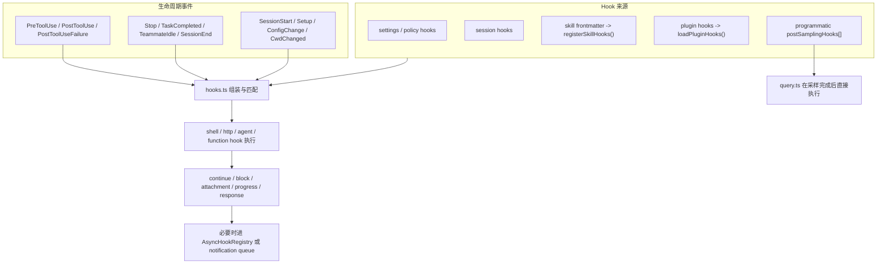

## 一句话结论

Hooks 不是“一套配置项”，而是一层层接到生命周期上的扩展面：持久化 settings hooks 负责治理和审计，session hooks 负责会话内临时行为，skill frontmatter hooks 是 session hooks 的包装，plugin hooks 负责可热更新的插件扩展，而 post-sampling hooks 则是程序内注册的特殊后处理面。

## 状态标签总览

| Hook 来源 / 层次 | 当前状态 | 关键入口 | 适合做什么 |
|---|---|---|---|
| settings / policy hooks | `external build active` | `src/utils/hooks.ts`, `src/utils/hooks/hooksConfigSnapshot.ts` | 企业审计、权限治理、全局持久规则 |
| session hooks | `external build active` | `src/utils/hooks/sessionHooks.ts` | 当前 session / 当前 agent 的临时行为 |
| skill frontmatter hooks | `external build active` | `src/utils/hooks/registerSkillHooks.ts` | 技能自带的局部钩子，自动注册为 session hooks |
| plugin hooks | `external build active` | `src/utils/plugins/loadPluginHooks.ts` | 插件式扩展、热重载、按插件启停 |
| post-sampling hooks | `external build active` | `src/utils/hooks/postSamplingHooks.ts`, `src/query.ts` | 模型响应完成后的程序内后处理 |
| hook 事件广播面 | `external build active` | `src/utils/hooks/hookEvents.ts` | SDK / remote observer 的 started-progress-response 流 |

## 为什么不是“一套统一 hooks 子系统”

如果把 hooks 统称成“一套统一子系统”，会马上看错三件事：

- 你会以为所有 hooks 都来自 `settings.json`。
- 你会以为 session hooks 与 plugin hooks 只是存储位置不同。
- 你会以为所有 async hook 都只是 fire-and-forget，不会再影响模型或消息队列。

真实情况恰好相反：这些层之所以分开，就是为了把“持久治理”“会话内临时行为”“插件热重载”“程序内后处理”拆开，不让它们互相污染。

## 正常链路

这张图有两个关键点：

1. `postSamplingHooks` 根本不走 `settings.json` 那条注册链，它是程序内注册数组。
2. skill hooks 并不是独立存储层，它们会被 `registerSkillHooks()` 翻译成 session hooks。

## 关键结构 / 状态

| 结构 / 变量 | 作用 | 这页应该怎么理解 |
|---|---|---|
| `TOOL_HOOK_EXECUTION_TIMEOUT_MS = 10 * 60 * 1000` | 工具类 hook 的默认长超时 | hooks 可以包长命令，但不适合塞主业务关键路径 |
| `getSessionEndHookTimeoutMs()` | `SessionEnd` 默认 1500ms，可由 `CLAUDE_CODE_SESSIONEND_HOOKS_TIMEOUT_MS` 覆盖 | 停机/清理 hooks 被故意压得更紧，防止关机拖死 |
| `SessionHooksState = Map<string, SessionStore>` | session hooks 的内存状态容器 | 这里用 `Map` 是为了高并发下 O(1) 变更和零 listener 抖动，不是随手写法 |
| `registerSkillHooks()` | 把 skill frontmatter hooks 注册成 session hooks | `once: true` 是通过成功后回调删除，不是单独存储类型 |
| `loadPluginHooks()` | 读取所有启用插件的 hooks 并原子 clear-then-register | 插件 hooks 的热重载和裁剪是专门处理过的，不该与普通 settings hooks 混写 |
| `hooksConfigSnapshot` | 管理 `allowManagedHooksOnly` / `disableAllHooks` | managed-only 与 disable-all 语义不同，而且不会一刀切掉 plugin hooks / 某些 frontmatter 路径 |
| `ALWAYS_EMITTED_HOOK_EVENTS = ['SessionStart', 'Setup']` | hook 事件广播的默认白名单 | 不是所有 started/progress/response 都默认对 observer 可见 |
| `MAX_PENDING_EVENTS = 100` | hook 事件缓存上限 | 没有 handler 时只是有限缓冲，不是无限日志 |
| `asyncRewake` | 特殊异步 hook 回流模式 | 它会绕过 registry，并把 exit code 2 的阻断错误重新塞回 `task-notification` |

## 五条来源不要混写

| 来源 | 生命周期 | 存储方式 | 典型用途 |
|---|---|---|---|
| settings hooks | 跨 session 持久 | settings / policy config | 全局治理、审计、组织规则 |
| session hooks | 当前 session 内有效 | 内存 `Map` | agent 局部策略、临时实验、运行时回调 |
| skill frontmatter hooks | 当前 session 内有效 | 注册时转成 session hooks | 技能执行期间的局部守卫与一次性行为 |
| plugin hooks | 随插件启停 | plugin loader + registered hooks | 插件型扩展、热更新、统一打包治理 |
| post-sampling hooks | 程序内注册 | `postSamplingHooks[]` 数组 | 模型采样后的内部后处理，不对用户配置开放 |

这里最值得记住的一句是：**skill hooks 不是第五种持久配置，它只是 skill frontmatter 包出来的 session hooks。**

## 一个实际例子：把 Bash 写入审计做成插件 hooks

假设团队要做一个“所有 Bash 写入命令都必须审计，必要时拦截”的企业插件，最稳的做法不是修改 `BashTool`，而是用 plugin hooks：

1. 插件在自己的 hooks 配置里声明 `PreToolUse` 和 `PostToolUseFailure`。
2. 启动或 reload 时，`loadPluginHooks()` 会把这些 matcher 转成带 `pluginRoot` / `pluginId` 的 native matcher，并以 **clear-then-register 原子对** 方式替换旧 hooks。
3. 当 `BashTool` 即将执行时，生命周期事件进入 `hooks.ts`，命中该插件的 `PreToolUse`。
4. 插件 hook 可以做两件事：
   - 记录命令、cwd、session ID、匹配到的风险等级；
   - 对明显越界的写操作返回阻断，让主循环在工具执行前止损。
5. 如果命令失败，`PostToolUseFailure` 再补一条失败审计，而不用把失败日志散落到业务工具实现里。
6. 如果插件被禁用，`pruneRemovedPluginHooks()` 会清掉不再启用的 plugin hooks；如果插件 reload，atomic swap 会避免旧 hooks 被提前清空造成“空窗期”。

这个例子的核心不是“hooks 能执行 shell”，而是：**它让治理逻辑落在插件层，而不需要侵入 `BashTool` 主逻辑。**

## 再看一个更细的模式：skill frontmatter 的 `once: true`

skill frontmatter hooks 的设计目标不是长驻治理，而是“技能带一个小范围行为”：

- `registerSkillHooks()` 会把 skill frontmatter hooks 注册到当前 session。
- 如果某个 hook 标了 `once: true`，删除动作不是在注册阶段发生，而是在第一次 **成功执行后** 通过 `onHookSuccess` 回调移除。
- 这特别适合做“一次性初始化提醒”或“第一次命中时补充上下文”的行为。

这也解释了为什么 skill hooks 不该和 settings hooks 混写：它们根本不是同一层次的生命周期。

## 失败与恢复

| 失败场景 | 表现 | 恢复动作 |
|---|---|---|
| 用户把 `disableAllHooks: true` 写进本地设置，以为所有 hooks 都会停 | 实际上 managed hooks 仍可能继续运行 | 回到 `hooksConfigSnapshot.ts` 区分“managed 禁全部”和“非 managed 禁全部” |
| 开了 `allowManagedHooksOnly` 以后，session hooks 消失 | 技能或局部注册的 hooks 不再触发 | 这是设计结果；先确认是否需要 policy 放行，而不是先怀疑匹配器 |
| skill 的 `once: true` 没有如预期移除 | hook 只有“成功执行后”才会删，失败不会删 | 查 hook 结果和 `onHookSuccess` 是否真的被调用 |
| 以为 plugin hooks 在 `/reload-plugins` 期间会短暂失效 | 某些旧文档会这样写 | 现在是 atomic clear-then-register，应该回文档修正为“避免空窗期” |
| async stop hook 看起来“没回主会话” | 实际在后台执行，或经 `task-notification` 回流 | 查 `asyncRewake`、notification queue 和 exit code 2 处理 |
| 关会话时清理脚本经常被截断 | `SessionEnd` 默认只有 1500ms | 根据需要设置 `CLAUDE_CODE_SESSIONEND_HOOKS_TIMEOUT_MS`，但不要把重工作放在关停路径 |

## 边界与误读

<Warning>
不要把 post-sampling hooks、plugin hooks、skill hooks 写成“只是不同来源的同一种配置”。它们的注册链、生命周期和失败后果都不一样。
</Warning>

- session hooks 的价值就在隔离；如果你期待它持久跨 session，那就是层选错了。
- post-sampling hooks 目前是程序内 API，不是 settings 暴露给用户的持久配置。
- `allowManagedHooksOnly` 不等于“插件 hooks 一定全灭”；当前实现专门把 plugin hooks 与某些 agent frontmatter 路径区别对待。
- hook 事件流和主消息流不是一条通道；只有 `SessionStart` 与 `Setup` 是默认 always emitted，其余 started/progress/response 取决于 `includeHookEvents` 或 remote 模式。
- async hook 也不是简单 fire-and-forget；`asyncRewake` 会有专门回流语义。

## 场景变体

| 场景 | 更适合的 hook 层 |
|---|---|
| 企业审计 / 组织治理 | settings / policy hooks，必要时打包成 plugin hooks |
| 某个 skill 的一次性初始化提醒 | skill frontmatter hooks + `once: true` |
| 某个 agent 临时加校验 | session function hooks |
| 插件式外部集成 | plugin hooks + hot reload |
| 模型响应后做内部后处理 | post-sampling hooks |
| 收尾清理与 stop 阶段补偿 | `Stop` / `TaskCompleted` / `SessionEnd` hooks |

## 先读什么

- 先读 [Hooks 生命周期钩子](/docs/extensibility/hooks)
- 再读 [命令系统](/docs/extensibility/command-system)

## 继续读什么

- [插件状态与漂移](/docs/extensibility/plugin-status-and-drift)
- [Skills 技能系统](/docs/extensibility/skills)
- [信任边界](/docs/safety/trust-boundaries)
- [Permission Rule Cookbook](/docs/safety/permission-rule-cookbook)

## 相关源码入口

- `src/utils/hooks.ts`
- `src/utils/hooks/sessionHooks.ts`
- `src/utils/hooks/registerSkillHooks.ts`
- `src/utils/hooks/postSamplingHooks.ts`
- `src/utils/hooks/hookEvents.ts`
- `src/utils/hooks/hooksConfigSnapshot.ts`
- `src/utils/plugins/loadPluginHooks.ts`
- `src/query.ts`
- `src/query/stopHooks.ts`

## 本页证据等级

- `external build active`: settings hooks、session hooks、skill frontmatter hooks、plugin hooks、post-sampling hooks、event broadcast、async 回流
- `inference`: “hooks 是分层系统而不是统一配置面”是对以上实现结构的归纳
