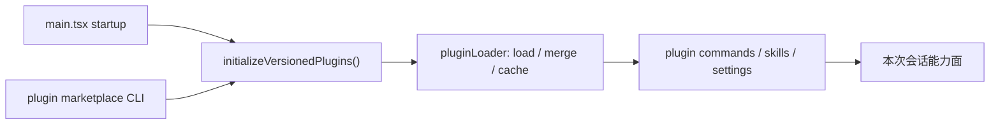

## 一句话结论

把当前仓库的 plugin 世界写成“已移除”是不准确的；更准确的说法是：**插件基础设施仍然活着，marketplace、loader、cache、CLI 管理命令都在，但公开生态面与原始产品叙事已经发生收缩或漂移。**

## 状态标签总览

| 主题 | 当前状态 | 说明 |
|---|---|---|
| plugin CLI 命令 | `external build active` | `main.tsx` 里仍有 `plugin` / `marketplace` 子命令 |
| versioned plugin init | `external build active` | 会话启动仍会初始化 versioned plugins |
| plugin loader / cache / settings merge | `external build active` | 真实参与命令、技能、设置装载 |
| marketplace 生态广度 | `docs drift` / 语义收缩 | 不应把“基础设施还在”写成“生态完整复原” |
| 某些旧宣传口径 | `docs drift corrected` | “plugins removed” 过度简化了当前现实 |

## 为什么不能简单写成 removed

如果整个插件系统真的被移除，当前仓库不该同时还存在这些事实：

- [main.tsx](/Users/admin/work/claude-code-docs-sweep/src/main.tsx) 仍导入 `initializeVersionedPlugins`、`clearPluginCache`、plugin telemetry、plugin marketplace handler 等模块。
- CLI 顶层仍有 `claude plugin ...`、`claude plugin marketplace ...` 这组命令。
- plugin loader 仍负责合并 session plugins、marketplace plugins、缓存插件设置，并对冲突做处理。
- `--plugin-dir` 仍是一个真实的顶级参数，不是遗留注释。

因此“已移除”最多只能描述某些旧生态想象或某些产品化层面的收缩，不能描述当前代码事实。

## 正常链路

## 关键结构 / 状态

| 结构 | 作用 | 为什么还重要 |
|---|---|---|
| `initializeVersionedPlugins()` | 初始化 versioned plugin 体系并触发迁移 / 同步 | 启动时真实执行，不是死代码注释 |
| `pluginLoader.ts` | 合并 session、marketplace、installed plugins，缓存设置 | 命令缺失或设置冲突时是排查入口 |
| `installedPluginsManager` | 管理版本化安装态 | 说明插件并不是临时内存态 |
| `marketplaceManager` | 维护 marketplace 源、安装、移除、缓存 | 生态面虽然收缩，但 marketplace 机制仍然存在 |
| plugin telemetry | 记录加载错误与会话启用状态 | 说明插件仍被当成运行中的扩展面观察 |

## 一个实际例子

假设某个 slash command 本应来自插件贡献，却在某次会话里消失了。正确排查顺序不应是“插件系统不是早删了吗”，而应该是：

1. 看启动时是否执行了 `initializeVersionedPlugins()`。
2. 看 plugin loader 是否清缓存、重新加载、合并了正确来源。
3. 看 session plugins 与 installed plugins 是否发生名字覆盖或 settings 冲突。
4. 只有当这些基础设施都没参与时，才有资格说“这个能力对当前构建而言已经不在面上”。

也就是说，plugin 是否“活着”，不能靠一句总览判断，必须回到装载链。

## 为什么不是更简单的结论

“removed” 这个结论虽然省事，但会同时制造两个误导：

1. 维护者会错过真实存在的装载链路，导致命令/技能问题排查方向错误。
2. 文档作者会把“生态热度下降”混写成“底层机制不存在”。

对当前仓库来说，更精确的表达应该是：

- **基础设施层**：还在，且仍然参与启动与装载。
- **公开生态层**：可能收缩、漂移，不能照搬原始产品叙事。

## 失败与恢复

| 失败场景 | 当前表现 | 恢复方式 |
|---|---|---|
| plugin cache 过期或脏 | 命令、设置、技能加载不一致 | 先查 plugin loader / clear cache 路径 |
| marketplace 信息与当前仓库叙事不一致 | 文档把生态写得过满或过空 | 区分 marketplace 机制与生态现实 |
| `--plugin-dir` 会话行为异常 | 只在某次会话缺命令 | 查 inline plugin 与 installed plugin 的合并优先级 |
| 误把 plugin 相关代码当死代码删除 | 命令装载链被破坏 | 先确认 main startup 是否仍依赖这条链 |

## 边界与误读

<Warning>
“插件基础设施还在”不等于“公开 marketplace 生态与原产品完全一致”；两者必须分开写。
</Warning>

- 不要再把 plugin 全体写成 removed。
- 也不要反过来把“还有 loader 和 CLI”写成“生态完整恢复”。
- 不要忽略 `--plugin-dir`、plugin CLI、versioned init 这些仍在热路径附近的事实。
- 不要把 marketplace 存在与某个具体插件生态规模画等号。

## 场景变体

| 场景 | plugin 状态最重要的含义 |
|---|---|
| 维护命令装载 | 不能忽略 plugin loader |
| 审校总览文档 | 不能再笼统写 removed |
| 排查会话差异 | 要考虑 `--plugin-dir` 与 installed plugins 合并 |
| 研究生态现状 | 区分“底层机制存在”与“公开生态活跃度” |

## 先读什么

- 先读 [命令系统](/docs/extensibility/command-system)
- 再读 [文档漂移矩阵](/docs/research/docs-drift-matrix)

## 继续读什么

- [MCP 连接生命周期](/docs/extensibility/mcp-connection-lifecycle)
- [Skills 排序与预算](/docs/extensibility/skills-ranking-and-budgeting)
- [能力图谱](/docs/research/project-capability-atlas)

## 相关源码入口

- `src/main.tsx`
- `src/utils/plugins/pluginLoader.ts`
- `src/utils/plugins/installedPluginsManager.js`
- `src/utils/plugins/marketplaceManager.ts`
- `src/utils/telemetry/pluginTelemetry.js`

## 本页证据等级

- `external build active`: [src/main.tsx](/Users/admin/work/claude-code-docs-sweep/src/main.tsx), [src/utils/plugins/pluginLoader.ts](/Users/admin/work/claude-code-docs-sweep/src/utils/plugins/pluginLoader.ts), [src/utils/plugins/installedPluginsManager.js](/Users/admin/work/claude-code-docs-sweep/src/utils/plugins/installedPluginsManager.js), [src/utils/plugins/marketplaceManager.ts](/Users/admin/work/claude-code-docs-sweep/src/utils/plugins/marketplaceManager.ts)
- `docs drift corrected`: “plugin removed” 改写为“基础设施仍在，公开生态语义已收缩或漂移”
