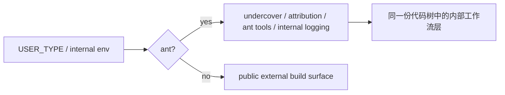

## 一句话结论

`ant-only` 不是“又一种 feature flag”，而是 **身份边界**；它决定同一份代码树里哪些路径属于内部工作流世界，哪些路径属于 external build 的公开能力面。

## 状态标签总览

| 主题 | 当前状态 | 说明 |
|---|---|---|
| `USER_TYPE === 'ant'` 分支 | `ant-only` | 这是身份层，不是实验层 |
| undercover / commit attribution | `ant-only` | 主要服务内部人员向公开仓库贡献代码时的暴露控制 |
| ant 专属工具与调试分支 | `ant-only` | 例如 `ConfigTool`、`REPLTool`、某些内部日志/override |
| 与 feature gate 叠加的内部能力 | `ant-only` + `feature-gated` | 两层可以同时存在，但不能混写 |
| external build 对这些路径的可见性 | 多为证据可见，但不应宣称可用 | 研究价值存在，产品结论要谨慎 |

## 为什么它必须单独成页

如果不把 ant-only 单独拆出来，文档会在两个方向上一起出错：

1. 把内部世界能力误写成公开产品能力。
2. 因为它不属于公开世界，就把它对组织工作流的解释力全部删掉。

这页的作用正是把两种误读都压住：**既不把内部能力宣传成 public feature，也不把它们当成毫无意义的噪音。**

## 正常链路

## 关键结构 / 状态

| 源码入口 | 它说明什么 | 当前含义 |
|---|---|---|
| `src/tools.ts` | 有些工具直接按 `process.env.USER_TYPE === 'ant'` 裁剪 | 工具是否出现不是纯 feature gate 决定 |
| `src/utils/undercover.ts` | undercover 明确只对 ant 世界生效 | 不是普通用户的“隐私增强模式” |
| `src/setup.ts` | ant 模式下会 prime repo classification，用于 auto-undercover | 说明内部贡献公开仓库是实际工作流场景 |
| `src/services/analytics/growthbook.ts` | ant 世界有额外 override 与调试入口 | 内部实验与公开实验不是完全同一套操作面 |

`undercover.ts` 里的注释甚至把这件事说得很直白：对 ant 世界来说，undercover 模式用于防止内部模型代号、项目名、归属信息泄露到公开仓库；对 external builds，这些函数会退化成 trivial return。

## 一个端到端例子

`undercover` 是最典型的 ant-only 能力之一：

1. 它的默认逻辑不是“用户自己打开一个隐私选项”，而是内部环境下 **默认开启，直到 repo 被确认是 internal**。
2. 它的目标不是普通终端用户体验，而是规范 commit message、PR title、PR body，不要泄露 Anthropic 内部模型代号、项目名和归属信息。
3. `setup.ts` 还会在启动阶段预热 repo classification cache；如果仓库被确认是 internal，还会清空系统提示相关缓存，让后续回合摘掉 undercover 限制。

这条链路说明：ant-only 的价值不在“酷炫隐藏功能”，而在 **身份边界改变了系统该如何对外说话和归属自己**。

## 为什么不是更简单的设计

如果只靠 feature flag，而不引入身份层，就会把两类需求揉在一起：

- “这个能力是否还在实验中”
- “这个能力本来就只属于内部组织工作流”

这两类问题完全不同。前者偏产品灰度，后者偏组织边界。`ant-only` 的存在，就是把这条边界显式编码进系统。

## 失败与恢复

| 失败场景 | 错误写法 | 正确恢复 |
|---|---|---|
| 树上看到 ant-only 工具 | “公开用户只是没打开而已” | 改成身份层隔离，不要写成普通 feature |
| ant-only 与 feature gate 同时存在 | “只是又一个实验功能” | 写明是双层门控：身份层 + 实验层 |
| 看到 undercover | “给所有用户的防泄露模式” | 改写成内部贡献公开仓库时的暴露控制机制 |
| 看到内部 logging / override 入口 | “外部 build 也会走这条日志面” | 先判断 `USER_TYPE`，再决定是否纳入 public path |

## 边界与误读

<Warning>
ant-only 代码存在，不等于 external build 用户“理论上也能触发”。很多时候它表达的是内部组织边界，而不是未公开产品功能。
</Warning>

- `ant-only` 和 `feature-gated` 可以叠加，但不是一回事。
- 不要把内部 world 的存在写成公开 capability backlog。
- 也不要因为它属于内部世界，就忽略它对产品和组织使用方式的解释力。
- 对外文档里，最稳妥的写法通常是：**代码证据存在，但当前状态是 ant-only，不应混写成 public feature。**

## 场景变体

| 场景 | ant-only 最重要的意义 |
|---|---|
| 文档写作 | 防止把内部能力写成公开能力 |
| 逆向研究 | 解释 Anthropic 如何在内部使用这套系统 |
| 排查行为差异 | 判断 external 与 internal 为什么同树不同面 |
| 安全与归属 | 理解 undercover / attribution 的存在理由 |

## 先读什么

- 先读 [三层门禁系统](/docs/internals/three-tier-gating)
- 再读 [Feature Flags](/docs/internals/feature-flags)

## 继续读什么

- [GrowthBook 运行时实验](/docs/internals/growthbook-ab-testing)
- [隐藏功能巡礼](/docs/internals/hidden-features)
- [Gating Matrix](/docs/internals/gating-matrix)

## 相关源码入口

- `src/tools.ts`
- `src/utils/undercover.ts`
- `src/setup.ts`
- `src/services/analytics/growthbook.ts`

## 本页证据等级

- `ant-only`: [src/tools.ts](/Users/admin/work/claude-code-docs-sweep/src/tools.ts), [src/utils/undercover.ts](/Users/admin/work/claude-code-docs-sweep/src/utils/undercover.ts), [src/setup.ts](/Users/admin/work/claude-code-docs-sweep/src/setup.ts)
- `inference`: “身份边界改变系统对外说话方式与归属策略”是对 undercover / attribution 路径的结构总结
