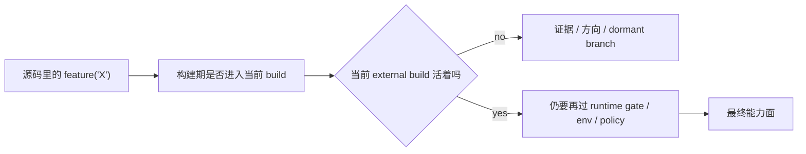

## 一句话结论

在这个仓库里，feature flags 的首要意义不是“线上灰度开关”，而是 **划出 external build 的边界**：它告诉你哪些代码可以研究，哪些代码可以运行，以及哪些代码只能当成方向线索。

## 状态标签总览

| 类别 | 典型例子 | 当前状态 |
|---|---|---|
| orchestration / assistant | `COORDINATOR_MODE`, `KAIROS`, `PROACTIVE` | 多数 `feature-gated` |
| tool / capability | `WEB_BROWSER_TOOL`, `CONTEXT_COLLAPSE`, `HISTORY_SNIP` | 多数 `feature-gated` |
| platform / remote | `BRIDGE_MODE`, `DAEMON`, `SSH_REMOTE`, `DIRECT_CONNECT` | 多数 `feature-gated` |
| diagnostics / internal helpers | `OVERFLOW_TEST_TOOL`, `TRANSCRIPT_CLASSIFIER` 等 | 混合，很多仍不应当成公开默认能力 |

## 为什么重要

如果忽略 feature flags，reverse-engineered 文档会系统性高估三个方向：

1. 协调器、多 agent、Kairos 这类编排世界的成熟度。
2. 浏览器、voice、assistant 这类体验分支的公开可用度。
3. bridge、daemon、remote-control 这类平台化能力在 external build 的现实状态。

`feature('...')` 在当前仓库里承担的，不只是“以后也许能开”的作用，更像是：

- 把内部分支挡在 external build 之外；
- 给恢复工程保留结构证据；
- 帮你建立“树上有”与“当前活”的区别。

## 正常链路

## 关键结构 / 状态

| 源码入口 | 说明 | 你该怎么使用它 |
|---|---|---|
| `src/entrypoints/cli.tsx` | 入口层把 external build 读法固定下来 | 用来确定当前文档是否应该把某条路径写成活跃能力 |
| `src/main.tsx` | 大量 `feature('...')` 分支的汇流点 | 看各种远程、assistant、bridge、daemon、Kairos 路径是否可能被调用 |
| `src/tools.ts` | feature-gated tool 最集中 | 判断“树上有工具”与“本轮可调用工具”之间的距离 |
| 具体功能目录 | 例如 assistant、bridge、workflow、browser tool | 作为研究材料，但不能自动上升成产品结论 |

## 一个实际例子

以 `BRIDGE_MODE` 为例：

1. 代码树里确实有 bridge 相关模块，说明这不是纯粹的想象功能。
2. 但是否进入当前 external build，要先经过 `feature('BRIDGE_MODE')`。
3. 即便构建层允许，还要看 auth、policy limit、最小版本检查等运行时条件。
4. 所以正确写法应该是：**bridge 是树上明确存在、但受多层 gate 约束的能力**，而不是“当前默认可用的远程控制能力”。

这个例子能很好说明：feature flag 只是第一层，不是唯一层；但第一层没过，就更不能往下写成现实能力。

## 为什么不是更简单的设计

把 feature flags 理解成传统 SaaS 灰度开关会有一个问题：那种理解默认这些代码都已经是同一个公开产品面的组成部分，只是当前用户看不见。

而当前仓库并不是这样。很多 flag 背后同时夹带着：

- external 与 internal build 的边界；
- reverse-engineered 仓库尚未完全恢复的支路；
- 只在特定身份世界里才成立的内部产品面。

因此对这棵树来说，feature flag 更像 **“先别把这里写成现实” 的结构提示**。

## 失败与恢复

| 失败方式 | 会造成什么 | 恢复方式 |
|---|---|---|
| 看到实现目录就直接写成功能页 | 产出一篇很丰富但大量漂移的文档 | 先查 `feature('...')` 是否让它进入 external build |
| 把 feature flag 当唯一 gate | 漏掉 runtime 与身份层限制 | 回到三层门禁图补齐 |
| 把 dormant branch 当死代码 | 错过真实产品方向线索 | 标注为 `feature-gated`，而不是删掉讨论 |
| 把 flag 的存在写成“当前可用” | 误导维护与排障顺序 | 改成“证据存在，但当前不应宣称为 live capability” |

## 边界与误读

<Warning>
“代码存在”只能证明设计方向或结构证据，不足以证明当前 external build 会执行这段代码。
</Warning>

- 不要把 `feature('...')` 看成单纯的运行时开关。
- 不要把 feature-gated 写成 ant-only，也不要反过来写。
- 不要因为某功能目录很完整，就自动推断它是当前活跃路径。
- 不要把 dormant branch 直接扔掉；它对逆向和漂移分析仍然有价值。

## 场景变体

| 场景 | feature flag 更像什么 |
|---|---|
| external build 阅读 | 活跃路径过滤器 |
| 产品方向研究 | 结构证据与未来线索 |
| 内部构建世界 | 真正的能力开关之一 |
| 文档审校 | 防止把 dormant branch 写成 live feature |

## 先读什么

- 先读 [三层门禁系统](/docs/internals/three-tier-gating)
- 再读 [Gating Matrix](/docs/internals/gating-matrix)

## 继续读什么

- [隐藏功能巡礼](/docs/internals/hidden-features)
- [Ant 特权世界](/docs/internals/ant-only-world)
- [文档漂移矩阵](/docs/research/docs-drift-matrix)

## 相关源码入口

- `src/entrypoints/cli.tsx`
- `src/main.tsx`
- `src/tools.ts`
- `src/services/analytics/growthbook.ts`
- `src/*` 中所有 `feature('...')` 调用点

## 本页证据等级

- `feature-gated`: [src/entrypoints/cli.tsx](/Users/admin/work/claude-code-docs-sweep/src/entrypoints/cli.tsx), [src/main.tsx](/Users/admin/work/claude-code-docs-sweep/src/main.tsx), [src/tools.ts](/Users/admin/work/claude-code-docs-sweep/src/tools.ts)
- `inference`: “feature flags 在这里更像 external build 边界而非普通灰度开关”是对当前仓库结构的解释性总结
