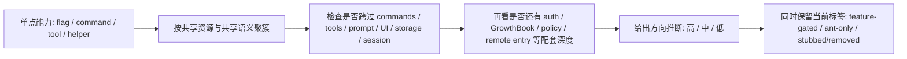

## 一句话结论

真正值得进入路线图的，不是某个孤零零的 flag，而是那些同时出现在 commands、tools、prompt、UI、storage、session 或远程入口中的能力簇；这些簇让我们可以谨慎推断出几条更大的方向，但仍然不能把它们写成官方承诺。

## 状态标签总览

| 方向 | 代表能力簇 | 当前产品面标签 | 推断强度 | 为什么成立 |
|---|---|---|---|---|
| 常驻协作者 | `KAIROS`, `PROACTIVE`, `KAIROS_CHANNELS`, `KAIROS_GITHUB_WEBHOOKS`, `SleepTool`, `PushNotificationTool` | 主要是 `feature-gated` | 高 | 不只是命令入口，而是同时碰到提示词、后台等待、通知、频道和主循环分支 |
| 多 agent 编排与共享状态 | `COORDINATOR_MODE`, `TEAMMEM`, `ULTRAPLAN`, task notifications | 主要是 `feature-gated` | 高 | 有独立的 coordinator prompt、worker tool 集、团队记忆与计划/审批表层 |
| 远程控制与控制平面外移 | `BRIDGE_MODE`, `DIRECT_CONNECT`, `SSH_REMOTE` | 主要是 `feature-gated` | 高 | 从 CLI 快路径到 entitlement、session 入口和远程控制命令形成一整条链 |
| 多模态 / browser / computer use | `VOICE_MODE`, `WEB_BROWSER_TOOL`, `CHICAGO_MCP`, `claude-in-chrome` | 主要是 `feature-gated`，部分依赖 `stubbed/removed` | 中 | 入口明显，但完整度不如前面三簇稳定，且 computer-use 依赖层残缺 |
| 体验人格化与 ambient UI | `BUDDY` 及其 teaser/live 逻辑 | `feature-gated` | 中 | 有命令、提示词和 UI 通知层，但还不像底层架构主线 |
| 内部 / 公开双轨运营 | `Undercover`, ant-only overrides | 主要是 `ant-only` | 中 | 更像交付与协作策略，而不是终端面向用户的产品方向 |

## 为什么这页和索引页必须拆开

[隐藏功能巡礼](/docs/internals/hidden-features) 负责回答“这东西今天应该贴什么标签”；这页要回答的则是另一件事：

这些零散的标签，拼起来到底在指向怎样的系统演化方向？

如果索引页和路线图页不拆开，就会出现一种很常见的漂移：明明只是 `feature-gated` 的代码簇，被写成了“已经存在的未来产品蓝图”。所以这里必须先声明一个前提：

- 这页所有方向判断都属于 **推断**。
- 推断的依据是“代码簇是否跨层重复出现”，不是“某个命名看起来很大”。
- 推断强度高，也不等于 external build 现在就能用。

## 正常链路

这个流程里，最关键的是最后一步。路线图页不能覆盖索引页；它必须在每个方向旁边继续保留“当前产品面标签”，提醒读者这仍然是推断，不是当前 capability matrix。

## 关键结构 / 状态

| 方向 | 支撑它的跨层证据 | 目前最该小心的边界 |
|---|---|---|
| 常驻协作者 | `main.tsx` 与 `print.ts` 都有 `PROACTIVE` / `KAIROS` 分支；`tools.ts` 暴露 `SleepTool`、Push 与 webhook 相关工具；提示词层也有针对性段落 | 当前 external build 仍由 build gate 卡住，不能写成已公开 assistant runtime |
| 多 agent 编排 | `coordinatorMode.ts` 提供独立 system prompt 和 worker tool 集；`TEAMMEM` 牵到 memdir、watcher、UI 折叠展示；`ULTRAPLAN` 牵到命令、对话框和 remote task | 这是一条很强的方向，但不等于当前交互路径已默认进入 coordinator |
| 远程控制 | `cli.tsx`、`commands.ts`、`bridgeEnabled.ts`、`main.tsx` 的 pending connect / ssh 入口形成远程入口簇 | 需要区分“控制平面方向很强”和“当前 external build 默认不可用” |
| 多模态 / browser / computer use | voice、browser、chrome、computer-use 入口都有，但完整度不一致 | `CHICAGO_MCP` 的关键依赖仍是 stub，不能把它和 voice/browser 一起写成同等成熟 |
| 体验人格化 | `BUDDY` 覆盖命令、UI 通知、trigger 检测、prompt | 更像体验层试验，不是底层运行时方向 |
| 双轨运营 | `Undercover`、ant-only override、内部与公开仓协作规则 | 这是交付与身份边界方向，不是面向终端用户的能力面 |

## 一个实际例子：为什么“常驻协作者”是高强度推断

如果只看到 `KAIROS` 一个 flag，这个方向还不够稳；真正让它变成高强度推断的，是它在多层同时出现：

1. `src/main.tsx` 里，`PROACTIVE` / `KAIROS` 不只控制一个命令，而是影响启动分支、默认视图、assistant activation path 等主链路判断。
2. `src/screens/REPL.tsx` 与 `src/cli/print.ts` 都有与 proactive 相关的视图/流程分支，说明这不是“只在交互端试验”，而是同时考虑了 headless 面。
3. `src/tools.ts` 又把 `SleepTool`、PushNotification 和 GitHub webhook 相关工具挂进工具池，说明系统在考虑“离开当前 turn 之后怎么办”。
4. `src/constants/prompts.ts` 和 system prompt 相关实现里还专门区分了 focused / brief / proactive 叙事，这已经不是单一开关，而是运行方式变化。

这四层合在一起，才使“从 turn-based CLI 走向常驻协作者”成为高强度方向推断。与此同时，索引页仍然会提醒我们：**它在当前 external build 里的产品面标签依旧是 `feature-gated`。**

## 为什么 “多 agent 编排” 也是高强度，而不是噪声

`COORDINATOR_MODE`、`TEAMMEM` 和 `ULTRAPLAN` 分开看时很像不同实验；合起来看就不像了：

- `coordinatorMode.ts` 给 coordinator 自己单独写了 system prompt、tool discipline 和 worker result protocol。
- `TEAMMEM` 又把团队记忆扩展到了 memdir、watcher、collapse UI 和 file access hooks。
- `ULTRAPLAN` 不只是一个命令名，它还联动 REPL 对话框、remote task XML 标签和审批/回传流。

它们共同透露出的不是“再加几个命令”，而是“把单 agent 对话工具做成更强的编排系统”。这就是为什么这条方向同样值得标成高强度推断。

## 为什么多模态方向只能给中强度

多模态证据并不弱，但它不像前两条那样形成稳定的跨层闭环：

- `VOICE_MODE` 有完整的 auth + GrowthBook 运行时门控 helper。
- `WEB_BROWSER_TOOL` 有工具注册和 REPL 面板位点。
- `claude-in-chrome` 有 hint、native host 和 browser 相关路径。
- 但 `CHICAGO_MCP` 的关键依赖仍然是 stub，导致 computer-use 分支不能被写成同等成熟的能力簇。

所以最准确的写法不是“多模态方向不存在”，而是“方向明确，但成熟度与依赖完整性不如常驻协作者和多 agent 编排稳定”。

## 失败与恢复

| 失败场景 | 错误推断 | 恢复动作 |
|---|---|---|
| 用单个 flag 推出完整产品路线 | “有 `VOICE_MODE`，所以多模态肯定是下一个主线” | 先要求跨层证据：命令、工具、UI、session、远程入口至少命中两三层 |
| 只按名称大小判断方向重要性 | “`ULTRAPLAN` 名字大，所以优先级最高” | 回看它是否真正连接 prompt、UI、task protocol 和 remote path |
| 把时间窗口 UI 当成长期架构证据 | “Buddy teaser 说明 companion 已是核心主线” | 把体验层信号和运行时架构层信号分开计权 |
| 把高强度推断写成发布时间 | “高强度 = 下一版就开放” | 改回“高强度只说明代码簇完整，和发布时间没有必然关系” |

## 边界与误读

<Warning>
这页说的是“最像什么方向”，不是“未来一定会发什么”。尤其在当前 external build 里，很多方向的现状依旧是 `feature-gated`。
</Warning>

- 不要把 `Undercover` 直接塞进终端用户产品路线图；它更像内部/公开双轨协作机制。
- 不要把 `BUDDY` 和 `KAIROS` 当成同一类证据；前者更偏体验包装，后者更偏运行方式。
- 不要把 `CHICAGO_MCP` 的命名强度误写成实现强度；依赖状态必须单独看。
- 不要把 exact date teaser 逻辑误读成产品稳定性。比如 `BUDDY` 的 2026 年 4 月 1 日到 4 月 7 日 teaser，更像一次事件型上线包装，而不是证明它已经成为主架构层。

## 场景变体

| 读者 | 这页最适合怎么用 |
|---|---|
| 文档作者 | 决定哪些隐藏能力值得被提升成“方向页”，哪些只留在索引表 |
| 逆向研究者 | 按代码簇而不是按单个文件名判断产品演化线 |
| 架构阅读者 | 把常驻化、编排、控制平面、多模态、体验层拆开看 |
| 漂移修正者 | 防止把“名字大”或“代码多”直接写成既成事实 |

## 先读什么

- 先读 [隐藏功能巡礼](/docs/internals/hidden-features)
- 再读 [Gating Matrix](/docs/internals/gating-matrix)

## 继续读什么

- [Feature Flags](/docs/internals/feature-flags)
- [GrowthBook 运行时实验](/docs/internals/growthbook-ab-testing)
- [Ant 特权世界](/docs/internals/ant-only-world)
- [Project Capability Atlas](/docs/research/project-capability-atlas)

## 相关源码入口

- `src/main.tsx`
- `src/cli/print.ts`
- `src/screens/REPL.tsx`
- `src/commands.ts`
- `src/commands/ultraplan.tsx`
- `src/tools.ts`
- `src/coordinator/coordinatorMode.ts`
- `src/setup.ts`
- `src/memdir/memdir.ts`
- `src/bridge/bridgeEnabled.ts`
- `src/voice/voiceModeEnabled.ts`
- `src/buddy/useBuddyNotification.tsx`
- `src/utils/undercover.ts`
- `src/services/mcp/client.ts`
- `packages/@ant/computer-use-mcp/src/index.ts`

## 本页证据等级

- `feature-gated`: 常驻协作者、多 agent 编排、远程控制、多模态、体验人格化这几条方向背后的大多数能力，当前产品面标签仍主要是 `feature-gated`
- `ant-only`: “内部 / 公开双轨运营”方向主要来自 `Undercover` 与 ant override 世界
- `stubbed/removed`: 多模态方向里的 computer-use 子簇，关键依赖仍要保留 `stubbed/removed` 警示
- `inference`: 本页所有“方向”本身都是推断；强弱只表示代码簇密度与跨层完整度
