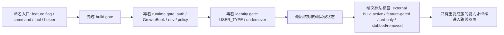

## 一句话结论

这页不负责“讲未来会有什么”，只负责把树上那些看起来像能力的东西按证据整理成索引：哪些在当前 external build 下只是 `feature-gated`，哪些主要属于 `ant-only`，哪些即使有入口名也要因为底层依赖残缺而补上 `stubbed/removed` 的边界说明。

## 状态标签总览

| 能力 | 产品面标签 | 依赖状态 | 主要门控 | 关键源码锚点 | 推断强度 | 不要误读成什么 |
|---|---|---|---|---|---|---|
| `KAIROS` | `feature-gated` | `external build active` | `feature('KAIROS')` 及相关子 flag | `src/main.tsx`, `src/commands.ts`, `src/tools.ts` | 强 | 当前 external build 已默认开放 assistant 模式 |
| `PROACTIVE` | `feature-gated` | `external build active` | 命中 `PROACTIVE` 或 `KAIROS` build gate，另叠加 `CLAUDE_CODE_PROACTIVE` | `src/main.tsx`, `src/screens/REPL.tsx`, `src/cli/print.ts` | 中强 | 当前主会话会无条件常驻后台工作 |
| `COORDINATOR_MODE` | `feature-gated` | `external build active` | `feature('COORDINATOR_MODE')` + `CLAUDE_CODE_COORDINATOR_MODE` | `src/main.tsx`, `src/coordinator/coordinatorMode.ts`, `src/tools.ts` | 强 | 当前仓库默认就是多 agent 编排模式 |
| `BRIDGE_MODE` | `feature-gated` | `external build active` | build gate 之外，还要过 claude.ai 订阅、OAuth scope、GrowthBook、policy、版本门槛 | `src/entrypoints/cli.tsx`, `src/commands.ts`, `src/bridge/bridgeEnabled.ts` | 强 | 远程控制只是“藏起来没展示”，随便配个开关就能用 |
| `VOICE_MODE` | `feature-gated` | `external build active` | `feature('VOICE_MODE')` + auth + GrowthBook kill-switch | `src/commands.ts`, `src/voice/voiceModeEnabled.ts` | 强 | 语音已经被彻底删光，或反过来已经公开可用 |
| `WEB_BROWSER_TOOL` | `feature-gated` | `external build active` | `feature('WEB_BROWSER_TOOL')` | `src/tools.ts`, `src/screens/REPL.tsx`, `src/main.tsx` | 中 | 这个仓库已经恢复了当前公开可用的浏览器工具 |
| `TEAMMEM` | `feature-gated` | `external build active` | `feature('TEAMMEM')` | `src/setup.ts`, `src/memdir/memdir.ts`, `src/services/teamMemorySync/watcher.ts` | 中强 | 当前 memory 层默认已经带团队记忆同步 |
| `BUDDY` | `feature-gated` | `external build active` | `feature('BUDDY')`，并带本地日期 teaser/live 逻辑 | `src/commands.ts`, `src/buddy/useBuddyNotification.tsx`, `src/buddy/prompt.ts` | 中 | 终端默认就会出现吉祥物或陪伴人格层 |
| `CHICAGO_MCP` / computer use | `feature-gated` | `stubbed/removed` | `feature('CHICAGO_MCP')`，还要过平台与交互式条件 | `src/main.tsx`, `src/services/mcp/client.ts`, `packages/@ant/computer-use-mcp/src/index.ts` | 中 | 当前 external build 里已经有完整 computer-use 链路 |
| `DIRECT_CONNECT` / `SSH_REMOTE` | `feature-gated` | `external build active` | `feature('DIRECT_CONNECT')` / `feature('SSH_REMOTE')` | `src/main.tsx` | 中 | 外部构建已经有现成远程入口，只差文档没写 |
| `ULTRAPLAN` | `feature-gated` | `external build active` | `feature('ULTRAPLAN')` | `src/commands.ts`, `src/commands/ultraplan.tsx`, `src/screens/REPL.tsx` | 中 | 当前 plan mode 就等于 Ultraplan |
| `EXPERIMENTAL_SKILL_SEARCH` | `feature-gated` | `external build active` | `feature('EXPERIMENTAL_SKILL_SEARCH')` | `src/query.ts`, `src/commands.ts`, `src/tools/SkillTool/SkillTool.ts` | 中 | 当前 skill listing 默认就在用远程 canonical 搜索 |
| `Undercover` | `ant-only` | `external build active` | 身份与环境边界，而不是普通 feature flag | `src/utils/undercover.ts` | 强 | 普通 external build 也会自动进入 undercover 工作流 |

## 为什么这页必须做成索引页

把隐藏功能直接写成路线图，很容易犯三个错误：

- 把树上有名字的能力误写成“当前可用能力”。
- 把 `feature-gated` 和 `ant-only` 混成同一个“内部功能池”。
- 把底层依赖是 stub 的情况，扩大解释成整条能力面都不存在。

所以这页故意只做一件事：先给每个能力贴对标签，再决定它值不值得进入下一页的路线图推断。

## 正常链路

这里最容易被跳过的是第四步。很多“隐藏功能很完整”的错觉，其实就死在依赖层。例如 `CHICAGO_MCP` 入口名和调用位点都在，但 `packages/@ant/computer-use-mcp/src/index.ts` 明确是 stub；这时产品面标签仍然应该先写 `feature-gated`，同时把依赖状态单列写成 `stubbed/removed`，而不是只写一句“有 computer use”。

## 关键结构 / 状态

| 证据层 | 这层回答什么问题 | 典型入口 |
|---|---|---|
| build gate | 当前 external build 默认会不会把这条路编进热路径 | `src/entrypoints/cli.tsx`, `src/main.tsx`, `src/commands.ts`, `src/tools.ts` |
| runtime gate | 即使编进来了，当前用户会不会真的拿到 | `src/bridge/bridgeEnabled.ts`, `src/voice/voiceModeEnabled.ts`, `src/coordinator/coordinatorMode.ts` |
| identity gate | 这是实验门禁，还是内部身份边界 | `process.env.USER_TYPE`, `src/utils/undercover.ts` |
| dependency state | 依赖包是实装、半实装，还是纯 stub | `packages/@ant/*`, `packages/*-napi` |
| evidence strength | 它只是单点残留，还是成组能力簇 | 是否同时碰到 commands、tools、UI、prompt、storage |

这五层里，前四层都能直接落回代码；只有最后一层“证据强度”属于整理与归纳，所以必须始终和源码锚点同时出现，不能单独漂浮。

## 一个实际例子：为什么 `BRIDGE_MODE` 只能写成 `feature-gated`

`BRIDGE_MODE` 是最适合拿来示范“索引页怎么判标签”的例子，因为它同时穿过了 build、runtime 和 policy 三层：

1. `src/commands.ts` 只在 `feature('BRIDGE_MODE')` 为真时注册 `/bridge` 相关命令。
2. `src/entrypoints/cli.tsx` 也只在同一个 build gate 下才开放 `remote-control` / `bridge` 快路径。
3. `src/bridge/bridgeEnabled.ts` 没有在 build gate 之后直接返回 true，而是继续检查 claude.ai 订阅、OAuth profile scope、organization UUID、GrowthBook gate、最小版本。
4. `cli.tsx` 里的 external build polyfill 又把 `feature()` 固定成 `false`，同时把 `BUILD_TARGET` 固定成 `"external"`。

这四步加在一起，足够支撑一个非常克制但清楚的结论：

- 当前 external build 下，`BRIDGE_MODE` 不能写成 `external build active`。
- 它也不只是“一个名字而已”，因为 runtime entitlement 链路很完整。
- 所以文档里最准确的标签是 `feature-gated`，而不是“已删除”或“当前已公开”。

## 再看一个反例：为什么 `BUDDY` 不该被写成核心架构层

`BUDDY` 也有不止一个源码锚点，但它透露的是另一种证据类型：

- `src/commands.ts` 注册 `/buddy` 命令位点。
- `src/buddy/prompt.ts` 会给提示词补入 companion 相关文案。
- `src/buddy/useBuddyNotification.tsx` 甚至写了精确的 teaser/live 日期逻辑：teaser window 是 **2026 年 4 月 1 日到 2026 年 4 月 7 日**，live 逻辑从 **2026 年 4 月起**生效。

这说明它不是“随手留的占位字符串”，但也不能因此把它写成核心 agent 架构层。它更像体验与人格化表面的实验能力，所以在索引页里它的正确位置是：

- 产品面标签：`feature-gated`
- 证据强度：中
- 不要误读成什么：当前终端默认就带 companion 人格层

## 失败与恢复

| 失败场景 | 错误写法 | 恢复动作 |
|---|---|---|
| 只看到目录和文件名 | “这个功能已经存在” | 回到 build gate、runtime gate 和依赖实现状态逐层确认 |
| 只看到 runtime helper | “那应该配环境变量就能开” | 先确认 `cli.tsx` 的 external build 是否已经把这条路整体关掉 |
| 把 ant-only 能力写成公开彩蛋 | “普通用户只是没发现入口” | 回到 `USER_TYPE === 'ant'`、undercover 和 ant override 逻辑 |
| 看到 stub 依赖就下结论“整条线都没了” | “computer use 不值得再看” | 改成“两层叙述”：产品面 `feature-gated`，关键依赖 `stubbed/removed` |
| 把证据强度当成熟度 | “强证据 = 马上上线” | 改回“强证据只说明代码簇完整，不说明发布时间” |

## 边界与误读

<Warning>
隐藏功能页不是发布计划页。它只能说“这里有多强的代码证据”，不能说“这个能力何时公开”。
</Warning>

- `feature-gated` 不等于“简单改个 config 就能启用”。很多能力还有 auth、GrowthBook、policy、平台条件。
- `ant-only` 不等于“只是更深一层的 feature gate”。它的核心语义是身份边界。
- `stubbed/removed` 是依赖状态，不是产品面标签的替代品。
- `external build active` 也不等于“所有安装环境都一定开放”，它只说明当前 external build 的默认热路径会走到。

## 场景变体

| 能力族 | 更适合怎么读 |
|---|---|
| `KAIROS` / `PROACTIVE` / `ULTRAPLAN` | 协作与常驻化方向的强证据 |
| `COORDINATOR_MODE` / `TEAMMEM` | 编排与共享状态方向的强证据 |
| `BRIDGE_MODE` / `DIRECT_CONNECT` / `SSH_REMOTE` | 控制平面外移与远程入口方向的强证据 |
| `VOICE_MODE` / `WEB_BROWSER_TOOL` / `CHICAGO_MCP` | 多模态与 browser/computer-use 探索痕迹 |
| `BUDDY` | 体验层和人格化尝试 |
| `Undercover` | 内部工作流与公开仓库协作边界 |

## 先读什么

- 先读 [三层门禁系统](/docs/internals/three-tier-gating)
- 再读 [Gating Matrix](/docs/internals/gating-matrix)

## 继续读什么

- [隐藏功能路线图](/docs/internals/hidden-feature-roadmap)
- [Feature Flags](/docs/internals/feature-flags)
- [GrowthBook 运行时实验](/docs/internals/growthbook-ab-testing)
- [Ant 特权世界](/docs/internals/ant-only-world)

## 相关源码入口

- `src/entrypoints/cli.tsx`
- `src/main.tsx`
- `src/commands.ts`
- `src/tools.ts`
- `src/bridge/bridgeEnabled.ts`
- `src/voice/voiceModeEnabled.ts`
- `src/coordinator/coordinatorMode.ts`
- `src/setup.ts`
- `src/memdir/memdir.ts`
- `src/utils/undercover.ts`
- `src/buddy/useBuddyNotification.tsx`
- `src/services/mcp/client.ts`
- `packages/@ant/computer-use-mcp/src/index.ts`
- `packages/@ant/claude-for-chrome-mcp/src/index.ts`
- `packages/url-handler-napi/src/index.ts`

## 本页证据等级

- `external build active`: 这里主要用于描述“依赖状态”与基础支撑代码是否真实存在，不表示这些隐藏能力已对外开放
- `feature-gated`: `KAIROS`, `PROACTIVE`, `COORDINATOR_MODE`, `BRIDGE_MODE`, `VOICE_MODE`, `WEB_BROWSER_TOOL`, `TEAMMEM`, `BUDDY`, `CHICAGO_MCP`, `DIRECT_CONNECT`, `SSH_REMOTE`, `ULTRAPLAN`, `EXPERIMENTAL_SKILL_SEARCH`
- `ant-only`: `Undercover`
- `stubbed/removed`: `packages/@ant/computer-use-mcp/src/index.ts`, `packages/@ant/claude-for-chrome-mcp/src/index.ts`, `packages/url-handler-napi/src/index.ts`
- `inference`: “哪些能力构成更强的产品方向证据”只做强弱归纳，不做发布时间承诺
