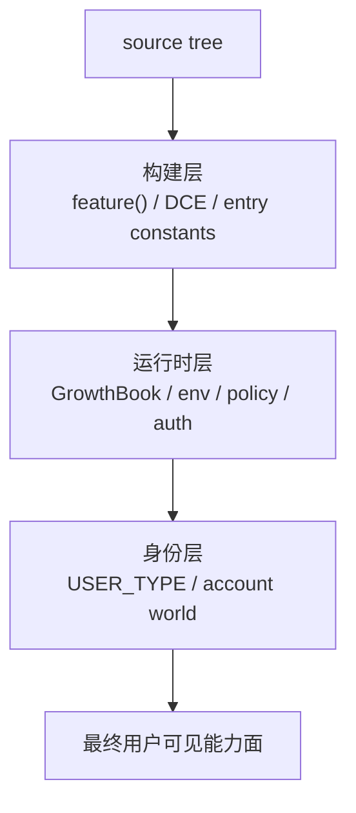

## 一句话结论

理解这个仓库最重要的前提不是某个工具怎么实现，而是先分清 **构建层、运行时层、身份层** 三种门禁；它们都能让某个能力“看得见但跑不到”，但原因完全不同。

## 三层门禁总表

| 层级 | 典型机制 | 它决定什么 | 典型误读 |
|---|---|---|---|
| 构建层 | `feature('...')`、bundler DCE、入口常量 | 某段代码在当前 external build 是否进入活跃世界 | 把树上存在直接写成当前功能 |
| 运行时层 | GrowthBook、env、policy、auth | 已编进构建的能力对当前会话是否开放 | 把运行时 kill-switch 写成“代码已删除” |
| 身份层 | `USER_TYPE === 'ant'` 等条件 | 某些内部能力是否只对 ant 世界可见 | 把 ant-only 误写成 feature-gated |

## 为什么一定要拆成三层

如果只说“这个功能被 gate 住了”，维护上几乎没有帮助，因为三层 gate 的排查动作完全不同：

- 构建层没开时，你该判断它是不是当前 external build 的事实。
- 运行时没开时，你该看 GrowthBook、env、policy、auth。
- 身份层没过时，你该明确标注 ant-only，而不是继续推断公开用户能否触发。

也就是说，三层门禁不是术语洁癖，而是 **决定你下一步该看哪里** 的坐标图。

## 正常链路

## 关键结构 / 状态

| 源码入口 | 它代表哪一层 | 应该怎么读 |
|---|---|---|
| `src/entrypoints/cli.tsx` | 构建层 | 入口显式把 external build 读法固定下来，尤其是 `feature() => false` 与 `BUILD_TARGET='external'` |
| `src/tools.ts` | 构建层 + 身份层 | 同时存在 `feature('...')` 和 `USER_TYPE === 'ant'` 两类分支 |
| `src/services/analytics/growthbook.ts` | 运行时层 | 既有 blocking init，也有 `getFeatureValue_CACHED_MAY_BE_STALE()` 这类 startup-friendly 读取 |
| `src/main.tsx` | 三层汇流点 | 很多能力先过 `feature()`，再过 runtime gate，最后还可能看 auth/policy |

## 一个端到端例子

以某个实验能力为例，完整判断顺序应该是：

1. 树上看见相关模块和 `feature('X')` 调用。
2. 先问：当前 external build 里，这个 `feature('X')` 有没有机会进入热路径？
3. 如果构建层没问题，再问：运行时是否还有 GrowthBook / env / policy / auth 条件？
4. 如果还要 `USER_TYPE === 'ant'`，那就必须落到 `ant-only`，不能继续写成“公开用户可能启用”。

这就是为什么“三层门禁”不是理论总结，而是实际写文档和排障时的判题器。

## 失败与恢复

| 失败方式 | 会造成什么 | 正确恢复动作 |
|---|---|---|
| 把三层 gate 混成一个“开关” | 文档会把 build/runtime/internal 世界写糊 | 先判断你面对的是哪一层 gate |
| 把 ant-only 当 feature-gated | 读者会以为公开 build 只是没默认开启 | 明确改写为身份层隔离 |
| 只看 GrowthBook 不看 `feature()` | 会在根本没进构建的能力上做 runtime 推断 | 先过构建层再谈运行时层 |
| 只看 `feature()` 不看 policy/auth | 会把“代码可见”误写成“当前用户能用” | 把运行时层补回来 |

## 边界与误读

<Warning>
“树上有代码”只说明它是证据，不说明它是当前 external build 的产品事实。
</Warning>

- `feature-gated` 不等于 `ant-only`。
- `ant-only` 也不等于“未来可能公开”；它只表示当前边界在身份层。
- GrowthBook / env / policy 是运行时层，不要混成 build-time gate。
- 入口层 `feature() => false` 会强烈影响 external build 的阅读方式，但不代表仓库里只存在一种 gate。

## 场景变体

| 你在做什么 | 先看哪层 |
|---|---|
| 判断某能力是不是当前 external build 事实 | 构建层 |
| 判断为什么某用户/组织看不到某能力 | 运行时层 |
| 判断某能力是否只属于内部世界 | 身份层 |
| 修文档漂移 | 三层都要过一遍 |

## 先读什么

- 先读 [什么是 Claude Code](/docs/introduction/what-is-claude-code)
- 再读 [Feature Flags](/docs/internals/feature-flags)

## 继续读什么

<CardGroup cols={2}>
  <Card title="Feature Flags" icon="flag" href="/docs/internals/feature-flags">
    看 build-time gates 的证据和分类。
  </Card>
  <Card title="Gating Matrix" icon="table" href="/docs/internals/gating-matrix">
    用矩阵直接对照 active、gated、ant-only 和 stub。
  </Card>
  <Card title="GrowthBook 体系" icon="flask" href="/docs/internals/growthbook-ab-testing">
    看运行时实验层。
  </Card>
  <Card title="Ant 特权世界" icon="shield" href="/docs/internals/ant-only-world">
    看身份层边界。
  </Card>
</CardGroup>

## 相关源码入口

- `src/entrypoints/cli.tsx`
- `src/tools.ts`
- `src/main.tsx`
- `src/services/analytics/growthbook.ts`

## 本页证据等级

- `external build active`: [src/entrypoints/cli.tsx](/Users/admin/work/claude-code-docs-sweep/src/entrypoints/cli.tsx), [src/tools.ts](/Users/admin/work/claude-code-docs-sweep/src/tools.ts), [src/main.tsx](/Users/admin/work/claude-code-docs-sweep/src/main.tsx), [src/services/analytics/growthbook.ts](/Users/admin/work/claude-code-docs-sweep/src/services/analytics/growthbook.ts)
- `docs drift corrected`: active、feature-gated、ant-only 不再被混写成同一类状态
