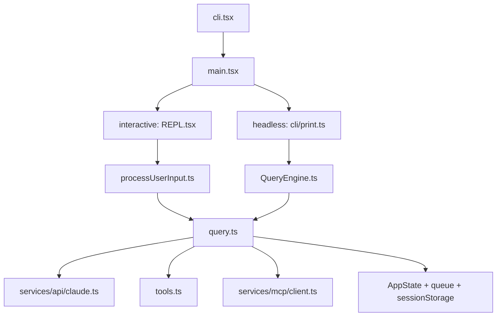

## 一句话结论

Claude Code 的真实架构不是一张“自上而下五层图”就能讲完的，它更像两条执行热路径加一套横切控制平面：`interactive` 与 `headless` 共享 `query.ts`，但不共享同一编排层。

## 30 秒摘要

| 结论 | 说明 | 状态 |
|---|---|---|
| 入口统一 | 所有模式都从 `src/entrypoints/cli.tsx -> src/main.tsx` 开始 | `external build active` |
| 编排分叉 | interactive 直接 `REPL.tsx -> query.ts`；headless 是 `print.ts -> QueryEngine.ts -> query.ts` | `external build active` |
| 横切控制平面 | `AppState`、queue、sessionStorage、tasks、hooks 决定系统是否“可恢复、可后台化、可扩展” | `external build active` |

## 为什么要这样分层

如果只从 UI、API、工具三层去看，这个仓库会显得“结构很大但主线很简单”。真正让它复杂起来的是：

- interactive 和 headless 不是同一套交互契约
- 会话必须能恢复、继续、压缩、后台化
- 工具池、MCP、skills、hooks 都是运行时装配，而不是静态常量
- 权限、成本、token、审计都不是附属逻辑，而是主循环的一部分

所以比起纯粹的“功能分层”，更实用的架构坐标系是：**入口热路径 + 横切控制平面 + 扩展装配面**。

## 正常链路

这张图要修正的关键漂移只有一个：`QueryEngine.ts` 不是 REPL 和 `query.ts` 之间的统一中间层。对交互式路径来说，`REPL.tsx` 自己已经承担了大量编排工作。

## 三个真正重要的架构块

### 1. 启动与装配面

- `src/entrypoints/cli.tsx` 负责 polyfill、fast path、feature 宏和构建常量
- `src/main.tsx` 负责 CLI 参数、初始化、settings、commands、agent definitions、MCP 配置和模式分流
- 它们共同决定“当前构建会不会跑某条路径”

### 2. 对话与执行面

- `src/query.ts` 是共享的单轮/多轮 agentic loop 核心
- `src/services/api/claude.ts` 是 provider 调用和 streaming 处理层
- `src/tools.ts` 与各具体工具目录提供真实执行能力

### 3. 控制平面

- `src/state/AppStateStore.ts`
- `src/utils/messageQueueManager.ts`
- `src/utils/sessionStorage.ts`
- `src/utils/task/framework.ts`
- `src/utils/hooks.ts`

这批模块不一定“最先出现在图里”，但它们决定系统是否能长期维持一致状态。

## 关键结构 / 状态

| 模块 | 负责什么 | 为什么重要 |
|---|---|---|
| `AppState` | 聚合会话级共享状态 | 决定权限、任务、MCP、bridge、插件是否同步 |
| `QueryEngine` | headless/SDK 会话包装层 | 决定 print 模式下的 transcript、cache、permission 包装 |
| `State` in `query.ts` | 当前 turn 的循环状态 | 决定恢复路径和继续条件 |
| `sessionStorage.ts` | transcript、resume、subagent sidechain | 决定会话是否可恢复 |

## 失败与恢复

架构层面最关键的恢复点有四个：

| 层次 | 典型失败 | 恢复位置 |
|---|---|---|
| API/streaming | 断流、限流、fallback | `src/services/api/claude.ts`, `withRetry.ts` |
| query loop | PTL、max output、stop hook 阻塞 | `src/query.ts` |
| 会话持久化 | resume 不完整、subagent transcript 缺失 | `src/utils/sessionStorage.ts` |
| 控制平面 | mode 改了但外部状态没同步 | `src/state/onChangeAppState.ts` |

如果只盯 `query.ts`，会低估后两类问题的实际影响。

## 边界与误读

<Warning>
总览页最容易犯的错，是把“树上有代码”写成“运行时会执行”。
</Warning>

- `feature() => false` 意味着很多 Anthropic 内部分支只能当“产品方向证据”，不能当“默认能力”
- ant-only、plugin、voice、LSP、hidden feature 需要分别标注，不该一锅端
- 反编译代码里有镜像目录、stub 包和保留壳，阅读时要以入口和 registry 为准

## 场景变体

| 变体 | 架构含义 |
|---|---|
| interactive | REPL 自己处理更多 UI、队列、权限与输入生命周期 |
| headless / print | `QueryEngine` 更重要，结构化 I/O、更强的恢复和输出整形更重要 |
| background task / subagent | 控制平面、task framework、sessionStorage 重要性上升 |
| hidden features | 可见于源码结构，但默认不属于 external build 的活跃面 |

## 先读什么

1. [什么是 Claude Code](/docs/introduction/what-is-claude-code)
2. [运行时与构建](/docs/introduction/runtime-and-build)
3. [交互与 Headless 分叉](/docs/introduction/interactive-vs-headless)

## 继续读什么

<CardGroup cols={2}>
  <Card title="控制平面" icon="sliders" href="/docs/runtime/app-state-control-plane">
    继续看 `AppState`、queue、tasks、hooks 怎么横切整个系统。
  </Card>
  <Card title="会话恢复" icon="clock-rotate-left" href="/docs/runtime/session-storage-and-resume">
    继续看 transcript、resume、subagent sidechain。
  </Card>
  <Card title="对话循环" icon="arrows-rotate" href="/docs/conversation/single-turn-state-machine">
    继续看单轮状态机和多轮恢复。
  </Card>
  <Card title="扩展装配面" icon="puzzle-piece" href="/docs/extensibility/command-system">
    继续看 commands、skills、MCP、plugins 如何被挂入主流程。
  </Card>
</CardGroup>

## 相关源码入口

- `src/entrypoints/cli.tsx`
- `src/main.tsx`
- `src/replLauncher.tsx`
- `src/screens/REPL.tsx`
- `src/cli/print.ts`
- `src/QueryEngine.ts`
- `src/query.ts`
- `src/state/AppStateStore.ts`

## 本页证据等级

- `external build active`: interactive/headless 分叉、query loop、控制平面
- `docs drift corrected`: REPL 与 QueryEngine 的关系已按当前代码修正
- `inference`: “入口热路径 + 控制平面 + 扩展装配面”是对当前实现的结构归纳
