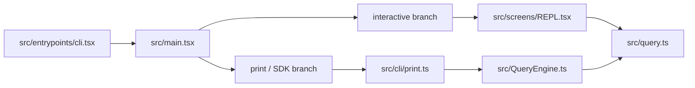

## 一句话结论

interactive 和 headless 共用的是 **`query.ts` 这一层 loop**，而不是共用 `QueryEngine.ts` 这一层外壳；交互路径是 `REPL.tsx -> query.ts`，headless 路径才是 `print.ts -> QueryEngine.ts -> query.ts`。

## 状态标签总览

| 路径 / 机制 | 当前状态 | 说明 |
|---|---|---|
| `main.tsx -> REPL.tsx -> query.ts` | `external build active` | interactive 主热路径 |
| `main.tsx -> cli/print.ts -> QueryEngine.ts -> query.ts` | `external build active` | headless / SDK 主热路径 |
| transcript / resume / rewind | `external build active` | 主要集中在 headless / print 体系 |
| 统一 query loop、工具执行、恢复分支 | `external build active` | 两条路径最终都会汇入 `query.ts` |
| 某些内部桥接、daemon、remote 分支 | 多数 `feature-gated` / `ant-only` | 不应反写为 interactive/headless 的通用现实 |

## 为什么存在

这两个模式看起来都像“给模型发消息”，但它们解决的是不同问题：

- interactive 需要终端输入、即时渲染、权限弹窗、快捷键、中断与视图状态。
- headless 需要结构化 I/O、可重放 transcript、消息队列排水、resume / rewind、稳定的 SDK 边界。

如果两条路径强行共享同一个上层 orchestrator，会出现两个问题：

1. 交互模式会被 transcript / structured-output / resume 语义拖重。
2. headless 模式又会被 UI 生命周期、Ink 状态、terminal 交互逻辑污染。

所以当前代码选择的是：**共享 loop，不共享壳**。

## 正常链路

这张图不是“示意图”，而是当前仓库最关键的纠偏图。很多旧描述把 `QueryEngine.ts` 写成交互路径的统一中间层，这会直接把排障方向带偏。

## 关键结构 / 状态

| 文件 | 主要职责 | 更像什么 |
|---|---|---|
| `src/main.tsx` | 参数解析、模式选择、初始化与分流 | 总入口路由器 |
| `src/screens/REPL.tsx` | interactive 输入、消息渲染、权限请求、状态同步、用户节奏控制 | 交互前端壳 |
| `src/cli/print.ts` | headless 输入输出协议、队列、resume / rewind / replay、外部调用边界 | 非交互编排层 |
| `src/QueryEngine.ts` | 会话级 ask/submitMessage 包装、transcript 写入、session 快照与持久化 | headless 会话引擎 |
| `src/query.ts` | 真正的单轮 loop、流式 API、工具执行、继续条件、恢复分支 | 共享执行内核 |

一个很实用的判断方法是：

- 看到 UI、permission dialog、键盘交互、Ink 状态，优先查 [REPL.tsx](/Users/admin/work/claude-code-docs-sweep/src/screens/REPL.tsx)。
- 看到 `--print`、resume、rewind、结构化输出、队列 drain，优先查 [cli/print.ts](/Users/admin/work/claude-code-docs-sweep/src/cli/print.ts) 和 [QueryEngine.ts](/Users/admin/work/claude-code-docs-sweep/src/QueryEngine.ts)。
- 看到两边都共用的工具循环、PTL、stop hooks、API streaming，才去查 [query.ts](/Users/admin/work/claude-code-docs-sweep/src/query.ts)。

## 一个端到端例子

### 例子 1：interactive 提交一条消息

1. 用户在 REPL 输入框按下回车。
2. [main.tsx](/Users/admin/work/claude-code-docs-sweep/src/main.tsx) 早已把当前进程导向 interactive 分支。
3. [REPL.tsx](/Users/admin/work/claude-code-docs-sweep/src/screens/REPL.tsx) 收集输入、权限上下文、工具池和系统提示相关状态。
4. REPL 直接触发 `query()`。
5. `query.ts` 发起模型流、处理 tool call、接收 stream events，并把结果回推给 UI。

这条链路里没有 `QueryEngine.ts`。如果你在这里排查 spinner、prompt queue、permission dialog，却把时间花在 `QueryEngine.ts` 上，基本会空跑。

### 例子 2：headless `--print --resume <session-id>`

1. 用户或 SDK 走 `--print` / headless 入口。
2. [cli/print.ts](/Users/admin/work/claude-code-docs-sweep/src/cli/print.ts) 建立输入输出协议和命令队列，并处理 `resumeSessionAt`、`rewindFiles` 等参数约束。
3. `print.ts` 调用 `ask()` / `QueryEngine` 包装层，而不是直接裸调 `query()`。
4. [QueryEngine.ts](/Users/admin/work/claude-code-docs-sweep/src/QueryEngine.ts) 负责 transcript、session snapshot、history pruning 与 resume 一致性。
5. 真正跑模型和工具时，最终还是进入 `query.ts`。

这里的关键不是“多了一层”，而是 **多出来的这一层正好承担了非交互模式需要的会话语义**。

## 失败与恢复

| 失败场景 | 先看哪里 | 为什么 |
|---|---|---|
| REPL 里输入提交后 UI 卡住、spinner 不消失 | `src/screens/REPL.tsx` | 交互调度和视图状态都在这里 |
| print / SDK 模式输出顺序怪异，或多条命令没有正确合并 | `src/cli/print.ts` | 队列排水与 batching 在这一层 |
| `--resume` / `--resume-session-at` / `--rewind-files` 行为异常 | `src/cli/print.ts` + `src/QueryEngine.ts` | 参数校验和 session 恢复分散在这两层 |
| 两条路径都出现相似的 tool loop / stop hook / PTL 问题 | `src/query.ts` | 共享执行内核在这里 |

一个典型的恢复思路是：

1. 先判断 bug 出现在 interactive 还是 headless。
2. 只沿对应的上层壳排查，不要一上来就跳到 `query.ts`。
3. 只有当症状跨两条路径复现时，才把问题上提到共享 loop。

## 边界与误读

<Warning>
“REPL -> QueryEngine -> query” 对当前仓库是错误描述。这个错误不是措辞问题，而是会直接让维护者去错文件里排障。
</Warning>

- 不要把 `QueryEngine.ts` 写成交互与 headless 的共同入口；共同入口是 `query.ts`。
- 不要把 interactive bug 自动解释成 QueryEngine bug；很多交互问题根本没经过那一层。
- 不要把 print / SDK 的 transcript 语义投射到 REPL 上；这两条壳本来就服务不同约束。
- 不要因为两条路径最终都进 `query.ts`，就忽略上层分流。真正影响维护成本的，恰恰是这层分流。

## 场景变体

| 场景 | 更该看哪一层 | 典型问题 |
|---|---|---|
| 普通终端聊天 | `REPL.tsx` | 输入框、权限确认、渲染更新 |
| SDK / 自动化调用 | `cli/print.ts` | JSON/stream-json、队列、回放 |
| 恢复旧会话 | `QueryEngine.ts` + `sessionStorage` | transcript、snapshot、rewind |
| 两端都受影响的执行异常 | `query.ts` | tool execution、stream event、fallback |

## 先读什么

- 先读 [架构总览](/docs/introduction/architecture-overview)
- 再读 [阅读顺序与源码地图](/docs/introduction/reading-order-and-source-map)

## 继续读什么

- [单轮状态机](/docs/conversation/single-turn-state-machine)
- [消息队列与 prompt 调度](/docs/runtime/message-queue-and-prompt-scheduling)
- [会话存储与恢复](/docs/runtime/session-storage-and-resume)
- [恢复与 fallback](/docs/conversation/recovery-and-fallback)

## 相关源码入口

- `src/main.tsx`
- `src/screens/REPL.tsx`
- `src/cli/print.ts`
- `src/QueryEngine.ts`
- `src/query.ts`
- `src/utils/sessionStorage.ts`

## 本页证据等级

- `external build active`: [src/main.tsx](/Users/admin/work/claude-code-docs-sweep/src/main.tsx), [src/screens/REPL.tsx](/Users/admin/work/claude-code-docs-sweep/src/screens/REPL.tsx), [src/cli/print.ts](/Users/admin/work/claude-code-docs-sweep/src/cli/print.ts), [src/QueryEngine.ts](/Users/admin/work/claude-code-docs-sweep/src/QueryEngine.ts), [src/query.ts](/Users/admin/work/claude-code-docs-sweep/src/query.ts)
- `docs drift corrected`: `QueryEngine` 不再被写成交互路径统一中间层
