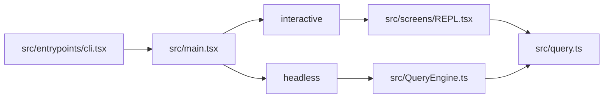

## 一句话结论

读这个仓库最有效的顺序不是按目录树展开，而是按“入口 -> 热路径 -> registry -> 控制平面 -> 扩展面 -> gated world”递进。

## 为什么需要这张地图

这个仓库最容易让人迷路的地方，不是文件太多，而是：

- 入口有 interactive 和 headless 两条大路径
- 大文件很多，尤其 `REPL.tsx`、`print.ts`、`claude.ts`
- 代码树里同时混有 external active、feature-gated、ant-only 和 stubbed world
- 有些结构看起来像“中心层”，实际上只服务其中一条路径

如果不先建立坐标系，读者很容易在前 30 分钟内犯三个错误：

1. 从 `REPL.tsx` 开始，直接被 UI 细节淹没。
2. 把 `QueryEngine.ts` 误读成 interactive 和 headless 共用的统一中间层。
3. 先扫 `feature('...')` 分支，结果花很多时间研究当前 external build 根本不会走到的路径。

## 实现状态

| 区域 | 状态标签 | 当前含义 |
|---|---|---|
| `cli.tsx -> main.tsx -> REPL.tsx -> query.ts` | `external build active` | interactive 主热路径 |
| `cli/print.ts -> QueryEngine.ts -> query.ts` | `external build active` | headless / SDK 主热路径 |
| registry、AppState、session storage、MCP | `external build active` | 读懂当前构建必经区域 |
| `feature('...')` 深处分支 | `feature-gated` | 代码可见，但默认构建不一定活跃 |
| `USER_TYPE === 'ant'` 及某些 stub 包 | `ant-only` / `stubbed/removed` | 读得到，不要先当产品事实 |

## 推荐阅读顺序

| 步骤 | 先读什么 | 读完要回答的问题 |
|---|---|---|
| 1 | `src/entrypoints/cli.tsx` | 这个 reverse-engineered build 在运行时先注入了什么假设？ |
| 2 | `src/main.tsx` | interactive 与 headless 在哪里真正分叉？ |
| 3 | `src/query.ts` | 单轮状态机、工具继续条件、恢复逻辑长什么样？ |
| 4 | `src/cli/print.ts` | headless 为什么不是“直接调 query()”这么简单？ |
| 5 | `src/QueryEngine.ts` | headless 会话包装、持久化和 ask() 封装是怎么接到 query 的？ |
| 6 | `src/tools.ts` 与 `src/commands.ts` | 能力面如何装配进系统？ |
| 7 | `src/state/AppStateStore.ts` | 会话控制平面的聚合范围有多大？ |
| 8 | `src/utils/messageQueueManager.ts`、`src/utils/sessionStorage.ts` | 输入排队与会话恢复靠什么站住脚？ |
| 9 | `src/services/mcp/client.ts`、`src/skills/loadSkillsDir.ts`、`src/utils/hooks.ts` | 扩展面如何接进来？ |
| 10 | `src/screens/REPL.tsx` | 这时候再回头看 UI，大文件就有坐标系了 |

## 为什么这样排

| 先后 | 目的 |
|---|---|
| 先入口 | 先确认 active path，不被 feature 噪音带偏 |
| 再热路径 | 先分清 `REPL.tsx -> query.ts` 与 `print.ts -> QueryEngine.ts -> query.ts` |
| 再 registry | 看工具、命令、skills、MCP 怎么装进去 |
| 再控制平面 | 看系统为何可恢复、可后台化、可扩展 |
| 最后回看大文件 | 带着热路径坐标读 `REPL.tsx` 才不至于只看到 UI 壳 |

## 先建立两条热路径

真正最值得先记住的，不是文件列表，而是这两条路径：

这张图专门用来纠正一个经常出现的漂移：`QueryEngine.ts` 不是交互式路径的统一中间层。

- interactive 主路径：`REPL.tsx -> query.ts`
- headless 主路径：`cli/print.ts -> QueryEngine.ts -> query.ts`

先把这件事看清，后面再读 state、queue、session storage 时就不会把两条链路混成一团。

## 一个实际阅读例子

如果你的问题是“用户按下回车后系统到底怎么跑起来”，推荐这样追：

1. 在 `main.tsx` 找 interactive 分支。
2. 跳到 `REPL.tsx` 看它何时构造 `toolUseContext`、何时取 `getSystemPrompt()`、`getUserContext()`、`getSystemContext()`。
3. 进入 `query.ts` 看 State、预处理、流式 API、工具执行和继续条件。
4. 再回到 `tools.ts` 看这轮能调用哪些能力。

如果你的问题改成“为什么 print/SDK 模式能 resume、rewind、结构化输出”，则换成：

1. `main.tsx` 的 `-p/--print` 路径
2. `cli/print.ts`
3. `QueryEngine.ts`
4. `query.ts`
5. `sessionStorage.ts`

这就是“按问题选路径，而不是按目录扫文件”。

## 失败与恢复

| 读法错误 | 常见后果 | 怎么补救 |
|---|---|---|
| 一上来读 `REPL.tsx` | 看到很多 UI 细节，却不知道哪部分决定执行 | 回到 `main.tsx` 和 `query.ts` 先建热路径 |
| 把 `QueryEngine` 当互动路径中心 | 文档会把 headless 事实误写到 interactive | 强制区分两条主链路 |
| 先扫 feature flags | 容易把实验/内部逻辑写成当前事实 | 先锁定 external active，再回头看 gated world |
| 只看工具目录 | 以为系统是“工具集合”，看不到 queue/state/session | 把 registry 之后的控制平面补上 |

## 边界与误读

- 不要先从 `src/screens/REPL.tsx` 开始，它太大且混合了 UI、状态和行为。
- 不要把 `QueryEngine.ts` 写成交互和 headless 的共同入口。
- 不要先扫所有 `feature('...')` 分支，它们在当前 external build 默认不活跃。
- 不要把 stub 包和 ant-only 分支当第一手产品事实。
- 不要只按目录树阅读；这个仓库更适合按“热路径 + 注册表 + 控制平面”阅读。

## 先读什么

- 先读 [什么是 Claude Code](/docs/introduction/what-is-claude-code)
- 再读 [架构总览](/docs/introduction/architecture-overview)
- 然后回到本页按顺序追源码

## 继续读什么

- [交互与 Headless 分叉](/docs/introduction/interactive-vs-headless)
- [运行时控制平面](/docs/runtime/app-state-control-plane)
- [消息队列与 prompt 调度](/docs/runtime/message-queue-and-prompt-scheduling)
- [能力图谱](/docs/research/project-capability-atlas)

## 相关源码入口

- `src/entrypoints/cli.tsx`
- `src/main.tsx`
- `src/screens/REPL.tsx`
- `src/cli/print.ts`
- `src/QueryEngine.ts`
- `src/query.ts`
- `src/tools.ts`
- `src/commands.ts`
- `src/state/AppStateStore.ts`

## 本页证据等级

- `external build active`: 入口、两条热路径、registry、控制平面
- `inference`: 阅读顺序是基于当前仓库复杂度给出的维护建议
