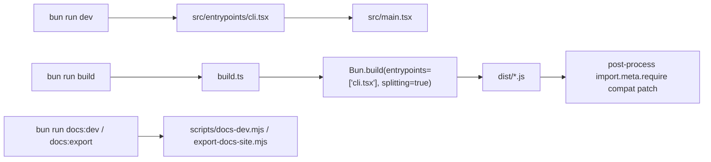

## 一句话结论

当前仓库应被理解成一个 **Bun-first、workspace 驱动、split build 输出** 的 external build，而不是“Node CLI + 单文件 bundle”的普通终端工具。

## 状态标签总览

| 主题 | 当前状态 | 为什么重要 |
|---|---|---|
| Bun 运行时 | `external build active` | `dev`、`build`、`test` 都以 Bun 为默认执行器 |
| `build.ts` split build | `external build active` | 实际产物来自 `Bun.build(..., splitting: true)` |
| 入口宏与全局常量注入 | `external build active` | `cli.tsx` 在最早层设置 `MACRO`、`BUILD_TARGET`、`BUILD_ENV` |
| `feature('...')` 分支 | 多数 `feature-gated` | 代码树可见，但不能自动写成当前 external build 活跃能力 |
| `packages/@ant/*` 与若干本地包 | 混合 `ant-only` / `stubbed/removed` | 说明树上仍保留内部或占位能力，不代表已经恢复成可用产品面 |

## 为什么存在

“运行时与构建”之所以值得单独讲，不是因为它很底层，而是因为它决定了你怎么读整棵树：

- 你看到的 `bun:bundle`、`feature()`、`MACRO.VERSION` 到底是在 build 时被替换，还是在入口层被兜底。
- 你应该把 `dist/cli.js` 理解成唯一产物，还是一个 split output 的入口 chunk。
- 你看到 `packages/@ant/*`、`*-napi`、GrowthBook、bridge、daemon 这些分支时，应该把它们当成当前产品事实，还是当成 gated / internal / stub world。

如果这一层没看清，后面文档很容易出现三种漂移：

1. 把当前仓库写成 Node-first，而实际上脚本、构建和运行都默认走 Bun。
2. 把当前产物写成单文件 bundle，而实际上 `build.ts` 明确启用了 `splitting: true`。
3. 看到树上有实验/内部模块，就把它们混写成“现在就可用的能力面”。

## 正常链路

这张图有两个阅读重点：

- CLI 主程序的真实入口是 `src/entrypoints/cli.tsx`，不是 `src/main.tsx`。
- docs 站的开发与导出脚本虽然和同一个仓库同居，但它们不是 CLI 主链路的一部分。

## 关键结构 / 状态

| 文件 / 结构 | 作用 | 你应该怎么读它 |
|---|---|---|
| `src/entrypoints/cli.tsx` | 真入口；设置 `MACRO`、`BUILD_TARGET`、`BUILD_ENV`、`INTERFACE_TYPE`；处理少量 fast path | 用来判断 external build 在最早阶段先注入了哪些假设 |
| `build.ts` | 清空 `dist/`、执行 split build、对 `.js` 产物做 `import.meta.require` 兼容补丁 | 它比任何历史 README 都更能代表“现在到底怎么构建” |
| `package.json` | 定义 `dev`、`build`、`test`、`lint`、`docs:*` 和 workspaces | 用来纠正文档漂移，尤其是“没有 test/lint”“单文件 bundle”这类过时说法 |
| `dist/` | 构建输出目录 | 结果不是纯单文件，而是由入口 chunk 加若干 split 产物组成 |
| `packages/*` 与 `packages/@ant/*` | workspace 内部依赖与 stub/internal 包 | 说明这个仓库是多包组织，不是孤立 CLI |

入口层还有几个很值得注意的小动作：

- 把 `process.env.COREPACK_ENABLE_AUTO_PIN` 设为 `0`，避免 corepack 自动改用户工程。
- 在某些远程环境下追加 `NODE_OPTIONS=--max-old-space-size=8192`。
- 对 `--version` 这类 fast path 尽量少加载模块，说明启动成本在这个仓库里是显式被优化的。

## 一个端到端例子

以 `bun run build` 为例，完整过程不是“把 TypeScript 编译成一个文件”这么简单，而是：

1. 先进入 [build.ts](/Users/admin/work/claude-code-docs-sweep/build.ts)。
2. `rmSync('dist', { recursive: true, force: true })` 清空旧产物。
3. `Bun.build({ entrypoints: ['src/entrypoints/cli.tsx'], target: 'bun', splitting: true })` 产出一组 JS 文件。
4. 构建完成后再次扫描 `dist/`，把 `import.meta.require` 替换成兼容 `createRequire(import.meta.url)` 的写法。
5. 最终 `package.json` 的 `bin.claude-js` 指向 `dist/cli.js`，但这个入口 chunk 依赖的并不一定只有它自己。

这就是为什么“`bin` 指向一个文件”不等于“构建只有一个文件”。

## 失败与恢复

| 场景 | 常见现象 | 当前恢复方式 |
|---|---|---|
| `Bun.build()` 失败 | `build.ts` 输出 `Build failed:` 和 `result.logs` | 直接打印日志并 `process.exit(1)`，没有继续兜底 |
| 产物里残留 `import.meta.require` | 在某些环境下运行 split chunk 出现兼容问题 | `build.ts` 的 post-process 会逐个 `.js` 文件替换 |
| 文档仍按旧说法写“单文件 bundle” | 读者把 chunk 关系、兼容补丁、bin 入口都理解错 | 以 `build.ts` 和 `package.json` 为准，重写文档结论 |
| 把树上 stub/internal 包写成可用功能 | 读者误判 external build 能力边界 | 强制为每类能力打 `feature-gated` / `ant-only` / `stubbed/removed` 标签 |

一个非常实际的恢复经验是：当运行时现象和旧文档冲突时，**先看 `build.ts` 和 `package.json`，再看根说明文件**。这个仓库的“真相来源”不是某篇总览，而是正在被脚本执行的代码。

## 边界与误读

<Warning>
`cli.tsx` 是入口，不等于它一个文件就定义了整个运行时语义；它只负责最早层的 bootstrap。后续真实行为仍要回到 `main.tsx`、`query.ts`、`tools.ts` 等 active 模块里看。
</Warning>

- 不要把 `dist/cli.js` 误解成“唯一 bundle 文件”；当前 build 明确启用了 split output。
- 不要把 `feature() => false` 简化成“树上这些功能不存在”；更准确的说法是“当前 external build 默认不把这些 gated 分支当活跃能力面”。
- 不要把 `packages/@ant/*` 的存在写成 computer use、内部桥接、浏览器能力都已恢复；很多仍然只是内部、占位或门控。
- 不要再沿用“没有 test/lint”的旧说法；当前 [package.json](/Users/admin/work/claude-code-docs-sweep/package.json) 已定义 `bun test` 与 `biome lint` 脚本。

## 场景变体

| 变体 | 运行方式 | 维护重点 |
|---|---|---|
| `bun run dev` | 直接跑源文件入口 | 看 `cli.tsx` 的 bootstrap 和 `main.tsx` 的分流 |
| `bun run build` | 先 split build，再做 compat patch | 看 `build.ts` 的产物策略，而不是猜 bundler 默认值 |
| `bun test` / `bun lint` | 仓库级脚本存在，但质量与覆盖面另当别论 | 文档应诚实写“脚本存在”，不要夸成“验证完备” |
| `docs:dev` / `docs:export` | 站点脚本，与 CLI 主执行链分离 | 改文档时别把 docs 工具链混成 Claude Code 运行时的一部分 |

## 先读什么

- 先读 [什么是 Claude Code](/docs/introduction/what-is-claude-code)
- 再读 [架构总览](/docs/introduction/architecture-overview)

## 继续读什么

- [交互与 Headless 分叉](/docs/introduction/interactive-vs-headless)
- [阅读顺序与源码地图](/docs/introduction/reading-order-and-source-map)
- [文档漂移矩阵](/docs/research/docs-drift-matrix)

## 相关源码入口

- `build.ts`
- `package.json`
- `src/entrypoints/cli.tsx`
- `src/main.tsx`
- `packages/*`
- `packages/@ant/*`

## 本页证据等级

- `external build active`: [build.ts](/Users/admin/work/claude-code-docs-sweep/build.ts), [package.json](/Users/admin/work/claude-code-docs-sweep/package.json), [src/entrypoints/cli.tsx](/Users/admin/work/claude-code-docs-sweep/src/entrypoints/cli.tsx)
- `inference`: “为什么 Bun-first 会影响阅读顺序”属于对当前实现复杂度的维护解释
- `docs drift corrected`: 单文件 bundle、无 test/lint 等旧说法已按当前仓库修正
