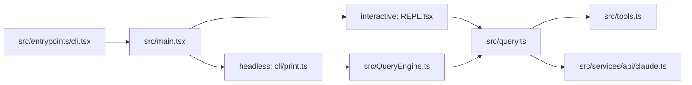

## 一句话结论

Claude Code 是一个直接跑在本地终端里的 agentic coding system：模型负责决策，工具负责真实执行，shell、文件系统、会话状态和权限模型共同构成它的运行时。

## 30 秒摘要

如果你只记住三件事：

| 结论 | 含义 | 状态 |
|---|---|---|
| 它不是 IDE 插件 | 当前主入口是 `src/entrypoints/cli.tsx -> src/main.tsx`，不是编辑器宿主 API | `external build active` |
| 它不是单轮问答器 | 真正工作方式是 `query.ts` 里的多轮 agentic loop，而不是“一问一答后立刻结束” | `external build active` |
| 它不是无边界自动执行器 | 权限规则、沙箱、Plan Mode、Hooks 和预算上限一起限制它 | `external build active` |

## 为什么存在

Claude Code 解决的不是“怎么在编辑器里加一个聊天窗口”，而是“怎么让模型在真实工程环境里持续做事”。这意味着它必须同时处理几件传统聊天产品不需要处理的事：

- 如何直接读取和修改工作区文件
- 如何运行真实 shell 命令并接住输出
- 如何把工具结果回喂给模型，进入下一轮决策
- 如何在高风险操作前插入权限和沙箱边界
- 如何把长会话持久化、恢复、压缩、继续

这也是为什么这个仓库的核心不在一个“聊天组件”，而在 `entrypoint + query loop + tools + session state + permissions` 这套组合平台上。

## 技术定位

| 维度 | Claude Code | 常见 IDE Copilot 类工具 | 云端聊天产品 |
|---|---|---|---|
| 运行位置 | 本地终端进程 | IDE 进程内 | 浏览器或云端服务 |
| 执行面 | shell、文件、任务、MCP | 编辑器缓冲区、LSP、少量命令 | 沙盒或受限工具 |
| 编排方式 | 多轮 agentic loop | 自动补全 + 聊天 | 单轮对话或轻量工具流 |
| 会话边界 | transcript、resume、queue、task | 编辑器标签页/面板 | Web 会话 |
| 风险面 | 真实项目和真实命令 | 编辑器内部为主 | 云端隔离环境为主 |

核心定位可以压缩成一句话：Claude Code 不是“终端里的聊天机器人”，而是“终端里的受约束执行系统”。

## 正常链路

下面是 external build 下最重要的一条热路径：

这条链路里最容易被误读的点只有一个：**interactive 模式不是先走 `QueryEngine.ts` 再走 `query.ts`**。当前代码里，交互式 REPL 直接落到 `query()`；`QueryEngine.ts` 主要在 headless/print 路径承担会话包装层。

## 一个端到端例子

用户输入：`bun run dev 有个 TypeScript 报错，帮我修一下`

1. `src/entrypoints/cli.tsx` 注入 `feature() => false` 和构建宏，进入 `src/main.tsx`
2. REPL 捕获 prompt，经 `processUserInput()` 做 slash command、附件和 hook 预处理
3. `src/query.ts` 组装 system prompt、用户上下文、工具池，调用模型
4. 模型先返回 `tool_use(Bash)` 看报错，再返回 `tool_use(Read/Grep/Edit)` 定位并修改代码
5. 工具结果标准化后重新喂给 `query()`，进入下一轮
6. 当模型不再需要工具，只输出总结文本时，当前 turn 才真正结束

这里的“agentic”不是修辞，而是一次真实的“思考 -> 行动 -> 观察 -> 再思考”循环。

## 关键结构 / 状态

| 结构 | 职责 | 入口 |
|---|---|---|
| `query.ts` 中的 `State` | 保存当前消息、恢复标志、压缩状态、turn 计数 | `src/query.ts` |
| `AppState` | 会话级控制平面，聚合任务、MCP、权限、文件历史、bridge 等状态 | `src/state/AppStateStore.ts` |
| transcript / queue / task output | 让会话可恢复、可后台化、可审计 | `src/utils/sessionStorage.ts` |

这也是为什么“Claude Code 是什么”不能只看 UI 或 API client。真正的系统边界在会话控制平面和工具执行面。

## 失败与恢复

Claude Code 不是“一旦出错就整轮报废”。常见失败路径有单独恢复逻辑：

| 场景 | 恢复方式 |
|---|---|
| `max_output_tokens` | 提升输出上限或注入恢复提示，让模型继续完成回答 |
| prompt too long / 413 | 当前仓库更应先理解为“上下文治理边界问题”；query 保留相关恢复分支，但 `contextCollapse` 受门控、`reactiveCompact` 当前为 stub |
| streaming 失败 | 标记已收集消息为 tombstone，切到 fallback 或重试 |
| 用户中断 | 为未完成工具生成合成结果，优雅结束而不是留下半条状态 |

这类恢复都发生在 `src/query.ts`、`src/services/api/claude.ts` 和 `src/services/api/withRetry.ts`，不是单独某个“错误页”负责的。

## 边界与误读

<Warning>
最常见的误读，是把树上存在的 feature 分支当作当前 external build 的现行能力。
</Warning>

- `src/entrypoints/cli.tsx` 里 `feature() => false` 是当前阅读这个仓库的第一原则
- `USER_TYPE === 'ant'` 保护的分支是内部员工或特权环境，不等于公开构建默认可用
- 有些包是 stub 或保留壳，不应该和 active path 混写

因此，“仓库里有某段代码”不等于“用户今天在这个站点描述的产品里就能用到它”。

## 场景变体

| 场景 | 典型路径 | 说明 |
|---|---|---|
| 交互式终端 | `REPL.tsx -> query.ts` | 人类实时观察、打断、确认权限 |
| 管道/SDK/打印模式 | `cli/print.ts -> QueryEngine.ts -> query.ts` | 更适合自动化、结构化输出、恢复会话 |
| feature-gated 实验能力 | `feature('...')` 包裹的路径 | 代码可读，但默认不活跃 |
| ant-only 路径 | `USER_TYPE === 'ant'` | 内部世界，不应当成公开能力说明 |

## 继续读什么

<CardGroup cols={2}>
  <Card title="运行时与构建" icon="terminal" href="/docs/introduction/runtime-and-build">
    看 external build 的真实入口、构建产物和运行假设。
  </Card>
  <Card title="交互与 Headless 分叉" icon="arrows-split-up-and-left" href="/docs/introduction/interactive-vs-headless">
    看 REPL 路径和 print/SDK 路径到底在哪里分开。
  </Card>
  <Card title="Agentic Loop" icon="arrows-rotate" href="/docs/conversation/the-loop">
    看 `query.ts` 如何把模型调用、工具执行和恢复路径串成循环。
  </Card>
  <Card title="安全体系" icon="shield" href="/docs/safety/why-safety-matters">
    看为什么它能动手，但又不是无边界自动执行。
  </Card>
</CardGroup>

## 相关源码入口

- `src/entrypoints/cli.tsx`
- `src/main.tsx`
- `src/screens/REPL.tsx`
- `src/cli/print.ts`
- `src/QueryEngine.ts`
- `src/query.ts`

## 本页证据等级

- `external build active`: `src/entrypoints/cli.tsx`, `src/main.tsx`, `src/query.ts`
- `feature-gated`: 仓库里大量隐藏分支存在，但当前默认构建不活跃
- `inference`: “terminal-native agentic coding system” 是基于以上热路径和执行面得出的架构归纳
