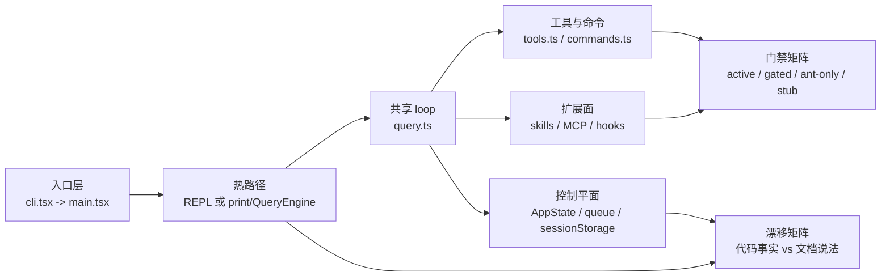

## 一句话结论

这份 reverse-engineered 仓库最值得研究的不是某个局部技巧，而是它如何把 **热路径、控制平面、扩展装配面、门禁矩阵和文档漂移** 组织成一个可长期运行的系统。

## 为什么这页必须是总导航页

如果把所有结论都塞进一页，读者只会得到一篇很长的摘要，却得不到可追踪的研究入口。所以这页的职责不是“替代全站”，而是提供一张能力地图，回答三个问题：

1. 你此刻遇到的问题属于哪一块能力面。
2. 这一块能力面在当前仓库里是 active、gated、ant-only，还是 stub。
3. 你下一页该读哪一页，下一跳该落到哪个源码入口。

这也是它和一般“项目概览”页的区别：它是导航页，不是总结页。

## 顶部坐标系

| 维度 | 你应该先记住什么 | 代表页面 |
|---|---|---|
| 热路径 | 入口之后有 interactive 与 headless 两条主线，但共用 `query.ts` | [架构总览](/docs/introduction/architecture-overview) |
| 控制平面 | `AppState`、队列、session storage、tasks、hooks 决定系统如何保持一致性 | [运行时控制平面](/docs/runtime/app-state-control-plane) |
| 扩展装配面 | tools、commands、skills、MCP、hooks 决定“系统此刻能做什么” | [工具池装配](/docs/tools/tool-pool-assembly) |
| 门禁矩阵 | active / feature-gated / ant-only / stubbed 要严格分栏 | [Gating Matrix](/docs/internals/gating-matrix) |
| 漂移矩阵 | 旧文档、设计意图和当前仓库实现经常不一致 | [文档漂移矩阵](/docs/research/docs-drift-matrix) |

## 总体能力图

这张图的重点不是“文件很多”，而是：**任何功能判断都不能只看一个模块**。你至少要同时知道：

- 它挂在哪条热路径上。
- 它是否经过控制平面。
- 它是静态内建，还是运行时装配进来的。
- 它在当前 external build 里到底活不活。

## 五大能力面怎么分

| 能力面 | 核心问题 | 典型源码入口 | 当前状态 |
|---|---|---|---|
| 入口与热路径 | 请求怎么跑起来，interactive 和 headless 在哪里分叉 | `src/entrypoints/cli.tsx`, `src/main.tsx`, `src/query.ts` | `external build active` |
| 控制平面 | 会话如何保持一致，为什么能 resume / 后台 / 多任务 | `src/state/AppStateStore.ts`, `src/utils/messageQueueManager.ts`, `src/utils/sessionStorage.ts` | `external build active` |
| 扩展装配面 | tools、commands、skills、MCP 如何进入系统 | `src/tools.ts`, `src/commands.ts`, `src/skills/loadSkillsDir.ts`, `src/services/mcp/client.ts` | `external build active` |
| 门禁与分层世界 | 哪些能力只是 gated、ant-only 或 stub | `src/tools.ts`, `src/entrypoints/cli.tsx`, `packages/@ant/*` | 混合态 |
| 文档漂移 | 哪些公开说法与当前仓库不一致 | 当前 docs 与 active 源码入口对照 | 需要持续修正 |

## 一个实际使用例子

假设你遇到的问题是：“为什么某个 MCP 工具明明配置了，却没有出现在模型可调用能力里？”

这不是单一页面能回答的问题，它跨了三层：

1. 先用本页把问题归类到“扩展装配面”。
2. 再跳到 [工具池装配](/docs/tools/tool-pool-assembly)，看 `assembleToolPool()`、deny rules、排序与去重。
3. 如果发现是连接问题，再跳到 [MCP 连接生命周期](/docs/extensibility/mcp-connection-lifecycle)。
4. 如果最后发现工具树上存在但当前构建被 gate 掉，则继续看 [Gating Matrix](/docs/internals/gating-matrix)。

换句话说，这页负责把“我该去哪一层排查”讲清，而不是自己把所有源码细节讲完。

## 为什么不是更简单的地图

如果只给一张“模块目录树”，会遗漏三个维护中最痛的事实：

- 同名能力在不同模式下会走完全不同的上层路径。
- 很多能力不是静态定义，而是运行时装配出来的。
- 树上存在不等于 external build 活跃。

所以这页必须把“热路径”和“门禁状态”一起呈现；否则它只是一份 prettier 过的 `tree` 输出。

## 失败与恢复

| 失败方式 | 会把你带去哪里 | 正确恢复动作 |
|---|---|---|
| 只看目录结构，不看热路径 | 把 interactive 问题误追到 QueryEngine | 先回到入口与热路径图 |
| 只看 `src/tools.ts`，不看 MCP / hooks / skills | 把能力面缩成“内置工具表” | 回到扩展装配面 |
| 看到 `feature()` / `USER_TYPE === 'ant'` 就当作当前能力 | 把 gated / internal 功能写成已上线 | 先查门禁矩阵，再下结论 |
| 只看旧文档摘要，不回源码 | 写出一篇语言很顺但事实漂移的总览 | 以源码入口和当前 Hub 页为准重写 |

## 边界与误读

<Warning>
这页不是“总论替代品”，也不是“把所有页缩成一页”。它的价值在于给出坐标，而不是抢走子页该承担的细节。
</Warning>

- 不要把本页里的短结论当作最终证据；证据仍要回到对应 Hub 页和源码入口。
- 不要把“树上有能力”写成“当前 external build 可用能力”。
- 不要把 “interactive / headless / SDK / background” 混成一条单线执行图。
- 不要把控制平面误写成纯 UI store；它在这个仓库里是横跨任务、权限、MCP、bridge 的会话级聚合层。

## 场景变体

| 你在做什么 | 最好先读哪一组 |
|---|---|
| 修启动、构建、模式分流 | `开始` + `运行时与控制平面` |
| 修工具、权限、tool call | `工具` + `安全` |
| 修 resume、上下文、compact | `对话` + `上下文` |
| 修多 agent、任务、后台执行 | `多 Agent` + `运行时与控制平面` |
| 修技能、命令、MCP、hooks | `可扩展性` |
| 做逆向证据整理 | `揭秘` + `研究` |

## 推荐阅读路线

### 路线 1：想先理解主系统

1. [什么是 Claude Code](/docs/introduction/what-is-claude-code)
2. [架构总览](/docs/introduction/architecture-overview)
3. [交互与 Headless 分叉](/docs/introduction/interactive-vs-headless)
4. [运行时控制平面](/docs/runtime/app-state-control-plane)

### 路线 2：想理解“为什么某些功能树上有但跑不起来”

1. [三层门控](/docs/internals/three-tier-gating)
2. [Gating Matrix](/docs/internals/gating-matrix)
3. [Ant-Only 世界](/docs/internals/ant-only-world)
4. [文档漂移矩阵](/docs/research/docs-drift-matrix)

### 路线 3：想做扩展或排查能力注入问题

1. [工具池装配](/docs/tools/tool-pool-assembly)
2. [命令系统](/docs/extensibility/command-system)
3. [MCP 连接生命周期](/docs/extensibility/mcp-connection-lifecycle)
4. [Skills 排序与预算](/docs/extensibility/skills-ranking-and-budgeting)

## 先读什么

- 先读 [阅读顺序与源码地图](/docs/introduction/reading-order-and-source-map)
- 如果你是第一次进仓库，再回到 [架构总览](/docs/introduction/architecture-overview)

## 继续读什么

<CardGroup cols={2}>
  <Card title="运行时控制平面" icon="sliders" href="/docs/runtime/app-state-control-plane">
    看会话状态、权限、任务和 MCP 如何在同一个 store 聚合。
  </Card>
  <Card title="工具池装配" icon="toolbox" href="/docs/tools/tool-pool-assembly">
    看 built-in、MCP、deny rules 和排序去重如何组成真实能力面。
  </Card>
  <Card title="Gating Matrix" icon="table" href="/docs/internals/gating-matrix">
    看 active、feature-gated、ant-only、stubbed 的总矩阵。
  </Card>
  <Card title="文档漂移矩阵" icon="triangle-exclamation" href="/docs/research/docs-drift-matrix">
    看哪些说法最容易与当前源码失配。
  </Card>
</CardGroup>

## 相关源码入口

- `src/entrypoints/cli.tsx`
- `src/main.tsx`
- `src/query.ts`
- `src/tools.ts`
- `src/commands.ts`
- `src/state/AppStateStore.ts`
- `src/utils/messageQueueManager.ts`
- `src/utils/sessionStorage.ts`
- `src/skills/loadSkillsDir.ts`
- `src/services/mcp/client.ts`

## 本页证据等级

- `external build active`: [src/entrypoints/cli.tsx](/Users/admin/work/claude-code-docs-sweep/src/entrypoints/cli.tsx), [src/main.tsx](/Users/admin/work/claude-code-docs-sweep/src/main.tsx), [src/query.ts](/Users/admin/work/claude-code-docs-sweep/src/query.ts), [src/tools.ts](/Users/admin/work/claude-code-docs-sweep/src/tools.ts), [src/state/AppStateStore.ts](/Users/admin/work/claude-code-docs-sweep/src/state/AppStateStore.ts)
- `inference`: “如何用这张图做维护入口”属于基于当前仓库结构给出的研究方法
- `docs drift corrected`: 本页只承担导航职责，不再伪装成单页塞完全部结论
