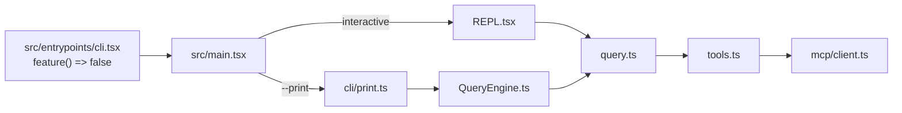
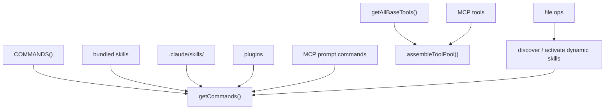
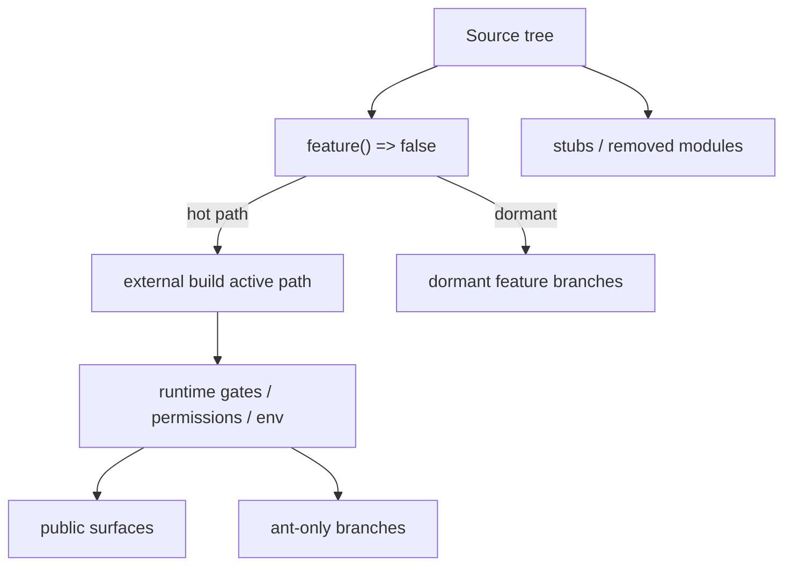

## 三条先给结论

- 当前仓库的核心不是某个单独聊天循环，而是 `启动装配 + query loop + 工具池 + 命令/skills + MCP + control plane` 的组合平台。
- 在 external build 里，`feature() => false` 是最重要的阅读前提；它决定了哪些分支只是“树上存在”，哪些才是“当前会跑”。
- 社区对 Claude Code 的高频判断里，关于“组合能力”“MCP 复杂度”“hooks 粒度不足”“CLAUDE.md 是信任边界”的几条，在当前源码中都有直接旁证。

<Note>
完整研究稿位于 `docs/analysis/2026-04-02-claude-code-capability-atlas.md`。这个页面保留同样的结论，但更偏图谱式阅读。
</Note>

## 顶部摘要区

| 研究问题 | 回答 |
|---|---|
| 这是什么仓库？ | 一个 Bun-first、反编译重建的 Claude Code CLI 平台工程，不是官方源码镜像。 |
| 真正的热路径是什么？ | `cli.tsx -> main.tsx -> (REPL | print) -> query.ts`，headless 再经由 `QueryEngine.ts`。 |
| 最值得研究的地方在哪里？ | 工具池、commands/skills、MCP、hooks、AppState 控制平面，而不只是单个 API client。 |

## 核心图谱区

> 图示：[`Claude Code 能力全景图（SVG）`](../../images/research/capability-overview.svg)

这张热路径图背后的源码锚点是：

- `src/entrypoints/cli.tsx:3-18`
- `src/main.tsx:2584-2845`
- `src/main.tsx:3134-3146`
- `src/QueryEngine.ts:178-214`
- `src/screens/REPL.tsx:2797-2805`

## 模块地图区

> 图示：[`Claude Code 能力矩阵图（SVG）`](../../images/research/capability-matrix.svg)

### 为什么说扩展层是主产品面

- `src/tools.ts` 不只是列工具，而是同时处理 preset、deny rules、REPL mode、MCP 合并与排序稳定性。
- `src/commands.ts` 不只是 slash commands，而是 built-ins、bundled skills、plugin skills、workflow commands、dynamic skills 的汇合点。
- `src/skills/loadSkillsDir.ts` 把 Markdown prompt workflow 升格为一等命令对象，并支持 frontmatter、路径条件、动态发现与 fork 执行。
- `src/services/mcp/client.ts` 展示了 MCP 并不是“接个 HTTP server”这么简单，而是 transport、auth、timeout、session ingress、能力截断、IDE 特例等一整层集成逻辑。

## 风险与偏差区

<AccordionGroup>
  <Accordion title="最关键的阅读风险">
    当前仓库最容易被误读的地方，是把树上存在的 `feature(...)` 分支、`USER_TYPE === 'ant'` 内部能力和 stub 包，直接当作当前 external build 的活跃能力。`src/entrypoints/cli.tsx` 里的 `feature() => false` 使这种误读尤其昂贵。
  </Accordion>
  <Accordion title="最典型的文档漂移">
    本地 `AGENTS.md` 仍把构建描述成单文件产物，并写着“没有 test runner / linter”。但 `build.ts` 已经使用 `splitting: true`，`package.json` 也定义了 `test`、`lint`、`format` 等脚本。对于当前工程现实，`build.ts + package.json + docs/` 的权威性已经高于本地 onboarding 文档。
  </Accordion>
  <Accordion title="为什么控制平面值得单独关注">
    `src/state/AppStateStore.ts` 把 task、MCP、plugin、fileHistory、attribution、sessionHooks、remote bridge、computer-use、REPL VM context 等状态收在一个会话级控制平面里。很多“UI 问题”或“工具问题”的根因，其实在共享状态同步上。
  </Accordion>
</AccordionGroup>

## 社区核验区

> 图示：[`Claude Code 社区观点核验图（SVG）`](../../images/research/community-verdicts.svg)

| 社区共识 | Verdict | 当前仓库里的证据 |
|---|---|---|
| Claude Code 的壁垒来自组合能力而非单功能 | `源码证实` | 工具、命令、skills、MCP、hooks、state 全都不是配角。 |
| hooks 很有用，但还不够细 | `部分成立 / 依赖上下文` | 仓库里 hooks 很深，社区 issue 仍在要更细 lifecycle。 |
| MCP 是最强扩展面，也是最脆的一面 | `源码证实` | `mcp/client.ts` 的复杂度与 issue 热点一致。 |
| sub-agents 生产力高，但边界仍粗糙 | `部分成立 / 依赖上下文` | 官方公开支持，社区仍反馈 session/stop/identity 边缘行为。 |
| CLAUDE.md 既提高效率，也构成信任边界 | `源码证实` | trust、memory、settings、print mode 都把它视为强输入。 |

## 结语与延伸阅读

<CardGroup cols={2}>
  <Card title="一条核心结论" icon="diagram-project">
    这个仓库最值得研究的不是“模型怎么回消息”，而是“会话如何组织能力”。
  </Card>
  <Card title="最佳阅读顺序" icon="route">
    建议按 `cli.tsx -> main.tsx -> query.ts -> QueryEngine.ts -> tools.ts -> commands.ts -> loadSkillsDir.ts -> mcp/client.ts -> AppStateStore.ts -> REPL.tsx` 进入。
  </Card>
  <Card title="延伸：对话循环" icon="arrows-rotate" href="../../conversation/the-loop">
    继续看 `query.ts` 的 agentic loop 状态机。
  </Card>
  <Card title="延伸：三层门禁" icon="shield" href="../../internals/three-tier-gating">
    继续看 feature gate、GrowthBook 与 ant-only 的层次关系。
  </Card>
</CardGroup>

### 主要外部参考

- [Anthropic: Claude Code overview](https://docs.anthropic.com/en/docs/claude-code/overview)
- [Anthropic: Settings](https://docs.anthropic.com/en/docs/claude-code/settings)
- [Anthropic: Memory](https://docs.anthropic.com/en/docs/claude-code/memory)
- [Anthropic: Slash commands](https://docs.anthropic.com/en/docs/claude-code/slash-commands)
- [Anthropic: Hooks](https://docs.anthropic.com/en/docs/claude-code/hooks)
- [Anthropic: MCP](https://docs.anthropic.com/en/docs/claude-code/mcp)
- [Anthropic: Sub-agents](https://docs.anthropic.com/en/docs/claude-code/sub-agents)
- [Anthropic: Common workflows](https://docs.anthropic.com/en/docs/claude-code/common-workflows)
- [awattar/claude-code-best-practices](https://github.com/awattar/claude-code-best-practices)
- [Yuyz0112/claude-code-reverse](https://github.com/Yuyz0112/claude-code-reverse)
- [luandro/awesome-claude-code-workflows](https://github.com/luandro/awesome-claude-code-workflows)
- [anthropics/claude-code-action](https://github.com/anthropics/claude-code-action)
