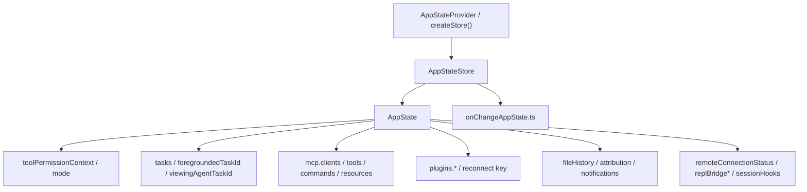

## 一句话结论

`AppState` 不是狭义的 UI store，而是 Claude Code 的会话控制平面；权限模式、任务前后台切换、MCP 连接、bridge 状态和 transcript 辅助信息都在这里汇流。

## 实现状态

| 组成 | 状态标签 | 当前含义 |
|---|---|---|
| `AppStateStore.ts` 主状态结构、默认值、store | `external build active` | 当前 interactive 与 headless 都真实依赖 |
| `onChangeAppState.ts` 副作用汇聚点 | `external build active` | 模式变化、外部 metadata 同步当前生效 |
| MCP / plugin / bridge / task 等聚合字段 | `external build active` | 都存在于当前 schema 中，但不同字段活跃度不同 |
| 某些 ant-only 或 gated 字段 | `ant-only` / `feature-gated` | 可见于结构定义，不等于公开构建默认能力 |

## 为什么存在

REPL、task、resume、MCP、plugin、bridge 都需要共享会话级事实。如果每条链路都维护自己的状态副本，系统几乎不可能在长会话里保持一致。

## 正常链路

## 关键结构 / 状态

`AppState` 的复杂度不在 store 机制，而在它把多少跨模块事实收敛成了同一份会话级真相。按职责看，最值得单独读的是这几组：

| 功能块 | 关键字段 | 作用 |
|---|---|---|
| 权限与模式 | `toolPermissionContext`, `mainLoopModel`, `thinkingEnabled` | 决定本轮模型和执行边界的基础设定 |
| 任务与前后台 | `tasks`, `foregroundedTaskId`, `viewingAgentTaskId` | 决定 leader / teammate / background task 如何切换视图 |
| 扩展外联 | `mcp.clients`, `mcp.tools`, `mcp.commands`, `mcp.resources`, `plugins.*` | 把远端能力面和本地插件状态收拢到一处 |
| 会话持久化辅助 | `fileHistory`, `attribution`, `notifications`, `elicitation` | 让 rewind、resume、审计和提示流可追踪 |
| Hook 与桥接 | `sessionHooks`, `replBridge*`, `remoteConnectionStatus` | 把本地会话与外部控制面连接起来 |

默认值同样重要。`getDefaultAppState()` 不只是“初始化几个空数组”，而是在启动阶段明确系统的初始控制姿态，比如：

- 默认权限模式从 `initialMode` 注入到 `toolPermissionContext`
- `mcp.*` 与 `plugins.*` 先以空能力面启动，后续由连接流程填充
- `fileHistory`、`attribution`、`sessionHooks` 预先准备好，让后续副作用可以无条件落盘或登记
- remote / bridge 相关字段先全部设为未连接状态，避免 UI 和 headless 对“连接中/已连接/重连中”各说各话

## 一个端到端例子

以“权限模式从 default 切到 plan”为例，真正发生的不是一个本地标签变色，而是一条控制平面更新链：

1. 某个 UI 动作、slash command 或外部控制请求修改 `toolPermissionContext.mode`。
2. `setAppState()` 写入 store。
3. `onChangeAppState()` 比较 old/new state，发现 mode 发生变化。
4. 它把内部模式名外化成 CCR/SDK 能理解的 external mode。
5. 通过 `notifySessionMetadataChanged()` 和 `notifyPermissionModeChanged()` 同步到外部控制面和状态流。

这个设计解决的是历史上“只有少数 mutation path 会通知外部，其他路径都悄悄变了但外部不知道”的一致性问题。

## 失败与恢复

如果问题表现为“某个局部功能看起来坏了，但 UI、远端状态和 transcript 各有一套说法”，优先把它当控制平面问题看。常见排查点是：

| 症状 | 优先看哪里 | 原因 |
|---|---|---|
| UI 上模式变了，但 SDK/CCR 没同步 | `src/state/onChangeAppState.ts` | mode 副作用统一在这里汇聚 |
| teammate 视图卡在错误对象 | `foregroundedTaskId`, `viewingAgentTaskId`, `teammateViewHelpers.ts` | 前后台和观察对象是分开的两个概念 |
| MCP 已经连接，但子 agent 看不到工具 | `mcp.tools` 在 headless / REPL 的同步路径 | 工具池拼装依赖 store 中的最新快照 |
| rewind 后文件历史或 attribution 数字怪异 | `fileHistory`, `attribution` | 这些不是日志附属品，而是控制面的一部分 |

恢复的关键也不在“把字段改回来”，而在确认状态变更和副作用传播是否还保持单一入口。一旦多个模块各自偷偷同步外部世界，状态漂移就会再次出现。

## 边界与误读

- `createStore()` 很薄，真正重的是 schema 和副作用汇聚。
- `AppState` 不是只有 REPL 会读；headless `print.ts` 也依赖它构造能力面和状态外显。
- 看到字段在 `AppState` 里存在，不等于它在当前 external build 一定活跃；像某些 ant-only / gated 字段要单独标注。
- 很多“UI bug”本质上是控制平面同步 bug，因为 UI 只是这份状态的一个观察者。

## 场景变体

| 场景 | `AppState` 主要扮演的角色 |
|---|---|
| 交互式 REPL | 统一权限模式、任务视图、bridge 状态和 MCP 菜单 |
| headless / SDK | 作为 QueryEngine 与 print 路径的共享会话快照 |
| subagent / teammate | 通过 `tasks`、`viewingAgentTaskId` 维护谁在前台、谁在后台 |
| resume / rewind | 让 file history、attribution、notifications 可继续而不是丢失 |

## 继续读什么

- [消息队列与 prompt 调度](/docs/runtime/message-queue-and-prompt-scheduling)
- [会话存储与恢复](/docs/runtime/session-storage-and-resume)
- [后台任务与 housekeeping](/docs/runtime/background-tasks-and-housekeeping)
- [MCP 连接生命周期](/docs/extensibility/mcp-connection-lifecycle)

## 相关源码入口

- `src/state/AppStateStore.ts`
- `src/state/AppState.tsx`
- `src/state/onChangeAppState.ts`
- `src/cli/print.ts`
- `src/screens/REPL.tsx`

## 本页证据等级

- `external build active`: `AppState` schema、默认值、mode 副作用同步、MCP/task/bridge 聚合
- `inference`: “控制平面”是对这些跨模块共享状态关系的架构归纳
