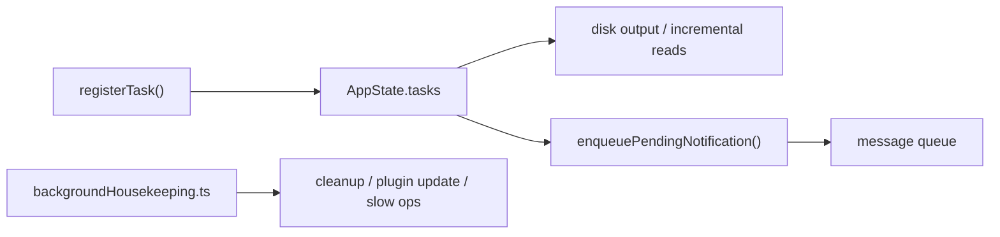

## 一句话结论

Claude Code 的后台化不是“某几个工具偷偷开线程”，而是明确的 task framework 加 housekeeping 层：注册、轮询、通知、输出落盘、终态回收和慢速维护任务都被建成了一套共用基础设施。

## 实现状态

| 组成 | 状态标签 | 当前含义 |
|---|---|---|
| `Task.ts`、`task/framework.ts`、本地/远程任务状态机 | `external build active` | 当前 REPL 与 headless 都依赖 |
| 主会话后台化 `LocalMainSessionTask` | `external build active` | 当前仓库真实支持 |
| housekeeping 清理与慢速维护 | `external build active` | 当前会按延迟和周期运行 |
| 某些提取记忆、deep-link、内部清理 | `feature-gated` / `ant-only` | 代码可见，但不是全部对 external build 生效 |

## 为什么存在

Claude Code 一旦允许这些能力同时存在：

- 子 agent 在后台继续执行
- 用户把当前主会话挂到后台
- 远端 review 或 remote task 回流
- 长会话中定时做清理和缓存维护

它就不能再把“后台能力”理解成 UI 边缘功能。后台化决定了系统是否能在长任务里保持可观察、可恢复、可清理。

## 正常链路

## 关键结构 / 状态

| 结构 | 作用 | 典型文件 |
|---|---|---|
| `registerTask()` / `updateTaskState()` | 统一任务注册和状态更新 | `src/utils/task/framework.ts` |
| `generateTaskAttachments()` / `applyTaskOffsetsAndEvictions()` | 轮询输出增量并安全清理终态任务 | `src/utils/task/framework.ts` |
| `LocalAgentTask` | 本地 agent 型任务的主实现 | `src/tasks/LocalAgentTask/LocalAgentTask.tsx` |
| `RemoteAgentTask` | 远端 task / review / workflow 回流 | `src/tasks/RemoteAgentTask/RemoteAgentTask.tsx` |
| `LocalMainSessionTask` | 把当前主会话 query 后台化 | `src/tasks/LocalMainSessionTask.ts` |
| `backgroundHousekeeping.ts` | 启动后延迟运行的慢速维护任务 | `src/utils/backgroundHousekeeping.ts` |

这里最关键的设计选择是：主会话后台化没有另造一套“特殊系统”，而是被建模成 `local_agent` 家族的一个变体。这样任务输出、通知和 transcript 都能复用相同框架。

## 一个端到端例子

主会话后台化是最能说明问题的例子：

1. 用户在长查询进行中把当前会话 background。
2. `registerMainSessionTask()` 生成一个 `s...` 前缀的任务 ID，并给它分配独立 transcript 路径。
3. 当前 query 继续跑，只是 UI 返回到一个新的 prompt。
4. 任务完成后，`completeMainSessionTask()` 决定是否发通知，并把终态写回 `AppState.tasks`。
5. 如果用户随后查看这个任务，TaskOutput 可以直接从隔离 transcript 和输出文件里恢复现场。

这说明“后台化”不是简单的 spinner，而是一个具备独立输出面和恢复面的任务对象。

## 失败与恢复

| 失败类型 | 典型症状 | 优先排查 |
|---|---|---|
| 任务完成但没有通知 | 主界面没有看到回流消息 | `enqueuePendingNotification()`、message queue 消费侧 |
| 任务结束后被过早清理 | 查看时 transcript 或 output 缺失 | `applyTaskOffsetsAndEvictions()`、`retain` / `evictAfter` |
| 后台主会话污染主 transcript | `/clear` 后仍混进旧后台输出 | `LocalMainSessionTask.ts` 的隔离 transcript 路径 |
| 慢速维护拖慢当前交互 | 启动后明显卡顿 | `backgroundHousekeeping.ts` 的延迟与“最近一分钟无交互”保护 |

当前实现里，housekeeping 的一个关键策略是：如果最近一分钟用户有交互，就把慢速操作继续延后。这说明 housekeeping 被设计成“让路于当前会话”，而不是抢占前台。

## 边界与误读

- “后台任务”不只等于 subagent；主会话 backgrounding、remote review、长轮询输出都属于这里。
- housekeeping 不是装饰性清理；它影响 transcript 体积、旧版本清理、插件状态和长期会话健康。
- 任务框架和 message queue 是配套设计，不是两套平行系统。
- 某些 maintenance 项目带有 feature gate 或 ant-only 限制，不能和任务框架本身混写。

## 场景变体

| 场景 | 关键机制 |
|---|---|
| 本地 subagent | `LocalAgentTask` + disk output + queue notification |
| 远端 review / workflow | `RemoteAgentTask` + poll + task-notification |
| 主会话后台化 | `LocalMainSessionTask` + side transcript |
| 长期开着的终端 | `backgroundHousekeeping.ts` 的延迟清理和周期维护 |

## 继续读什么

- [任务系统 V2](/docs/agent/task-system-v2)
- [异步 Agent 生命周期](/docs/agent/async-agent-lifecycle)
- [消息队列与 prompt 调度](/docs/runtime/message-queue-and-prompt-scheduling)

## 相关源码入口

- `src/Task.ts`
- `src/utils/task/framework.ts`
- `src/tasks/LocalAgentTask/LocalAgentTask.tsx`
- `src/tasks/RemoteAgentTask/RemoteAgentTask.tsx`
- `src/tasks/LocalMainSessionTask.ts`
- `src/utils/backgroundHousekeeping.ts`

## 本页证据等级

- `external build active`: task framework、LocalMainSessionTask、queue 回流、housekeeping
- `feature-gated` / `ant-only`: 部分慢速维护与内部清理任务
