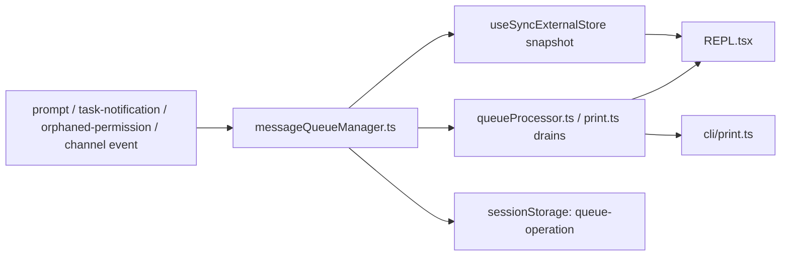

## 一句话结论

`messageQueueManager.ts` 不是 REPL 附属物，而是交互式终端、headless print、后台任务通知和 orphaned permission 恢复共用的控制平面部件。

## 实现状态

| 组成 | 状态标签 | 当前含义 |
|---|---|---|
| 统一命令队列、优先级、React 快照接口 | `external build active` | 当前 interactive 与 headless 都真实依赖 |
| `queue-operation` transcript 审计 | `external build active` | 当前会写入 session storage |
| orphaned permission 重新入队 | `external build active` | `print.ts` 当前实现的一部分 |

## 为什么存在

Claude Code 在一轮对话之间，不只会收到“用户下一句 prompt”。系统还会异步收到：

- 用户输入的 prompt / bash 命令 / slash command
- 后台 task 完成通知
- 远端 review 或 subagent 的回流消息
- orphaned permission response
- 某些 channel 或 SDK 注入的外部输入

如果这些事件各自维护一套私有缓冲区，系统就会立刻出现三个问题：

1. interactive 和 headless 路径顺序不一致。
2. 后台通知可能饿死用户输入，或者反过来永远插不进来。
3. 恢复和审计看不到“输入是怎样进系统的”。

所以 Claude Code 把它们统一抽象成 `QueuedCommand`，让“进入下一轮前的排队”成为一等基础设施。

## 正常链路

## 关键结构 / 状态

| 结构 | 作用 | 典型文件 |
|---|---|---|
| `enqueue()` | 处理用户主动输入，默认 `next` 优先级 | `src/utils/messageQueueManager.ts` |
| `enqueuePendingNotification()` | 处理系统通知，默认 `later`，避免饿死用户输入 | `src/utils/messageQueueManager.ts` |
| `peek / dequeue / dequeueAllMatching()` | 非 React 消费路径的核心 | `src/utils/messageQueueManager.ts` |
| `subscribeToCommandQueue()` | REPL 侧通过 `useSyncExternalStore` 订阅快照 | `src/utils/messageQueueManager.ts` |
| `processQueueIfReady()` | 在主线程之间按 mode 批量或单条 drain | `src/utils/queueProcessor.ts` |
| `recordQueueOperation()` | 把排队/出队写入 transcript 审计流 | `src/utils/sessionStorage.ts` |

当前优先级规则是 `now > next > later`。同一优先级内部保持 FIFO，但跨优先级时，系统明确偏向更紧急输入。

## 一个端到端例子

一个很典型但容易被写漏的场景是：

1. 用户在 REPL 里提交一个普通 prompt。
2. 同时一个 `LocalAgentTask` 正好完成，往队列里塞入 `task-notification`。
3. 更晚一点，`print.ts` 收到一次 orphaned permission response，需要把它重新转成可消费输入。

如果没有统一队列，这三个事件会分别在三个调用栈里被处理，顺序和语义都可能漂移。现在的设计则是：

- 用户 prompt 默认进 `next`
- 任务通知默认进 `later`
- 真正需要立刻打断的输入才会进 `now`

这样 REPL 既能优先处理用户的主流程，又不会把后台完成通知永远压住。

## 失败与恢复

| 失败类型 | 典型症状 | 优先排查 |
|---|---|---|
| 主线程被错误消息卡住 | 队列有消息但 REPL 不继续 | `queueProcessor.ts` 的 `agentId === undefined` 过滤 |
| 提示顺序异常 | 用户 prompt 后先弹出系统通知 | `enqueue` 与 `enqueuePendingNotification` 的默认优先级 |
| orphaned permission 重复处理 | 同一权限请求多次重放 | `print.ts` 里的重复保护逻辑 |
| 恢复后看不到排队轨迹 | transcript 只有消息没有排队上下文 | `recordQueueOperation()` 与 session storage |

源码里有一个很重要的注释直接说明了历史 bug：如果主线程 `peek()` 没过滤 subagent 定向消息，就会出现“队列明明有东西，但主循环再也不触发”的永久卡死。

## 边界与误读

- 队列不是“为了 UI 做的本地状态”；headless 也直接读取它。
- 队列不只装用户 prompt；系统通知和权限回流也走这里。
- 它不只是内存瞬态结构；`queue-operation` 进入 transcript 后，它也是恢复与审计的一部分。
- `now` 优先级不是普通优化，而是能触发正在运行 turn 的中断行为。

## 场景变体

| 场景 | 队列扮演的角色 |
|---|---|
| 交互式 REPL | 让输入框、任务通知、权限流共享同一调度面 |
| headless / SDK | 统一 drain 外部输入、resume 输入和 orphaned permission |
| subagent / remote review | 让后台完成通知在主线程里以普通消息形式出现 |
| transcript 审计 | 记录“输入如何进入系统”，而不只记录最终对话文本 |

## 继续读什么

- [会话存储与恢复](/docs/runtime/session-storage-and-resume)
- [后台任务与 housekeeping](/docs/runtime/background-tasks-and-housekeeping)
- [单轮状态机](/docs/conversation/single-turn-state-machine)

## 相关源码入口

- `src/utils/messageQueueManager.ts`
- `src/utils/queueProcessor.ts`
- `src/cli/print.ts`
- `src/screens/REPL.tsx`
- `src/tasks/LocalAgentTask/LocalAgentTask.tsx`
- `src/tasks/RemoteAgentTask/RemoteAgentTask.tsx`
- `src/utils/sessionStorage.ts`

## 本页证据等级

- `external build active`: queue、优先级 drain、orphaned permission 入队、queue-operation 审计
