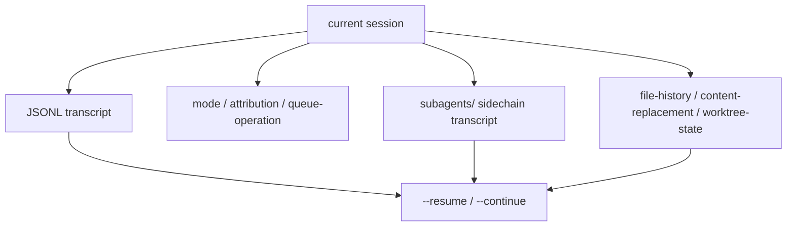

## 一句话结论

`sessionStorage.ts` 在这个仓库里更像“会话数据库适配层”，而不是日志工具箱；它同时承载 transcript、resume、sidechain、queue 审计、file history、content replacement 和 worktree 恢复。

## 实现状态

| 组成 | 状态标签 | 当前含义 |
|---|---|---|
| transcript JSONL、resume / continue、message chain | `external build active` | 当前构建真实可用 |
| subagent sidechain transcript 与 agent metadata | `external build active` | 当前仓库真实支持 |
| `queue-operation`、`file-history-snapshot`、`content-replacement`、`worktree-state` | `external build active` | 当前会进入 transcript 侧车信息 |
| 某些内部分析或大规模会话优化 | `feature-gated` / `ant-only` | 不应和基础持久化混写 |

## 为什么存在

只要系统想支持这些能力：

- `--resume` 和 `--continue`
- 紧急退出后继续恢复主会话
- subagent / background task 拥有独立 transcript
- 文件历史、内容替换、worktree 状态不丢
- transcript 能解释“为什么会恢复成现在这样”

它就不能只写 user / assistant 两类纯对话消息。很多恢复要依赖的是“消息之外的会话事实”。

## 正常链路

## 关键结构 / 状态

| 结构 | 作用 | 典型文件 |
|---|---|---|
| `recordTranscript()` | 把链式消息落入主 transcript | `src/utils/sessionStorage.ts` |
| `loadTranscriptFile()` | 读取 JSONL，重建消息、快照、替换和 collapse 信息 | `src/utils/sessionStorage.ts` |
| `recordSidechainTranscript()` | 给 subagent / background task 写独立 transcript | `src/utils/sessionStorage.ts` |
| `writeAgentMetadata()` / `readAgentMetadata()` | 让 resume 能恢复 agent 类型与 worktree | `src/utils/sessionStorage.ts` |
| `recordFileHistorySnapshot()` | 把文件历史侧写和消息链对应起来 | `src/utils/fileHistory.ts` |
| `resumeAgentBackground()` | 读取 sidechain transcript 并重建 resumed state | `src/tools/AgentTool/resumeAgent.ts` |

除了 `user / assistant / system / attachment` 消息，当前实现还会记录：

- `queue-operation`
- `file-history-snapshot`
- `attribution-snapshot`
- `content-replacement`
- `worktree-state`
- context collapse 相关 snapshot / commit

有三个边界尤其关键：

- `progress` 不参与 transcript chain，这一点直接决定 resume 能否正确接回。
- subagent transcript 和主会话 transcript 是分文件存储的，不是一个文件里硬塞多条分支。
- content replacement 与 file history snapshot 不是 UI 附件，而是恢复写入历史时的必要证据。

## 一个端到端例子

一个包含 background task 和 subagent 的恢复流程，大致会是这样：

1. 主会话先通过 `recordTranscript()` 把当前用户消息写到主 transcript。
2. 某个 subagent 启动后，通过 `getAgentTranscriptPath()` 获得 `subagents/agent-*.jsonl` 路径。
3. 工具结果很大时，系统把 content replacement 信息写入 transcript 侧记录。
4. 如果主会话被 background，`LocalMainSessionTask` 会给它绑定独立 transcript 文件。
5. 之后 `--resume` 或 `resumeAgentBackground()` 读取 transcript、metadata、replacement state 和 worktree path，把会话还原成“可以继续问”的状态，而不是单纯回放一串文本。

## 失败与恢复

| 失败类型 | 典型症状 | 恢复 / 排查 |
|---|---|---|
| resume 只看到 queue-operation，看不到真正对话 | `--resume` 提示没有可恢复会话 | `QueryEngine.ts` 里“先写用户消息再进 query”那段保护逻辑 |
| subagent 对话找不到 | agent 可见但 transcript 丢失 | `getAgentTranscriptPath()`、`writeAgentMetadata()`、`resumeAgentBackground()` |
| 文件历史断裂 | continue 后改动来源和回退能力不一致 | `recordFileHistorySnapshot()` 与 `content-replacement` |
| worktree 恢复到错目录 | resumed agent 在错误 cwd 里继续 | agent metadata 里的 `worktreePath` 与 `worktree-state` |

当前代码里有一个非常关键的注释：如果在 API 返回前进程被杀，只有 queue-operation 落盘、用户消息没写入，resume 就会错误地认为“没有对话”。这正是 `QueryEngine.ts` 提前持久化用户消息的原因。

## 边界与误读

- transcript 不是聊天记录导出文件，而是恢复协议的一部分。
- `loadTranscriptFile()` 做的不是“顺序读取所有行”，而是带有链重建、快照收集和旧格式桥接的恢复。
- sidechain 不是 UI 虚拟概念；它对应真实文件和 metadata。
- worktree-state、content-replacement、file-history-snapshot 这些记录不直接展示给用户，但决定恢复是否可信。

## 场景变体

| 场景 | 会依赖哪些额外记录 |
|---|---|
| 普通单会话 resume | 主 transcript + mode / tag / title |
| subagent resume | sidechain transcript + agent metadata |
| 背景主会话 | `LocalMainSessionTask` transcript + task output |
| 带 worktree 的 agent | worktree path + worktree-state |
| 长会话继续编辑 | file-history snapshot + content replacement |

## 继续读什么

- [AppState 控制平面](/docs/runtime/app-state-control-plane)
- [多轮对话管理](/docs/conversation/multi-turn)
- [消息队列与 prompt 调度](/docs/runtime/message-queue-and-prompt-scheduling)
- [工作树隔离](/docs/agent/worktree-isolation)

## 相关源码入口

- `src/utils/sessionStorage.ts`
- `src/QueryEngine.ts`
- `src/tasks/LocalMainSessionTask.ts`
- `src/utils/fileHistory.ts`
- `src/tools/AgentTool/resumeAgent.ts`

## 本页证据等级

- `external build active`: transcript、resume、subagent sidechain、queue-operation、file-history snapshot、content replacement
