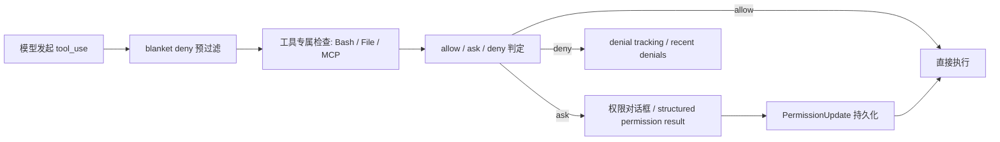

## 一句话结论

权限规则真正做的不是“给工具贴标签”，而是在模型真正执行前，把可预测的风险决策前移并持久化为可审计规则。

## 实现状态

| 组成 | 状态标签 | 当前含义 |
|---|---|---|
| `allow / ask / deny` 规则、规则来源、持久化更新 | `external build active` | 当前构建真实启用 |
| blanket deny 预过滤工具池 | `external build active` | 某些 deny 会在模型看到工具前生效 |
| denial tracking 与 recent denials | `external build active` | 防止模型在同类拒绝上无限打转 |
| `auto` 权限模式与 transcript classifier | `feature-gated` / `ant-only` | 代码里可见，但不是当前 external build 的默认事实 |

## 为什么存在

Claude Code 需要同时满足两个看起来互相矛盾的目标：

- 低风险动作要足够顺滑，否则每轮都会被权限弹窗打断。
- 高风险动作必须在执行前停下来，否则“能改代码”就会退化成“能乱动系统”。

如果只有一种全局策略，结果会很糟：

- 全 `allow`：安全边界等于没有。
- 全 `ask`：工具链几乎不可用，模型会被确认流淹没。
- 全 `deny`：Claude Code 退化成只会解释代码的只读问答器。

所以规则系统必须既支持细粒度内容匹配，又支持按来源叠加，还要能把拒绝历史反馈到下一轮行为中。

## 正常链路

这里有两个经常被忽略的时机差：

1. blanket deny 发生在模型看到工具前，直接缩减能力面。
2. 具体命令匹配发生在工具调用时，例如 `Bash(npm test:*)`、`Bash(rm -rf:*)`。

## 关键结构 / 状态

| 结构 | 作用 | 典型文件 |
|---|---|---|
| `ToolPermissionContext` | 当前会话的权限模式和规则集合 | `src/Tool.ts` |
| `PermissionMode` | `default / plan / acceptEdits / bypass...` 的显示与外部化规则 | `src/utils/permissions/PermissionMode.ts` |
| `permissions.ts` | 汇总 allow/ask/deny 规则、生成 decision reason、执行更新 | `src/utils/permissions/permissions.ts` |
| `PermissionUpdate.ts` | 把临时授权或永久授权写回对应来源 | `src/utils/permissions/PermissionUpdate.ts` |
| `bashPermissions.ts` | Bash 的精细命令、prefix、classifier 和安全校验 | `src/tools/BashTool/bashPermissions.ts` |
| `denialTracking.ts` | 记录连续拒绝与总拒绝次数，必要时回退到显式询问 | `src/utils/permissions/denialTracking.ts` |

一个实用理解方式是：模式决定默认姿态，规则决定例外，denial tracking 决定系统如何避免在坏局部最优里自转。

## 一个端到端例子

假设团队希望把常见的读操作放行，但把系统级破坏命令永远卡住：

| 规则 | 含义 |
|---|---|
| `Read`、`Glob`、`Grep` -> `allow` | 低副作用只读操作无需频繁确认 |
| `Bash(npm test:*)` -> `allow` 或 `ask` | 可按团队风险偏好选择 |
| `FileEdit` -> `ask` | 改文件是常见操作，但仍要显式确认 |
| `Bash(rm -rf:*)` -> `deny` | 即使模型想做，也不该给“顺手放行”的机会 |

一轮真实执行里会是这样：

1. 模型先请求 `Read` 和 `Grep`，这些直接通过。
2. 接着它请求 `Bash("npm test")`，命中允许或询问规则。
3. 如果它转而尝试 `rm -rf tmp/build-cache`，则 `bashPermissions.ts` 和通用权限层会把它落到 `deny`。
4. 该次拒绝会进入 denial tracking，后续模型更容易转向安全替代方案，而不是反复撞墙。

## 失败与恢复

| 失败类型 | 典型症状 | 恢复 / 止损 |
|---|---|---|
| 规则写得过宽 | 一条 allow 误覆盖太多命令 | `shadowedRuleDetection` 和规则 UI 提示不可达/被遮蔽规则 |
| 连续拒绝导致循环 | 模型重复尝试相近危险命令 | `denialTracking` 到阈值后转为更显式的 prompting |
| 外部模式和会话模式不同步 | UI 显示一种模式，实际执行另一种 | `onChangeAppState.ts` 统一同步模式到外部元数据 |
| blanket deny 过度 | 模型根本看不到某些工具 | 回到规则源头调整，而不是在工具调用时救火 |

用户拒绝 `ask` 并不等于整轮会话失败。Claude Code 会把这个拒绝结果留在上下文里，给模型下一轮改策略的机会。

## 边界与误读

<Warning>
`allow / ask / deny` 的真正语义，不是“友好程度”，而是“系统愿不愿意把这类动作当作默认可执行”。
</Warning>

- `allow` 适合高频、低副作用、边界清晰的动作，不等于“永远安全”。
- `ask` 不是坏事；它是把人放回决策回路。
- `deny` 也不只是“别做这个”，很多时候是在给模型施加明确策略边界。
- blanket deny 和命令级 deny 不是一回事：前者缩能力面，后者拦具体调用。
- `auto` 模式相关代码存在，不代表当前 external build 默认依赖 classifier 决定一切。

## 场景变体

| 场景 | 更合适的规则姿态 |
|---|---|
| 本地代码阅读与搜索 | 大量 `allow` |
| 常规测试与构建 | `allow` 或 `ask`，看团队习惯 |
| 文件改写与批量编辑 | 以 `ask` 为主 |
| Git 推送、删除、覆盖系统目录 | 明确 `deny` 或极窄 `ask` |
| 远程或 MCP 触发的高副作用操作 | 优先保守，避免隐式放行 |

## 继续读什么

- [权限模型](/docs/safety/permission-model)
- [信任边界](/docs/safety/trust-boundaries)
- [Plan Mode](/docs/safety/plan-mode)
- [沙箱机制](/docs/safety/sandbox)

## 相关源码入口

- `src/Tool.ts`
- `src/utils/permissions/PermissionMode.ts`
- `src/utils/permissions/permissions.ts`
- `src/utils/permissions/PermissionUpdate.ts`
- `src/utils/permissions/denialTracking.ts`
- `src/utils/permissions/shadowedRuleDetection.ts`
- `src/tools/BashTool/bashPermissions.ts`

## 本页证据等级

- `external build active`: allow/ask/deny、blanket deny 过滤、PermissionUpdate、denial tracking
- `feature-gated` / `ant-only`: auto mode classifier 相关路径
