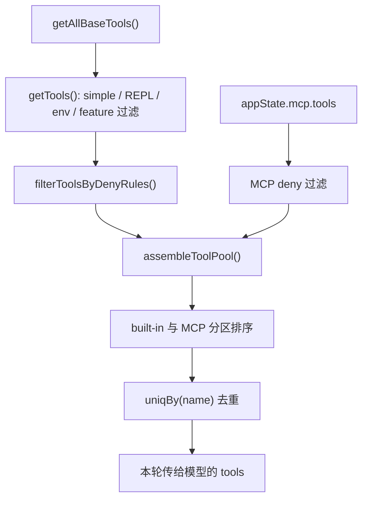

## 一句话结论

Claude Code 交给模型的不是一个静态工具数组，而是一份 **按模式、权限、平台、MCP 状态和缓存稳定性要求动态装配** 出来的工具池。

## 状态标签总览

| 工具来源 / 环节 | 当前状态 | 核心入口 |
|---|---|---|
| built-in base tools | `external build active` | `getAllBaseTools()` in `src/tools.ts` |
| deny rules 过滤 | `external build active` | `filterToolsByDenyRules()` |
| REPL/simple/worktree/LSP 等条件装配 | `external build active` | `getTools()` |
| MCP 工具合并 | `external build active` | `assembleToolPool()` |
| `feature('...')` 实验工具 | 多数 `feature-gated` | `WebBrowserTool`, `CtxInspectTool`, `WorkflowTool` 等 |
| `USER_TYPE === 'ant'` 工具 | `ant-only` | `REPLTool`, `ConfigTool`, `SuggestBackgroundPRTool` 等 |

## 为什么存在

工具池之所以不能写死，是因为“当前这轮会话到底能调用什么”受五类变量同时影响：

- 当前是不是 simple mode。
- 当前是不是 REPL mode，是否需要隐藏 primitive tools。
- 当前权限上下文里有没有 blanket deny。
- 当前是否连上了 MCP server，server 是否暴露了工具。
- 当前构建是否打开某个 feature gate，或者用户是否处在 ant-only 世界。

如果把这些都硬塞进一个固定工具列表里，就会出现两种坏结果：

1. 模型看到不该看到的工具，导致权限和能力面失真。
2. 每次会话的工具描述顺序不稳定，破坏 prompt cache 与系统 prompt 的缓存收益。

也正因为此，当前实现不仅在“合并”，还在做 **过滤、排序、去重和模式裁剪**。

## 正常链路

这条链路里最容易被忽略的是中间两步：

- **REPL mode 会隐藏一部分 primitive tools**，因为这些能力在 VM 环境里仍可访问，但不该再以直连 primitive 形式暴露给模型。
- **排序不是美化，而是为了 prompt-cache stability**；`assembleToolPool()` 的注释已经明确说明，built-in 需要保持连续前缀，避免 MCP 工具插入后打碎缓存断点。

## 关键结构 / 状态

| 结构 | 作用 | 关键细节 |
|---|---|---|
| `getAllBaseTools()` | 定义“当前环境可能出现的内置工具全集” | 里面混合了常驻工具、环境工具、gated 工具、ant-only 工具 |
| `getTools()` | 从全集里裁出当前模式真正允许的 built-in 集合 | 会处理 `CLAUDE_CODE_SIMPLE`、REPL mode、`isEnabled()` 等条件 |
| `filterToolsByDenyRules()` | 在模型看到工具之前做 blanket deny | 支持按 MCP server 前缀整体剔除 |
| `assembleToolPool()` | built-in 与 MCP 的统一装配入口 | 排序、去重、保持 built-in 前缀稳定 |
| `getMergedTools()` | 提供 built-in + MCP 的完整集合 | 适用于 tool search 阈值、token 计算等“只想看全集”的场景 |

还有两个常被忽略的实现点：

1. `specialTools` 会先把 `ListMcpResourcesTool`、`ReadMcpResourceTool`、synthetic output 之类特殊工具从普通 built-in 列表里摘出来。
2. `uniqBy(name)` 让 built-in 在名字冲突时优先生效，因此“先 built-in 后 MCP”不是偶然顺序，而是冲突策略。

## 五类来源别混写

| 来源 | 进入方式 | 该怎么写状态 |
|---|---|---|
| built-in | 直接在 `src/tools.ts` 注册 | `external build active` |
| 条件 built-in | 依赖 env、mode、平台、`isEnabled()` | `external build active`，但要写清条件 |
| MCP tools | 来自 `appState.mcp.tools`，在装配期合并 | `external build active` |
| feature-gated tools | `feature('...') ? require(...) : null` | `feature-gated` |
| ant-only tools | `process.env.USER_TYPE === 'ant'` | `ant-only` |

这一步很重要，因为很多文档错误都发生在这里：把树上出现过的工具名统统列成“可用工具清单”。

## 一个端到端例子

假设当前会话满足这些条件：

- 不是 `CLAUDE_CODE_SIMPLE`
- 是 REPL mode
- 连上了一个名为 `slack` 的 MCP server
- 权限规则里 deny 了 `mcp__slack`

那么装配过程会是：

1. `getAllBaseTools()` 先拿到当前环境下可能出现的 built-in 工具全集。
2. `getTools()` 去掉 special tools，并根据 REPL mode 隐藏 `REPL_ONLY_TOOLS` 中的 primitive 直连能力。
3. `filterToolsByDenyRules()` 先过滤 built-in 中被 blanket deny 的工具。
4. `assembleToolPool()` 拿到 `appState.mcp.tools` 后，再用同一套 deny matcher 把整个 `slack` MCP 工具组过滤掉。
5. built-in 与剩余 MCP 工具分别排序，再 `uniqBy(name)` 去重。
6. 最终模型拿到的是“当前轮真正可调用的能力面”，而不是“树上所有可能工具名的并集”。

这也解释了为什么用户明明“配置过 MCP”，模型却看不到工具：问题不一定在连接层，也可能发生在 deny、模式裁剪或去重阶段。

## 失败与恢复

| 失败场景 | 现象 | 恢复思路 |
|---|---|---|
| blanket deny 写得过宽 | 某个工具或整组 MCP server 工具完全消失 | 先查 `filterToolsByDenyRules()` 的匹配结果 |
| REPL mode 下看不到 primitive tool | 看起来像工具被删了 | 这是模式裁剪，不一定是 bug；先确认是否被 REPL VM 包裹 |
| MCP 已连接但工具未暴露 | 工具池里缺少远程工具 | 分两段查：先看 MCP 生命周期，再看 `assembleToolPool()` |
| 工具名称冲突 | 远程工具似乎“被吞掉” | 查 `uniqBy(name)` 的冲突策略，built-in 会优先 |
| 工具排序变化导致缓存波动 | prompt cache 命中下降或描述顺序飘 | 保持 `assembleToolPool()` 的分区排序，不要改成平铺 sort |

## 边界与误读

<Warning>
`src/tools.ts` 是工具装配中心，但不是“最终可调用工具清单”的静态快照。最终结果始终取决于运行时上下文。
</Warning>

- 不要把 `getAllBaseTools()` 当成“当前轮模型一定能看到的工具表”；它只是候选全集。
- 不要把 `src/tools.ts` 误写成“全部工具都在这里定义完成”；MCP 工具是在运行时合并进来的。
- 不要把 feature-gated 或 ant-only 工具列到对外默认能力里。
- 不要忽略排序逻辑的缓存语义；它不是装饰性实现。
- 不要再引用不存在的 `src/utils/toolPool.js`；当前工具池装配主实现就在 [src/tools.ts](/Users/admin/work/claude-code-docs-sweep/src/tools.ts)。

## 场景变体

| 场景 | 工具池会怎么变 |
|---|---|
| `CLAUDE_CODE_SIMPLE=true` | 只暴露简化工具子集；协调模式下还会补进 Agent / TaskStop |
| REPL mode | primitive 直连工具可能被隐藏，转由 REPL VM 间接提供 |
| 有 MCP server | 远程工具在装配期并入 built-in 集合 |
| 权限受限环境 | deny rules 在“模型看到之前”就先裁掉工具 |
| 内部 / 实验构建 | `feature()` 和 `USER_TYPE` 使工具全集变大，但不是 external build 的默认事实 |

## 先读什么

- 先读 [工具系统设计](/docs/tools/what-are-tools)
- 再读 [运行时控制平面](/docs/runtime/app-state-control-plane)

## 继续读什么

- [工具结果预算](/docs/tools/tool-result-budgeting)
- [工具渲染与进度显示](/docs/tools/tool-rendering-and-progress)
- [MCP 连接生命周期](/docs/extensibility/mcp-connection-lifecycle)
- [Gating Matrix](/docs/internals/gating-matrix)

## 相关源码入口

- `src/tools.ts`
- `src/hooks/useMergedTools.ts`
- `src/screens/REPL.tsx`
- `src/cli/print.ts`
- `src/tools/AgentTool/AgentTool.tsx`
- `src/services/mcp/client.ts`

## 本页证据等级

- `external build active`: [src/tools.ts](/Users/admin/work/claude-code-docs-sweep/src/tools.ts), [src/hooks/useMergedTools.ts](/Users/admin/work/claude-code-docs-sweep/src/hooks/useMergedTools.ts), [src/screens/REPL.tsx](/Users/admin/work/claude-code-docs-sweep/src/screens/REPL.tsx), [src/cli/print.ts](/Users/admin/work/claude-code-docs-sweep/src/cli/print.ts)
- `feature-gated`: `WebBrowserTool`, `CtxInspectTool`, `WorkflowTool` 等条件 require 分支
- `ant-only`: `REPLTool`, `ConfigTool`, `SuggestBackgroundPRTool` 等 `USER_TYPE === 'ant'` 分支
