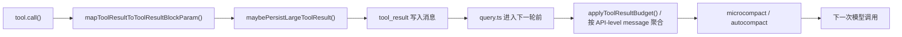

## 一句话结论

工具结果预算不是显示层优化，而是多轮 agentic loop 的硬稳定层；没有它，长命令输出、并发工具结果和大文件内容会很快把下一轮 prompt 撑爆。

## 实现状态

| 组成 | 状态标签 | 当前含义 |
|---|---|---|
| `maxResultSizeChars`、大结果落盘、预览替换 | `external build active` | 当前工具执行和 transcript 都真实依赖 |
| `applyToolResultBudget()` 的按消息聚合预算 | `external build active` | 当前 `query.ts` 每轮都会先过这一层 |
| 对 `Read` 一类 `Infinity` 工具的特殊处理 | `external build active` | 当前 external build 明确实现 |
| 某些 GrowthBook 阈值覆盖 | `feature-gated` | 影响阈值，不改变整体机制存在性 |

## 为什么存在

Agentic loop 最大的结构性风险之一，是工具结果会把对话上下文撑爆。和纯聊天不同，这里的“消息”常常包含：

- 命令输出
- 搜索命中列表
- 文件内容
- 子 agent 摘要
- MCP 返回的结构化文本

如果这些结果都无限回灌给模型，系统在第 2 到第 5 轮就可能失控。Claude Code 因此把预算分成两层：

1. 单个工具自身声明的结果上限
2. query 进入模型前，对整条 API 级 user message 再做一次聚合预算

第二层尤其重要，因为多工具并发时，“每个结果都不算太大”并不意味着“合起来也安全”。

## 正常链路

这张图里最关键的事实是：**Claude Code 不只在工具执行完成时做一次截断，还会在 query 重新组装 prompt 时再检查一次聚合大小。**

## 关键结构 / 状态

| 结构 | 作用 | 典型位置 |
|---|---|---|
| `maxResultSizeChars` | 工具声明自己的单结果上限 | `src/Tool.ts` |
| `persistToolResult()` | 把超大结果写到 session 下的 `tool-results/` | `src/utils/toolResultStorage.ts` |
| `buildLargeToolResultMessage()` | 用 `<persisted-output>` 包装“预览 + 完整路径” | `src/utils/toolResultStorage.ts` |
| `ContentReplacementState.seenIds` | 记住哪些 `tool_use_id` 已经被模型看过 | `src/utils/toolResultStorage.ts` |
| `ContentReplacementState.replacements` | 缓存替换后的 preview，保证重放稳定 | `src/utils/toolResultStorage.ts` |
| `applyToolResultBudget()` | query 进入模型前的统一接入点 | `src/query.ts`, `src/utils/toolResultStorage.ts` |

这里最不直观、但最值钱的数据结构是 `seenIds + replacements` 这对状态：

- `seenIds` 防止已经发给模型看的旧内容在后续轮次突然被重新替换，导致 prompt cache 漂移
- `replacements` 确保一旦某个 `tool_use_id` 被替换成 preview，后续每轮都能复用完全一样的替换文本

这不是“缓存优化”，而是让 resume、重跑和 prompt cache 都保持前缀稳定。

## 一个端到端例子

想象这样一个场景：

1. 模型在同一轮里并发发出三个 `Bash` / `Grep` / `WebFetch` 工具调用。
2. 三个工具都各自产出不算离谱的结果。
3. 但因为它们出现在同一个 assistant 之后、下一个 assistant 之前，`normalizeMessagesForAPI()` 最终会把这些 user tool_result 合并成一条 API-level user message。

这时如果只按“单工具结果是否超限”判断，系统会错误地以为都能安全塞回去；真正发给模型时却会合并成一大坨，直接超预算。

`applyToolResultBudget()` 专门就是为这个问题存在的：

- 它不是按本地 message array 的物理条目判断
- 而是按“assistant 是否切断了 API-level 边界”来分组
- 然后只对 fresh 的、还没见过的结果做替换决策

这也是为什么源码里会特别讨论“同一 assistant id 的碎片重现”和“progress message 不能把一组 tool_result 误切开”。

## 失败与恢复

| 问题 | 表现 | 处理 |
|---|---|---|
| 单个结果过大 | 一条 `tool_result` 本身就很长 | 立即落盘，保留 preview 和文件路径 |
| 多个结果合起来过大 | 每条都不大，但下一轮合并后爆掉 | `applyToolResultBudget()` 选最大的 fresh 结果替换 |
| persistence 失败 | 文件系统写入失败 | 该结果标记为 seen-but-unreplaced，后续冻结，避免 prompt 漂移 |
| resume 后替换决策不一致 | 恢复会话时内容前缀变化 | `reconstructContentReplacementState()` 从 transcript 记录重建替换状态 |

这里有个很微妙但重要的取舍：如果落盘失败，系统宁可接受“这一轮保留原文，后续冻结不再改写”，也不愿意让同一个结果在不同轮次出现不同的替换命运。优先级是**前缀稳定 > 每次都尽量压缩**。

## 边界与误读

- 预算控制不是为了省几百 token，而是为了避免长任务在第 3 到第 10 轮失控。
- `Read` 之类 `maxResultSizeChars = Infinity` 的工具不是“没有预算”，而是用工具自身的读取边界约束代替通用持久化。
- `<persisted-output>` 不是 UI 专用标记，它是给模型看的替换文本协议。
- “工具已经在执行时落盘过一次”不等于 query 阶段就不用再做聚合预算；这两层解决的是不同问题。
- 预算是按 `tool_use_id` 冻结命运的，不是每轮重新自由选择替换谁。

## 场景变体

| 场景 | 预算策略重点 |
|---|---|
| 长 Bash 输出 | 优先落盘，只给模型 preview |
| 多工具并发 | 按 API-level user message 分组再判断 |
| 关键源码读取 | 更依赖 Read 自身边界，不走普通持久化 |
| resume 会话 | 重建 `ContentReplacementState`，保证替换结果稳定 |

## 继续读什么

- [工具渲染与进度](/docs/tools/tool-rendering-and-progress)
- [压缩边界与 PTL](/docs/context/compaction-boundaries-and-ptl)
- [单轮状态机](/docs/conversation/single-turn-state-machine)

## 相关源码入口

- `src/Tool.ts`
- `src/utils/toolResultStorage.ts`
- `src/query.ts`
- `src/services/tools/toolExecution.ts`

## 本页证据等级

- `external build active`: `maxResultSizeChars`、落盘 preview、按消息聚合预算、resume 重建替换状态
- `inference`: “预算层是多轮稳定层”是基于这些实现关系做出的系统归纳
